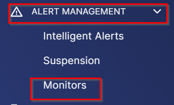
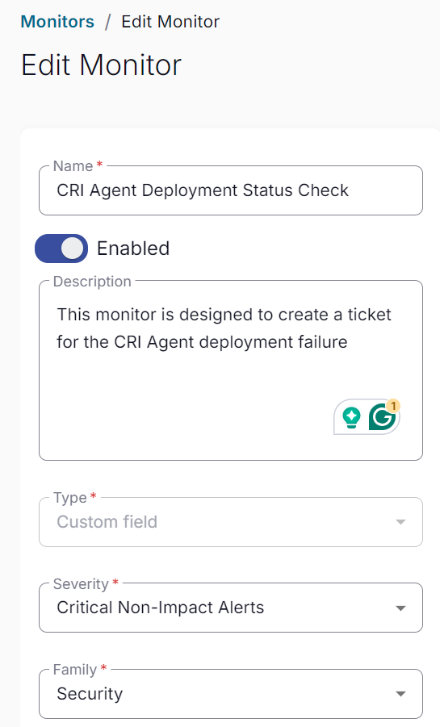
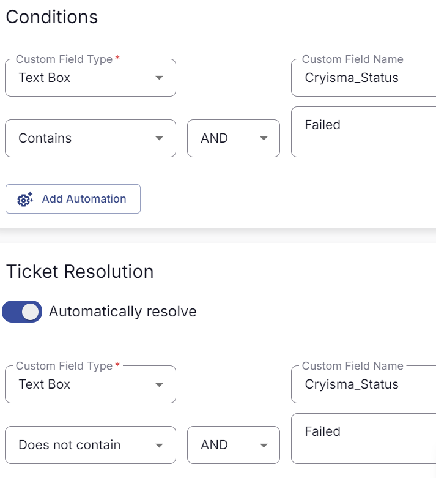
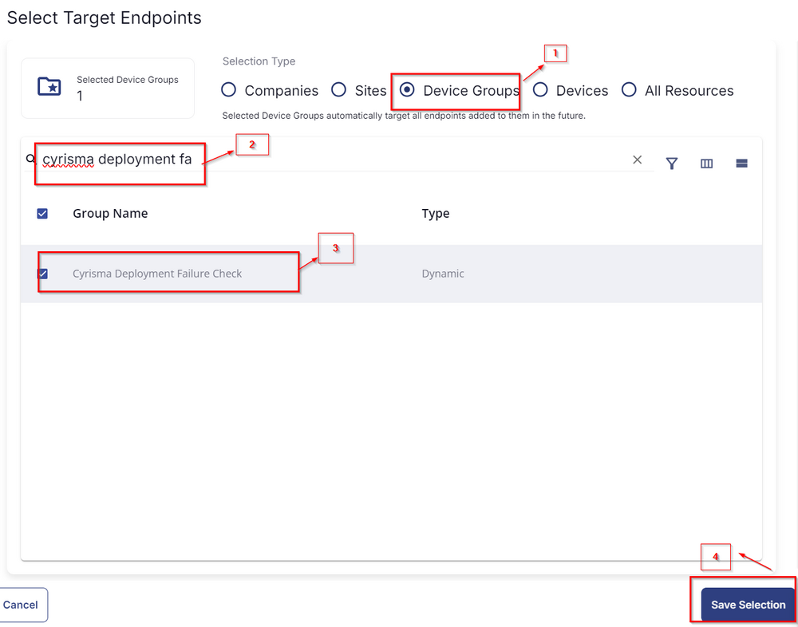

## Summary

This monitor is designed to create a ticket for the CRI Agent deployment failure.

## Create and Implement Monitor

- Click on Alert Management -> Monitors -> Create Monitor  
    
    

- Name: CRI Agent Deployment Status Check  
  Description: This monitor is designed to create a ticket for the CRI Agent deployment failure  
  Type: Custom Field  
  Severity: Critical Non-Impact Alerts  
  Family: Security  
    

- Set the Conditions as shown below:  
    

- Set Target as shown below:  
    

- Once all is done, click Save, the monitor will be created and the ticket creation will be set for the [CW RMM - Task - CRI Agent Deployment](https://proval.itglue.com/DOC-5078775-15298955) status check.

## Target

Dynamic Group: Cyrisma Deployment Failure Check

