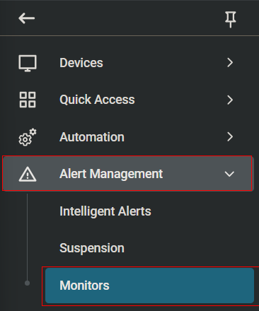
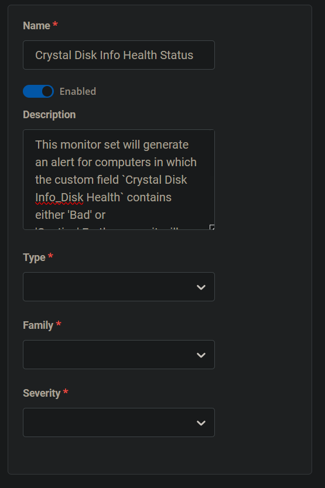
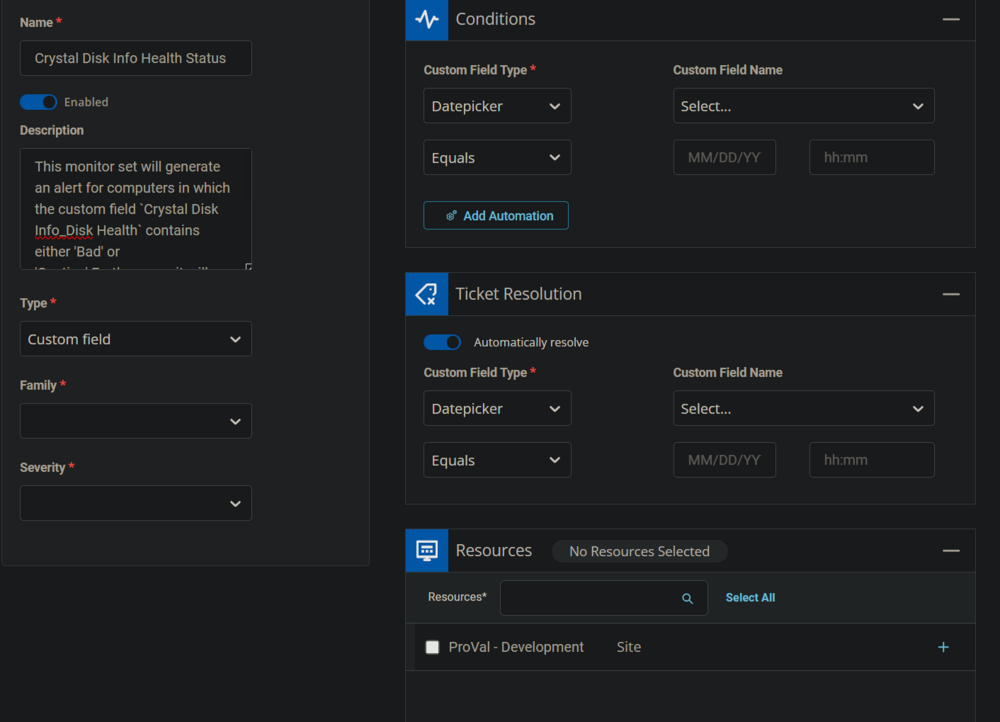
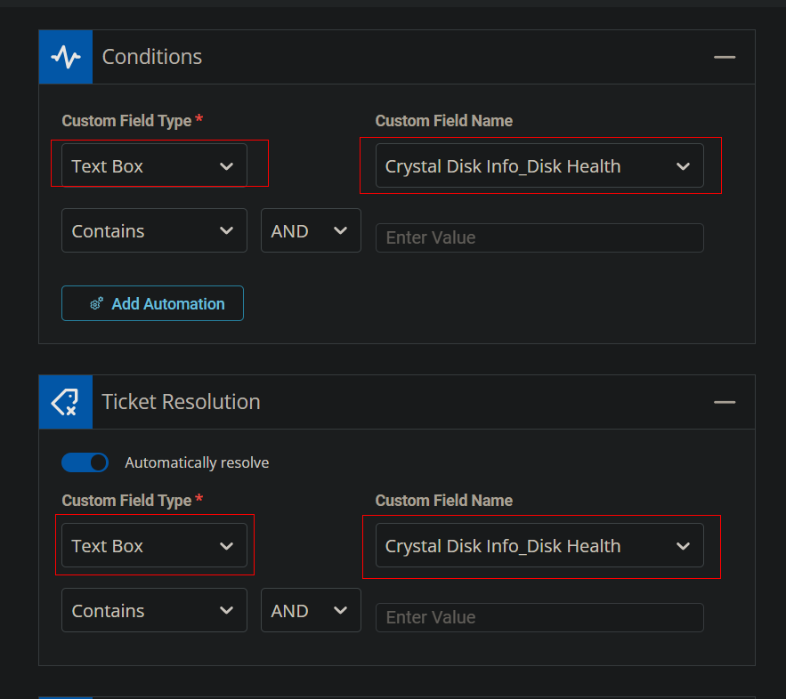
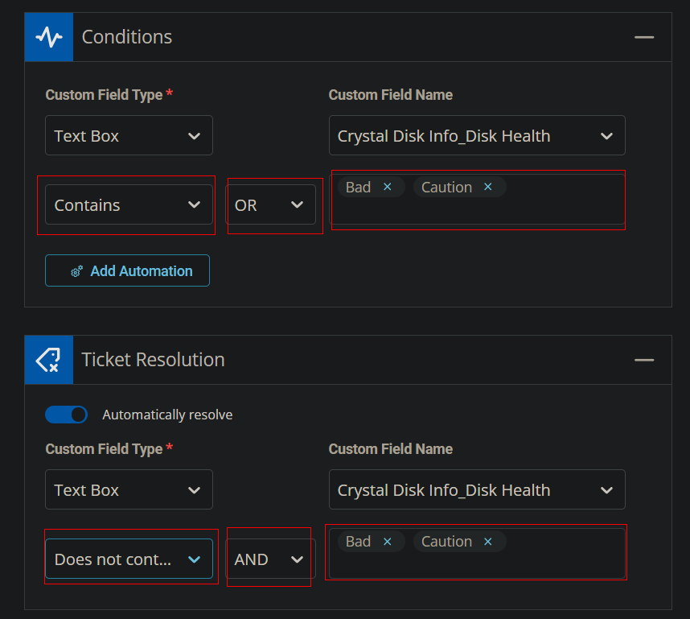
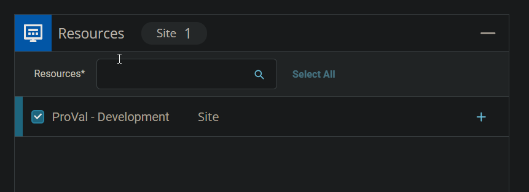
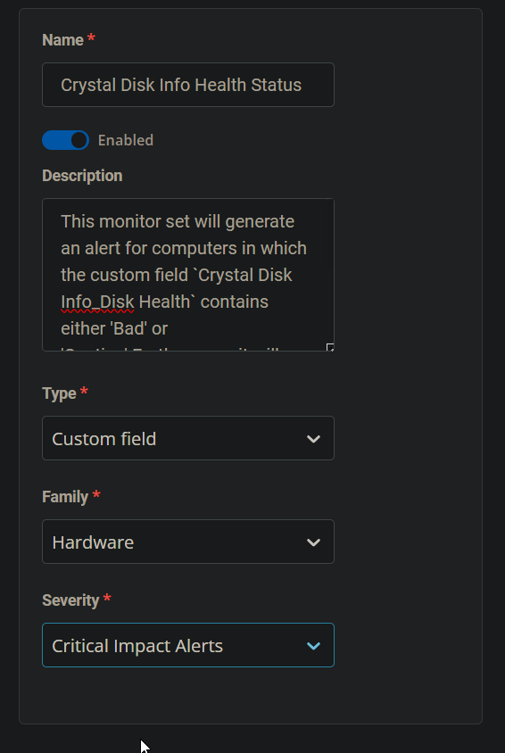
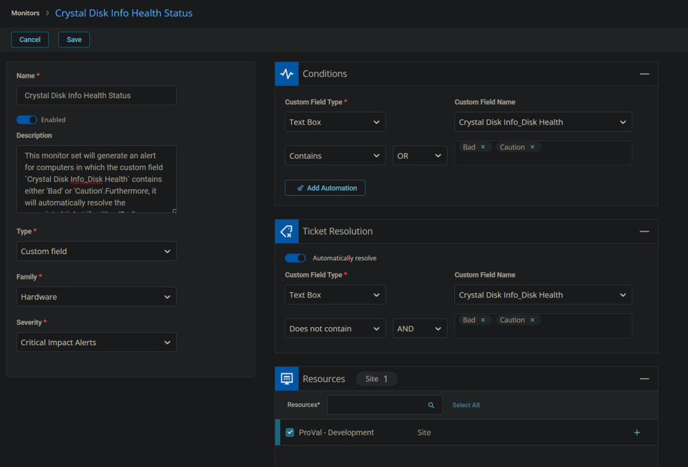
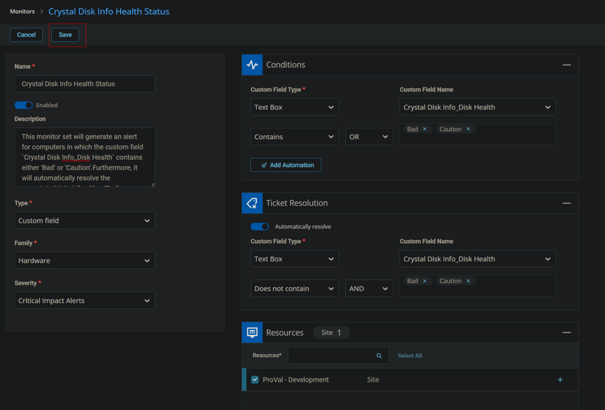

## Summary

The monitor set will generate an alert for computers in which the custom field [CW RMM - Custom Field - Crystal Disk Info_Disk Health](https://proval.itglue.com/DOC-5078775-13549899) contains either 'Bad' or 'Caution.' Furthermore, it will automatically resolve the associated ticket if neither 'Bad' nor 'Caution' is present in the aforementioned custom field.

## Monitor

1. Go to Alert Management > Monitors.  
   

2. Click the `Add Monitor` button.  
   

3. This screen will appear.  
   

4. Fill the Name and Description boxes.  
   **Name:** Crystal Disk Info Health Status  
   **Description:** This monitor set will generate an alert for computers in which the custom field `Crystal Disk Info_Disk Health` contains either 'Bad' or 'Caution'. Furthermore, it will automatically resolve the associated ticket if neither 'Bad' nor 'Caution' is present in the aforementioned custom field.  
   

5. Select the `Custom Field` in the Type dropdown.  
   

6. Select the `Text Box` from `Custom Field Type` dropdown and `Crystal Disk Info_Disk Health` from the `Custom Field Name` dropdown for both `Conditions` and `Ticket Resolution` sections.  
   

7. Leave the `Conditions` section condition to `Contains` and select `Does not contain` condition for the `Ticket Resolution` section. Select `OR` for the operator in the `Conditions` section and `AND` as the operator in the `Ticket Resolution` section. For the `value field`, type `Bad` then press Enter and type `Caution` and press Enter for both sections.  
   

8. Select the Resources/Clients to apply the monitor set against.  
   

9. Select `Hardware` for the `Family` and `Critical Impact Alerts` or any relevant option for the `Severity`.  
   

10. This is how the monitor set should look before saving it.  
    

11. Click the `Save` button to save the monitor set.  
    

## Dependencies

- [CW RMM - Custom Field - Crystal Disk Info_Disk Health](https://proval.itglue.com/DOC-5078775-13549899)  
- [CW RMM - Task - Get Crystal Disk Info (Disk Health)](https://proval.itglue.com/DOC-5078775-13549879)

