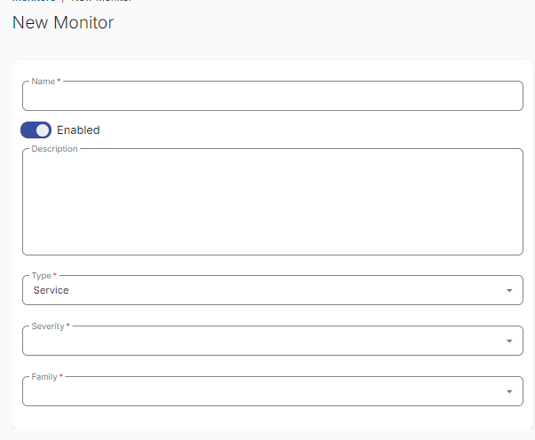
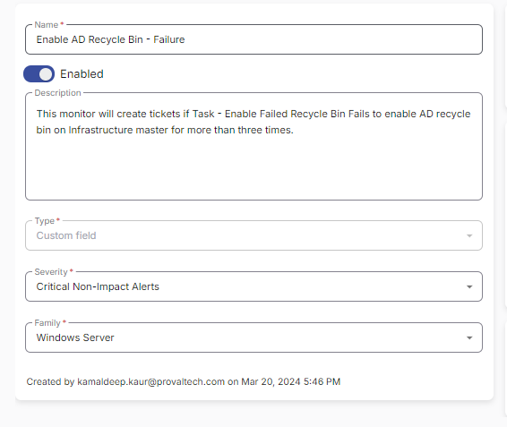
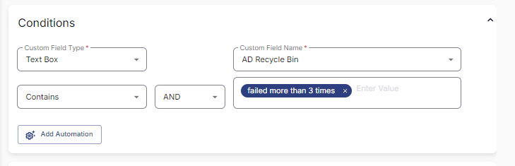
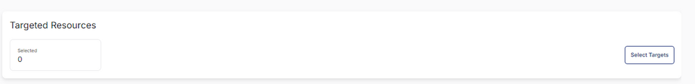
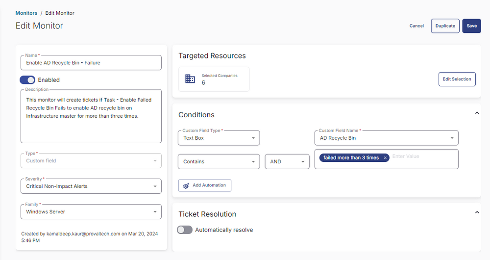

## Summary

This monitor will create tickets if [Task - Enable AD Recycle Bin](https://proval.itglue.com/DOC-5078775-15349513) fails to enable AD recycle bin on Infrastructure master for more than three times.

## Dependencies

- [Task - Enable AD Recycle Bin](https://proval.itglue.com/DOC-5078775-15349513)
- [CW RMM - Custom Fields - AD Recycle Bin](https://proval.itglue.com/DOC-5078775-15348941)

## Monitor

1. Go to Alert Management > Monitors.  
     

2. Click the `Create Monitor` button.  
     

3. This screen will appear.  
     

4. Fill in the following details.  
   **Name:** Enable AD Recycle Bin - Failure  
   **Description:** This monitor will create tickets if Task - Enable Failed Recycle Bin fails to enable AD recycle bin on Infrastructure master for more than three times.  
   **Type:** Custom Fields  
   **Severity:** Critical Non-Impact Alerts  
   **Family:** Windows Server  
     

5. Select `Text Box` in the Custom Field Type  
   Select `AD Recycle Bin` from Custom Field Name Drop Down  
   Add `failed more than 3 times` in the Value  
     

6. Click the `Select Targets` button to select the clients to monitor.  
     

7. Select all companies and click the `Save Selection` button.  
     

8. Confirm that this is the final appearance of the monitor set, then save it by clicking the `Save` button.  
     

