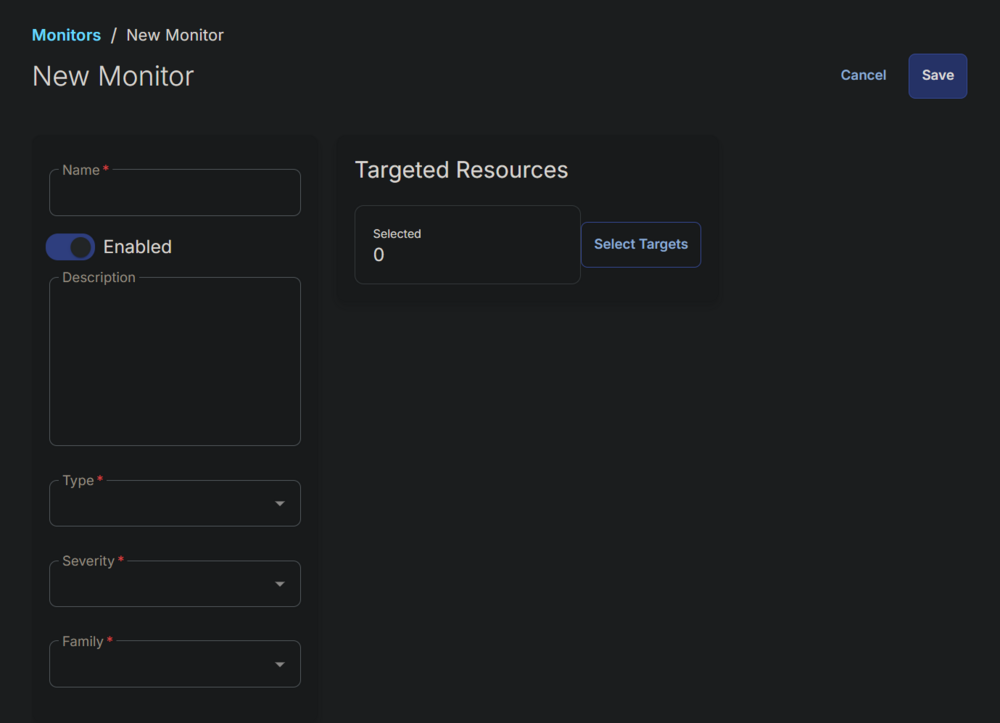
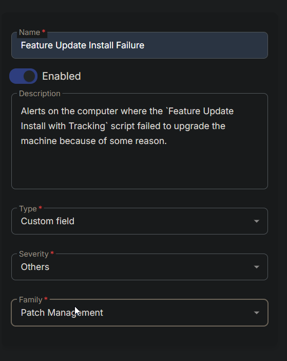
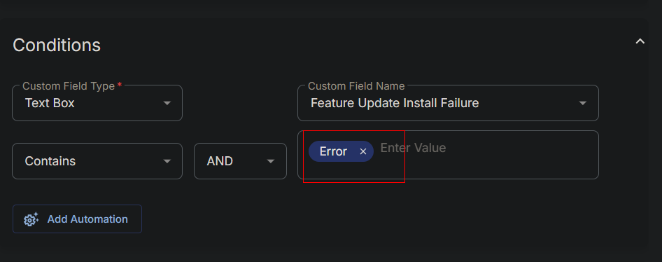
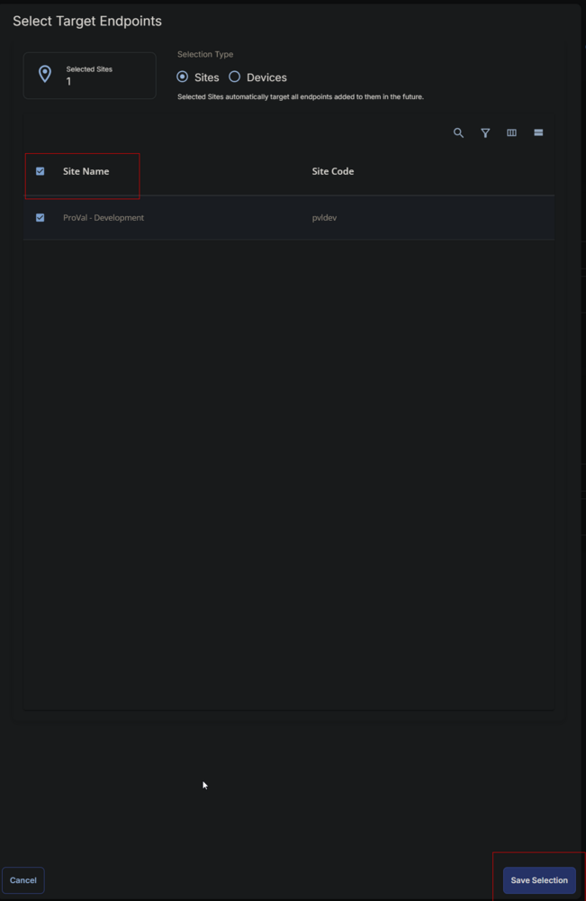
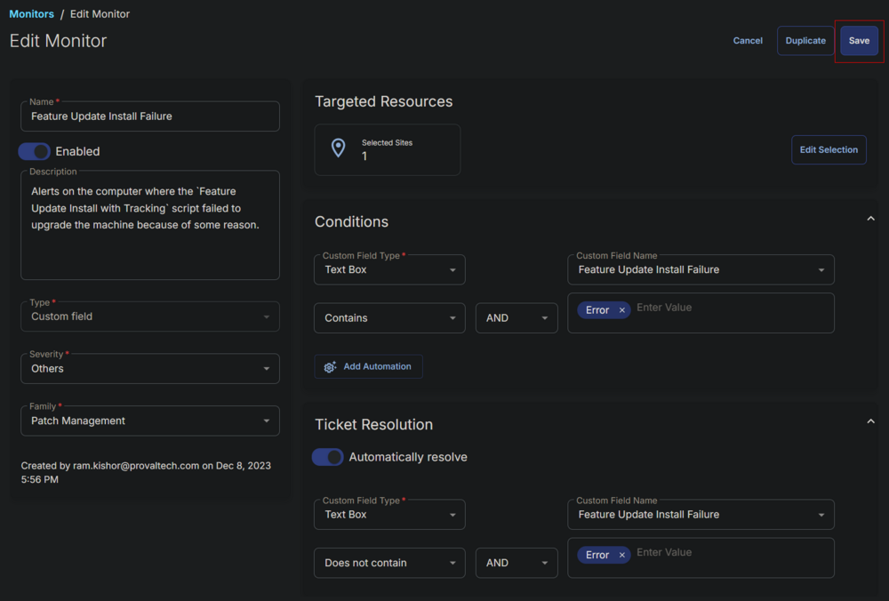

## Summary

Alerts on the computer where the `Feature Update Install with Tracking` script failed to upgrade the machine because of some reason.

## Dependencies

- [CW RMM - Custom Field - Feature Update Install Failure](https://proval.itglue.com/DOC-5078775-14592254)
- [CW RMM - Task - Feature Update Install With Tracking](<../tasks/Feature Update Install With Tracking.md>)

## Monitor

1. Go to Alert Management > Monitors.  
   
   
2. Click the `Create Monitor` button.  
   
   
3. This screen will appear.  
   
   
4. Fill the Name and Description boxes.  
   **Name:** Feature Update Install Failure  
   **Description:** Alerts on the computer where the `Feature Update Install with Tracking` script failed to upgrade the machine because of some reason.  
   
   
5. Select the `Custom Field` in the Type dropdown, `Others` in the Severity, and `Patch Management` for the Family.  
   
   
6. Select the `Text Box` from `Custom Field Type` dropdown and `Feature Update Install Failure` from the `Custom Field Name` dropdown menu. Type `Error` and press enter in the `Enter Value` field.  
   
   
7. Choose the same values/options in the `Ticket Resolution` Section, with the only difference being to use "`Does Not Contain`" as the operator instead of "`Contains`."  
   
   
8. Click the `Select Targets` button to select the clients to monitor.  
   
   
9. Select the relevant clients to monitor and click the `Save Selection` button.  
   
   
10. Confirm that this is the final appearance of the monitor set, then save it by clicking the `Save` button.  
    

