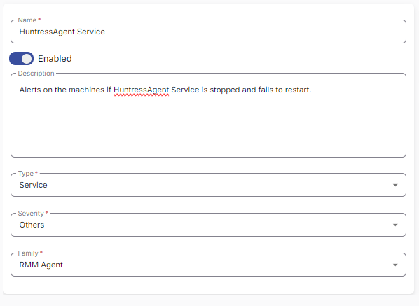
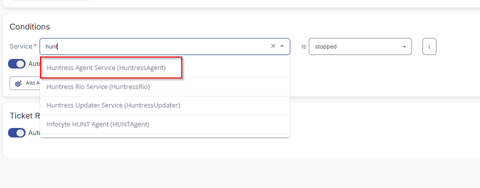
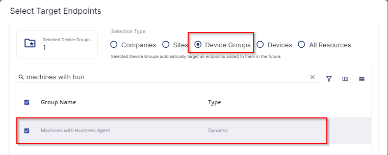
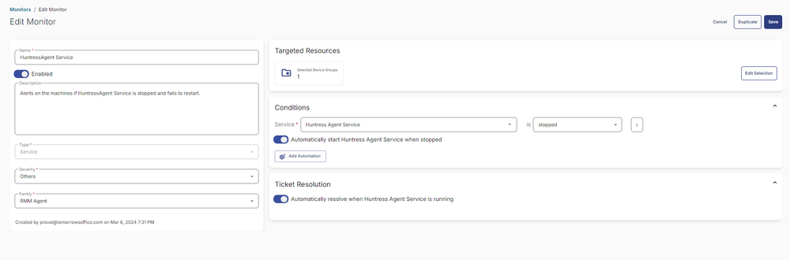

## Summary

This document provides instructions to set up alerts on machines if the HuntressAgent Service is stopped and fails to restart.

## Dependencies

[CW RMM - Device Group - Machines with Huntress Agent](<../groups/Machines with Huntress Agent.md>)

## Monitor

1. Go to **Alert Management > Monitors**.  
     

2. Click the **Create Monitor** button.  
     

3. The following screen will appear.  
     

4. Fill in the following details:  
   - **Name:** HuntressAgent Service  
   - **Description:** Alerts on the machines if HuntressAgent Service is stopped and fails to restart.  
   - **Type:** Service  
   - **Severity:** Others  
   - **Family:** RMM agent  
     

5. Select **Huntress Agent Service** from the Service dropdown.  
     

6. Ensure both the **Automatically Start Huntress Agent Service** toggle and the **Automatically resolve when Huntress Agent service is running** toggle are enabled.  
     

7. Click the **Select Targets** button to choose the clients to monitor.  
     

8. Select the **Machines with Huntress Agent** device group to monitor and click the **Save Selection** button.  
     

9. Confirm that this is the final appearance of the monitor set, then save it by clicking the **Save** button.  
     

