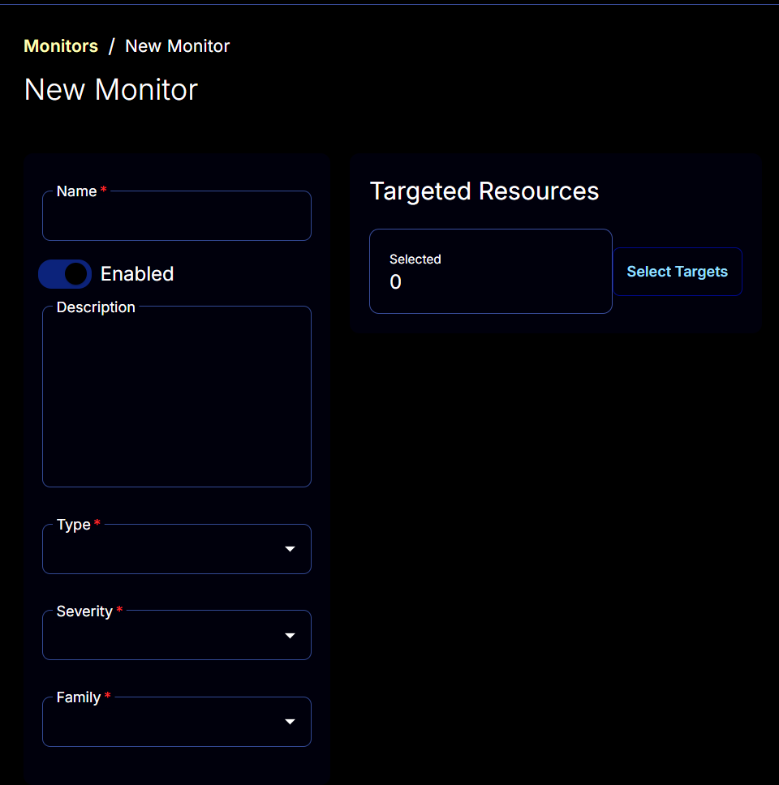
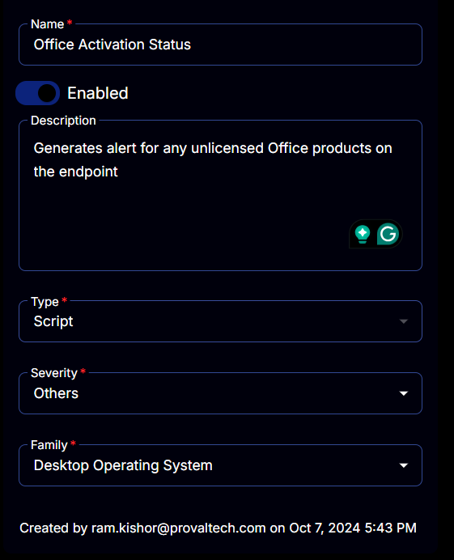
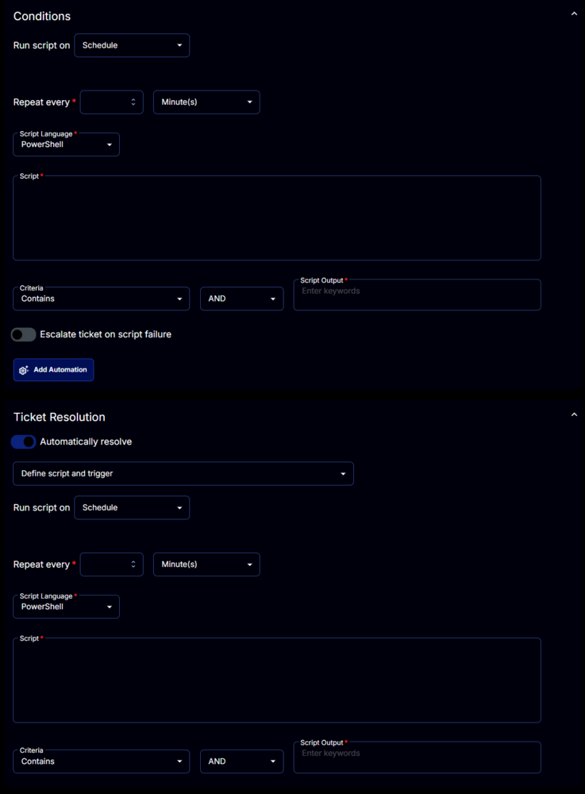
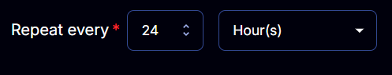
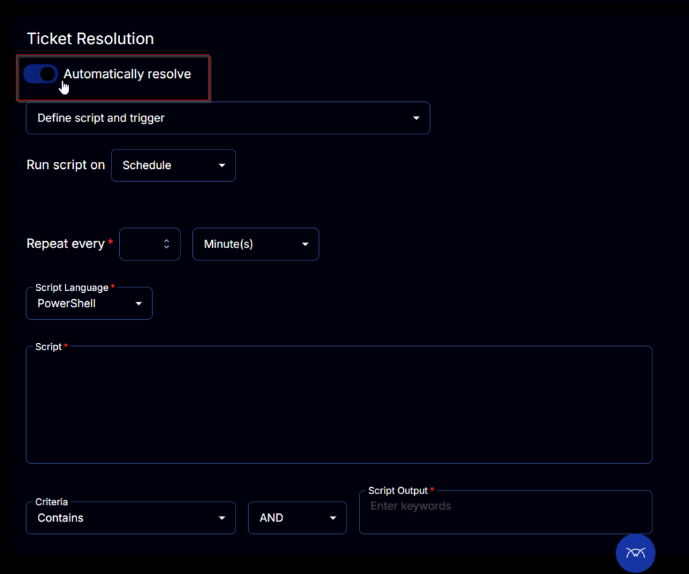
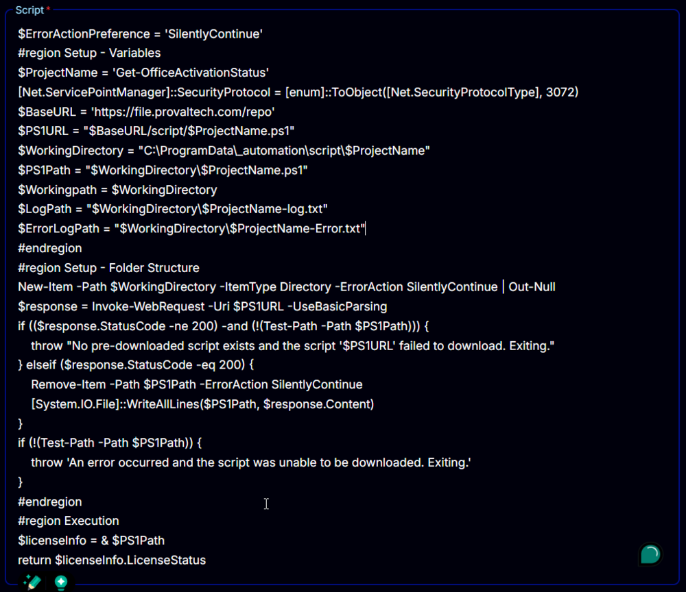
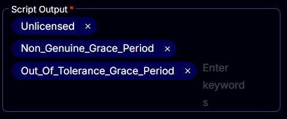
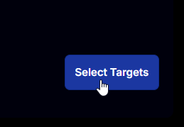
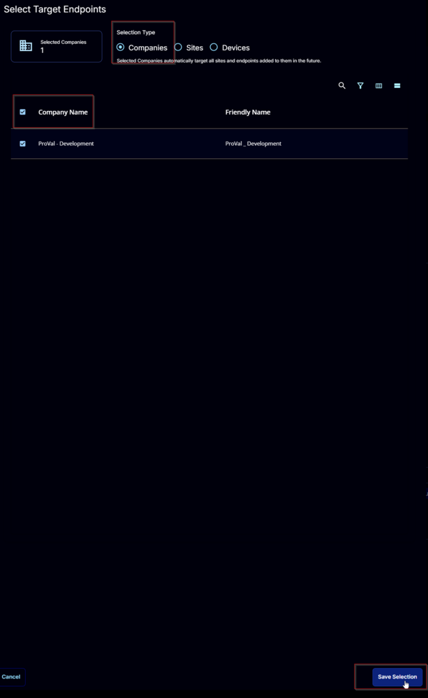
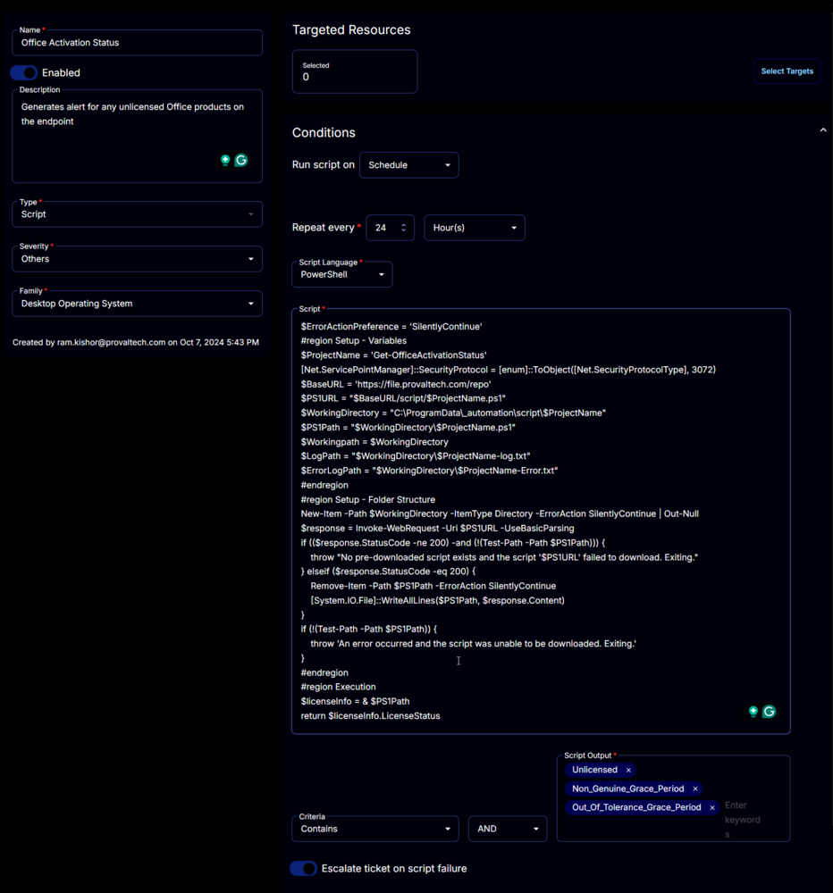

## Summary

Generates an alert for any unlicensed Office products on the endpoint.

## Monitor

1. Navigate to `Endpoints` > `Alerts` > `Monitors`  
   

2. Click the `Create Monitor` button.  
   

3. This screen will appear.  
   

4. **Name:** Office Activation Status  
   **Description:** Generates an alert for any unlicensed Office products on the endpoint  
   **Type:** Script  
   **Family:** Desktop Operating System  
   **Severity:** Others  
   

5. The `Conditions` tab will start looking like this:  
   

6. Set the `Repeat every` to `24` Hours:  
   

7. Disable the `Ticket Resolution` section by clicking the `Automatically resolve` button.  
   

8. Paste this PowerShell script in the `Script` box.  
   ```powershell
   $ErrorActionPreference = 'SilentlyContinue'
   #region Setup - Variables
   $ProjectName = 'Get-OfficeActivationStatus'
   [Net.ServicePointManager]::SecurityProtocol = [enum]::ToObject([Net.SecurityProtocolType], 3072)
   $BaseURL = 'https://file.provaltech.com/repo'
   $PS1URL = "$BaseURL/script/$ProjectName.ps1"
   $WorkingDirectory = "C:/ProgramData/_automation/script/$ProjectName"
   $PS1Path = "$WorkingDirectory/$ProjectName.ps1"
   $Workingpath = $WorkingDirectory
   $LogPath = "$WorkingDirectory/$ProjectName-log.txt"
   $ErrorLogPath = "$WorkingDirectory/$ProjectName-Error.txt"
   #endregion
   #region Setup - Folder Structure
   New-Item -Path $WorkingDirectory -ItemType Directory -ErrorAction SilentlyContinue | Out-Null
   $response = Invoke-WebRequest -Uri $PS1URL -UseBasicParsing
   if (($response.StatusCode -ne 200) -and (!(Test-Path -Path $PS1Path))) {
       throw "No pre-downloaded script exists and the script '$PS1URL' failed to download. Exiting."
   } elseif ($response.StatusCode -eq 200) {
       Remove-Item -Path $PS1Path -ErrorAction SilentlyContinue
       [System.IO.File]::WriteAllLines($PS1Path, $response.Content)
   }
   if (!(Test-Path -Path $PS1Path)) {
       throw 'An error occurred and the script was unable to be downloaded. Exiting.'
   }
   #endregion
   #region Execution
   $licenseInfo = & $PS1Path
   return $licenseInfo.LicenseStatus
   ```
   

9. Set `Unlicensed`, `Non_Genuine_Grace_Period`, and `Out_Of_Tolerance_Grace_Period` to the `Script Output` box.  
   

10. Enable the `Escalate ticket on script failure` option.  
    

11. Select the required client or group to target from the `Select Targets` button.  
      
    

12. 

13. Click the `Save` button to save the monitor set.  
    


