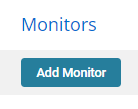
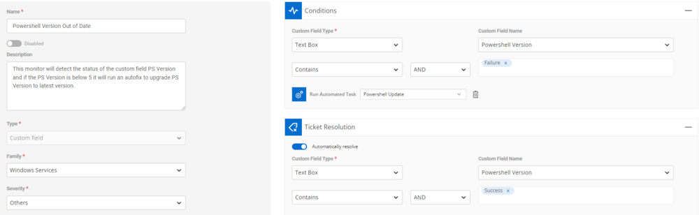
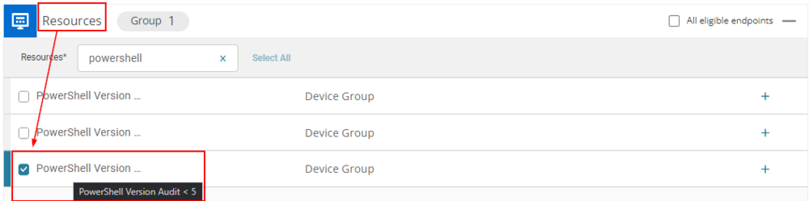

## Summary

This monitor will detect the status of the custom field PS Version, and if the PS Version is below 5, it will run an autofix to upgrade the PS Version to the latest version.

*Note: The custom field and device groups will need to be created before the monitor can be established.*

## Details

### Monitor Creation

Navigate to Automation > Monitors  
Click "Add Monitor"  

---

## Monitor Configuration:

- **Name:** PowerShell Version Out of Date
- **Description:** This monitor will detect the status of the custom field PS Version, and if the PS Version is below 5, it will run an autofix to upgrade the PS Version to the latest version.
- **Type:** Custom Field
- **Family:** Windows Services
- **Severity:** Other

### Conditions:

- **Custom Field Type:** Text Box
- **Custom Field Name:** PowerShell Version
- **Condition:** Contains --> AND --> Failure
- **Automated Task:** "PowerShell Update"

### Ticket Resolution

- **Custom Field Type:** Text Box
- **Custom Field Name:** PowerShell Version
- **Condition:** Contains --> AND --> Success

### Resources:

*Note: The custom field and device groups will need to be created before the monitor can be established.*  
This monitor is intentionally aimed at the PowerShell Version \< 5 device group.  

## Dependencies

- [CW RMM - Custom Field - PowerShell Version](https://proval.itglue.com/DOC-5078775-12824368)  
- [CW RMM - Task - PowerShell Version Information](<../tasks/PowerShell Version Information.md>)  
- [CW RMM - Device Groups - PowerShell Version](https://proval.itglue.com/DOC-5078775-12824362)  

## Ticketing

This solution does technically create tickets, but the tickets are designed to autoclose as soon as the machine runs the task to update PowerShell.
