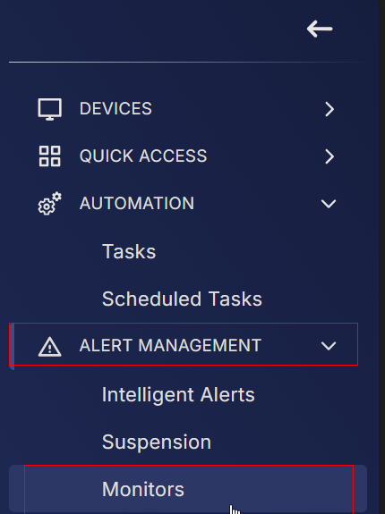
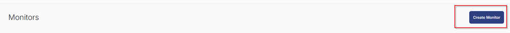
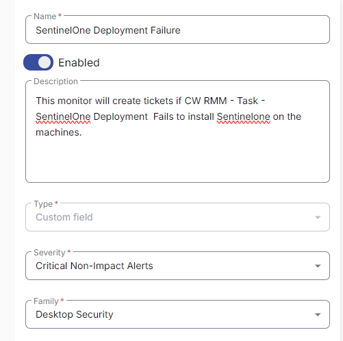
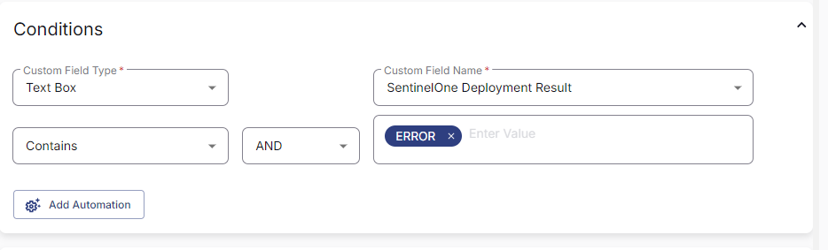
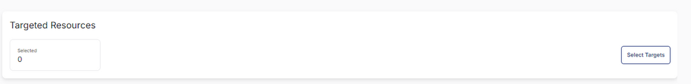
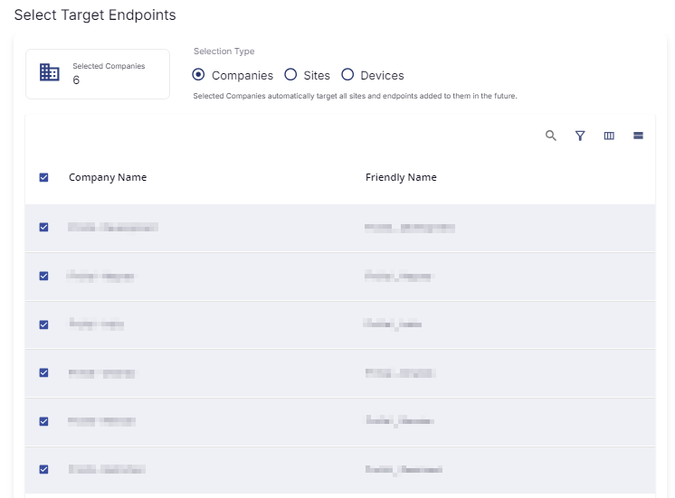
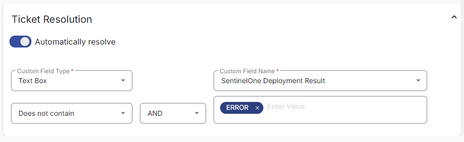
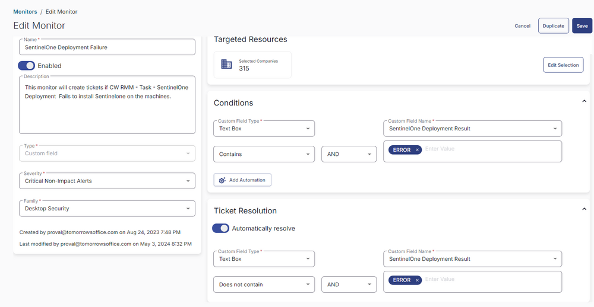

## Summary

This monitor will create tickets if [CW RMM - Task - SentinelOne Deployment](https://proval.itglue.com/DOC-5078775-15806354) fails to install SentinelOne on the machines.

## Dependencies

- [CW RMM - Task - SentinelOne Deployment](https://proval.itglue.com/DOC-5078775-15806354)
- [CW RMM - Custom Field - Endpoint - SentinelOne Deployment Result](https://proval.itglue.com/DOC-5078775-15805737)

## Monitor

1. Go to Alert Management > Monitors.  
     
   
2. Click the `Create Monitor` button.  
     
   
3. This screen will appear.  
     

4. Fill in the following details.  
   **Name:** SentinelOne Deployment Failure  
   **Description:** This monitor will create tickets if CW RMM - Task - SentinelOne Deployment fails to install SentinelOne on the machines.  
   **Type:** Custom Fields  
   **Severity:** Critical Non-Impact Alerts  
   **Family:** Desktop Security  
     

5. Select `Text Box` in the Custom Field Type.  
   Select `SentinelOne Deployment Result` from Custom Field Name Drop Down.  
   Add `Error` in the Value.  
     

6. Click the `Select Targets` button to select the clients to monitor.  
     

7. Select all companies and click the `Save Selection` button.  
     

8. In Ticket Resolution,  
   Set 'Text Box' as Custom Field Type.  
   Select `SentinelOne Deployment Result` from Custom Field Name Drop Down.  
   Replace Equals with `Does not Contain`.  
   Add `Error` in the Value.  
     

9. Confirm that this is the final appearance of the monitor set, then save it by clicking the `Save` button.  
     

