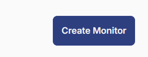
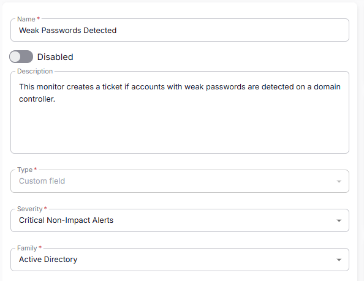
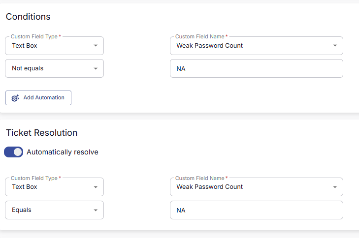
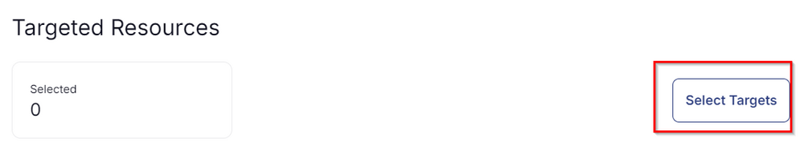
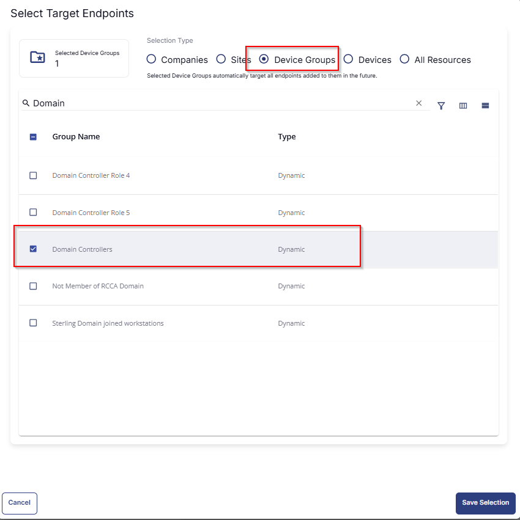

## Summary

This monitor creates a ticket if accounts with weak passwords are detected on a domain controller.

## Dependencies

- [CW RMM - Machine Group - Domain Controllers](https://proval.itglue.com/DOC-5078775-14036214)
- [CW RMM - Task - Weak Passwords - AD Test](https://proval.itglue.com/DOC-5078775-17546396)
- [CW RMM - Solution - Weak Passwords Audit](https://proval.itglue.com/DOC-5078775-17872310)

## Target

Domain Controllers  
This should target the group 'Domain Controllers.'

## Implementation

1. From the left bar select Alert Management -> Monitor  
     
   Then click 'Create Monitor'  
     

2. Fill in the mandatory columns on the left side.  
   Name: Weak Passwords Detected  
   Description: This monitor creates a ticket if accounts with weak passwords are detected on a domain controller.  
   Type: Custom Field  
   Severity: Critical Non-Impact Alerts  
   Family: Active Directory  
     

3. Fill in the condition on the right side.  
   Follow the screenshot:  
     

4. Select the target.  
   Click on Select Target:  
     
   Then click on Device Group and then search for the word Domain and then select the 'Domain Controllers' group as shown below:  
     

## Ticketing

**Subject**  
The custom field failed on %computername%

**Body**  
The custom field failed on %computername%

