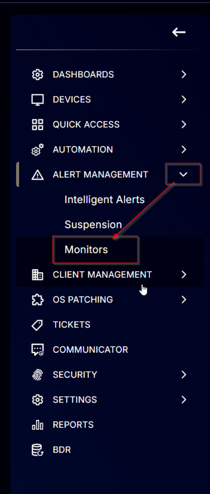
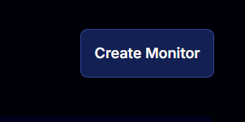
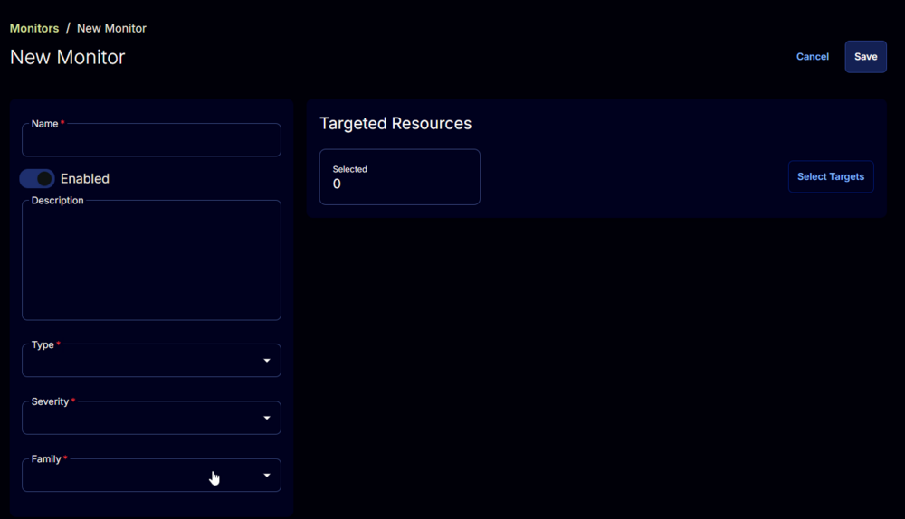
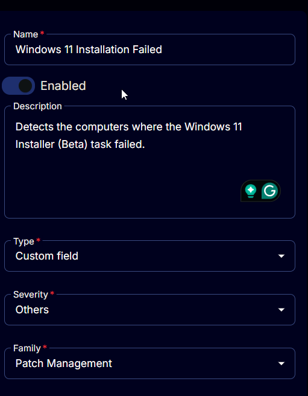
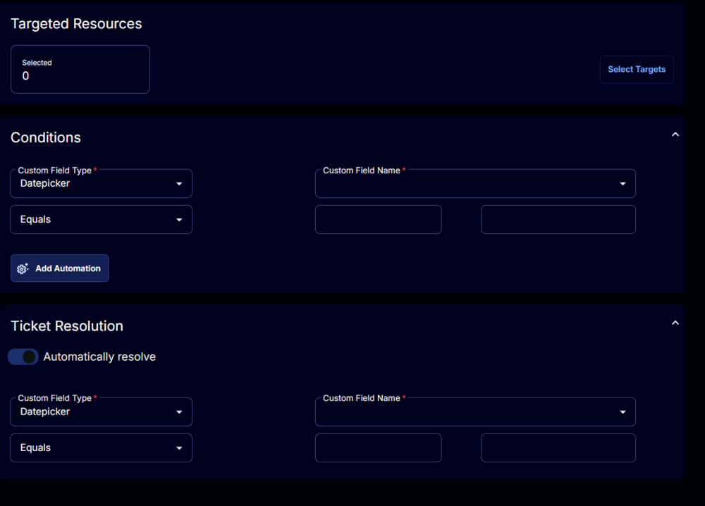
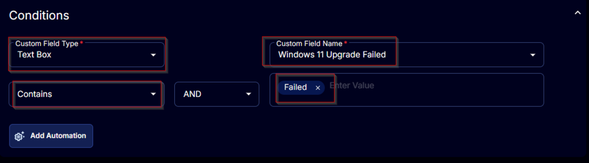
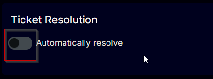
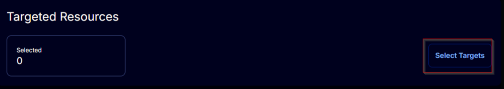
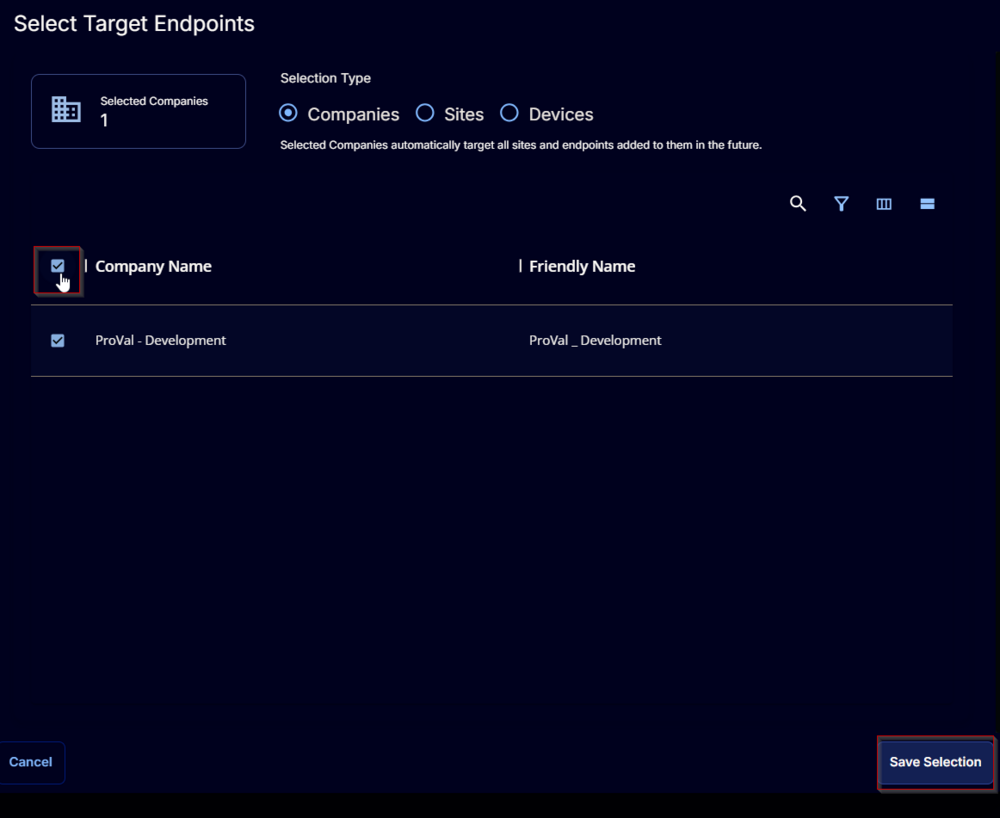
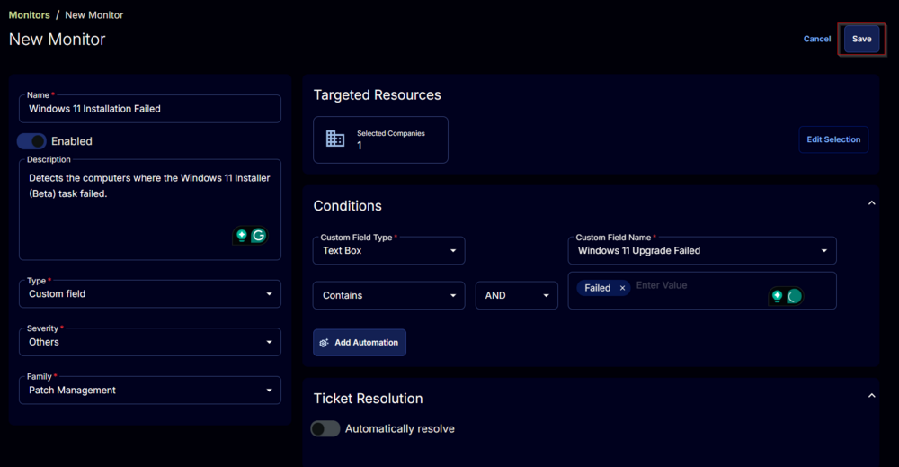

## Summary

This document detects the computers where the Windows 11 Installer (Beta) task has failed.

## Dependencies

- [CW RMM - Task - Windows 11 Installer (Beta)](/docs/96cec9d2-d276-47a5-a1c5-d79d561c192a) 
- [CW RMM - Task - Windows 11 Installation Validation](/docs/f3e6e1a0-0133-4d84-b0c7-fb02c1e2fca6) 
- [CW RMM - Custom Field - Endpoint - Windows 11 Upgrade Failed](/docs/eb332e7e-77ae-4cc0-82b1-c4f42cc05fac) 
- [CW RMM - Device Group - Windows 11 Upgrade Validation](/docs/9c422249-e949-4bcd-83ea-2c91b8365a96)

## Monitor

1. Navigate to `Alert Management` > `Monitors`  
   

2. Click the `Create Monitor` button at the top-right corner of the screen.  
     
   This will take you to the following screen.  
   

3. Fill in the following details:  
   **Name:** Windows 11 Installation Failed  
   **Description:** Detects the computers where the Windows 11 Installer (Beta) task failed.  
   **Type:** Custom Field  
   **Severity:** Others  
   **Family:** Patch Management  
     
   The right half of the screen will change after setting the `Type` to `Custom Field`.  
   

4. **Conditions**  
   - Change the `Custom Field Type` to `Text Box`.
   - Find and select the `Windows 11 Upgrade Failed` custom field in the `Custom Field Name` field.  
   - Set the comparator to `Contains`.  
   - Type `Failed` in the `Enter Value` field and press `Enter`.  
   

5. **Ticket Resolution**  
   - Turn off the `Automatically resolve` button.  
   

6. **Targeted Resources**  
   - Click the `Select Targets` button.  
     
   - Select all companies and click the `Save Selection` button.  
   

7. Click the `Save` button at the top-right corner of the screen to create the monitor set.  
   

