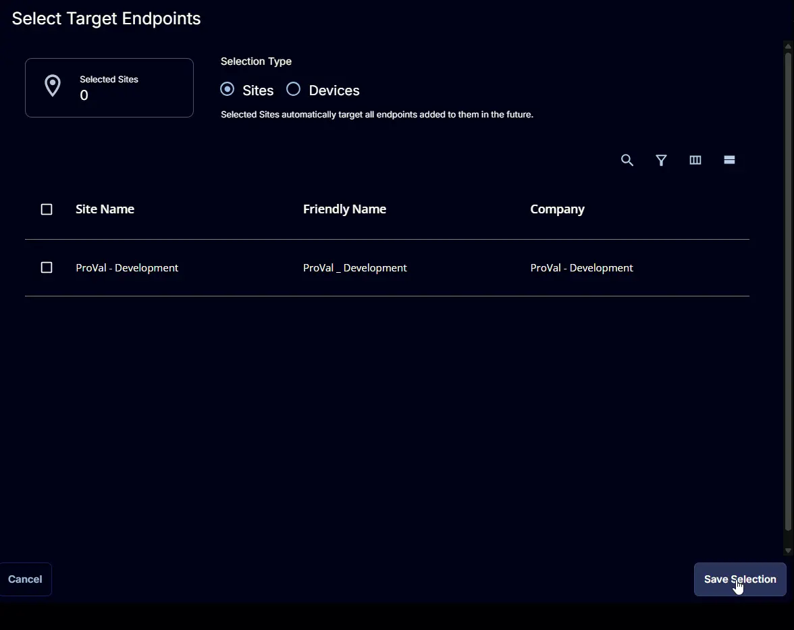

## Summary

## Dependencies

## Target

This monitor should target the group shown below:  
`<Include a screenshot of what the 'Select Target Endpoints' screen looks like>`

> 📝 **Document Author Workflow (Read Before Proceeding)**
> 
> **Do not paste raw PowerShell, Bash, or CMD scripts directly into this public document.** 
> To keep our public documentation clean and our code secure, all scripts must be hosted in our central repository.
> 
> 1. **Author & Format:** Write the script adhering strictly to the organization's PowerShell/Bash formatting rules (single quotes, `-f` composition, explicit parameters, etc.).
> 2. **Commit to Repository:** Push the finalized script to the **[`cw-rmm` repository](https://github.com/ProVal-Tech/cw-rmm)**.
> 3. **Directory Structure:** Save the file using the exact name of this markdown document (without the `.md` extension) inside the `monitors` directory. 
>    * *Example Path:* `monitors/<this-document-filename>/script.ps1` (or `.sh` / `.cmd`).
>    * *Multiple Scripts:* If the monitor requires multiple scripts of the same type, name them `script1.ps1`, `script2.ps1`, etc.
> 4. **Link in Document:** Replace the raw code blocks in the "Conditions" section below with the permanent GitHub URLs pointing to your committed scripts.

## Monitor Creation

### Step 1

Navigate to `ENDPOINTS` ➞ `Alerts` ➞ `Monitors`  

### Step 2

Locate the `Create Monitor` button on the right-hand side of the screen and click on it.  

This page will appear after clicking on the `Create Monitor` button:  

### Step 3

Fill in the mandatory columns on the left side  
**Name:** `<Name>`  
**Description:** `<Description>`  
**Type:** `<Type>`  
**Severity:** `<Severity>`  
**Family:** `<Family>`  
`<Include a screenshot of what this screen looks like all filled out>`

### Step 4

Click the `Select Target` button to choose the endpoints for running the monitor set.  

This page will appear after clicking on the `Select Target` button:  

## Conditions

- **Run script on:** `Schedule`
- **Repeat every:** `<Interval e.g., 15 Minutes, 24 Hours>`
- **Script Language:** `PowerShell`
- **Use Generative AI Assist for script creation:** `False`
- **PowerShell Script Editor:**

  Navigate to the [`cw-rmm` repository](https://github.com/ProVal-Tech/cw-rmm), open the script linked below, copy the raw code, and paste it into the RMM script editor:
  
  [PowerShell Script](https://github.com/ProVal-Tech/cw-rmm/blob/main/monitors/<filename>/script.ps1)

- **Criteria:** `<Contains / Does Not Contain / etc.>`
- **Operator:** `<AND / OR>`
- **Script Output:** `<Expected Output String>`
- **Escalate ticket on script failure:** `<True / False / Disabled>`
- **Add Automation:** `<Autofix Task Name or NONE>`

## Ticket Resolution

- **Automatically Resolve:** `<Enabled / Disabled>`
- **Dropdown Option:** `<Run same script as above / etc.>`
- **Criteria:** `<Contains / Does Not Contain>`
- **Operator:** `<AND / OR>`
- **Script Output:** `<Expected Recovery Output String>`

## Monitor Output

- **Output:** `<Generate Ticket / Do not Generate Ticket>`

## Completed Monitor

`<Screenshot(s) of completed monitor configuration>`

## Ticketing

**Note to ProVal Team:** *Ticket subject lines should be short and simple. The body of the ticket should provide a detailed explanation of why a ticket was generated and, ideally, what the next steps should be when a user is looking at the ticket.*

*If the monitor is intended to create tickets, please note the Subject and Body of the ticket below. Include an example ticket if possible.*

**Subject:**

**Body:**

## Changelog
