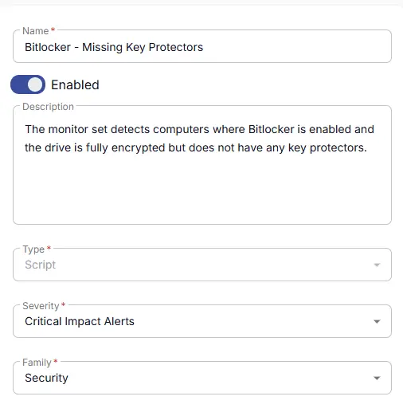
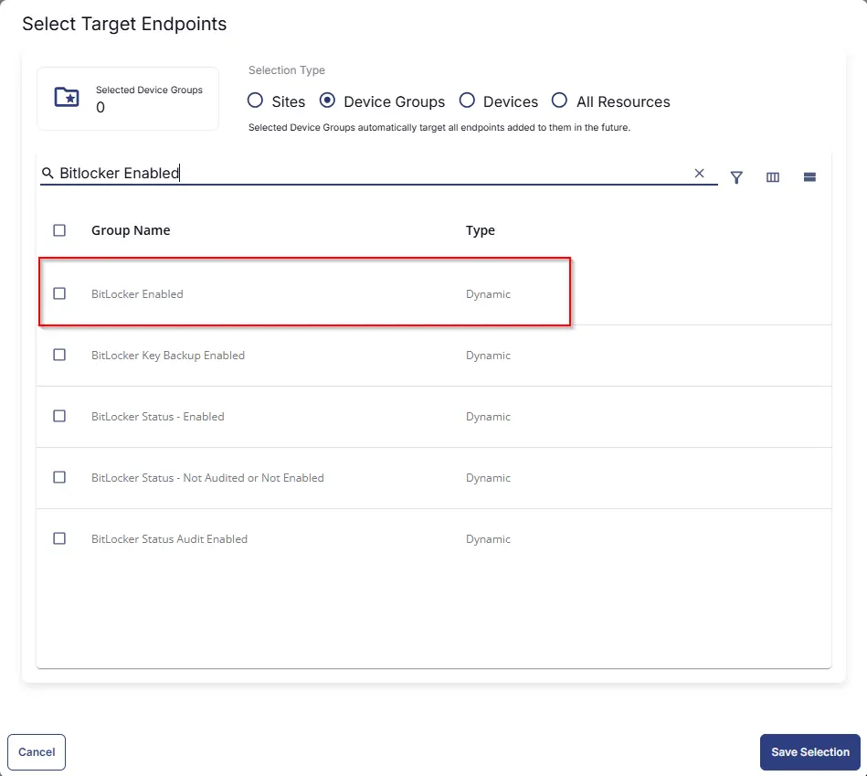
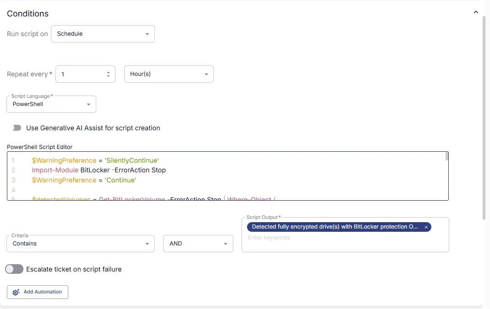
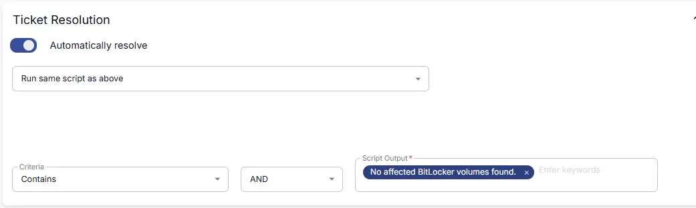
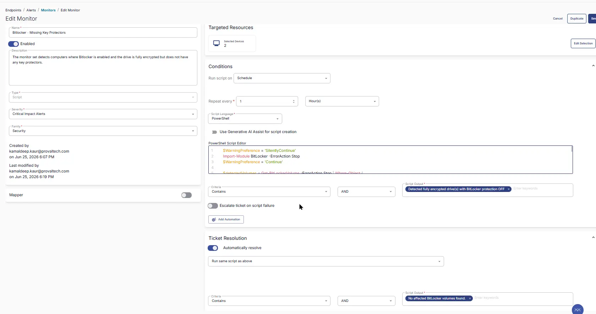

## Summary
This monitor set detects computers where Bitlocker is enabled and the drive is fully encrypted but does not have any key protectors.

## Dependencies

- [Solution - BitLocker Status and Recovery Key Audit](/docs/b2a974b2-c231-4197-a639-d0775d77d7c7)

## Monitor Setup Location

**Monitors Path:** `ENDPOINTS` ➞ `Alerts` ➞ `Monitors`  

## Monitor Summary

Fill in the mandatory columns on the left side  
Name: `Bitlocker - Missing Key Protectors`  
Description: `The monitor set detects computers where Bitlocker is enabled and the drive is fully encrypted but does not have any key protectors.`  
Type: `Script`  
Severity: `Critical Impact Results`  
Family: `Security`  



## Targeted Resources

- **Target Type:**  `Device Groups`  
- **Group Name:** `BitLocker Enabled`



## Conditions

- **Run Script on:** `Schedule`  
- **Repeat every:** `1` `Hours`  
- **Script Language:** `PowerShell`  
- **Use Generative AI Assist for script creation:** `False`  
- **PowerShell Script Editor:**  

```PowerShell
$WarningPreference = 'SilentlyContinue'
Import-Module BitLocker -ErrorAction Stop
$WarningPreference = 'Continue'

$detectedVolumes = Get-BitLockerVolume -ErrorAction Stop | Where-Object {
    $_.MountPoint -match '^[A-Za-z]:$' -and
    $_.VolumeStatus -eq 'FullyEncrypted' -and
    $_.ProtectionStatus -eq 'OFF' -and
    (
        -not $_.KeyProtector -or
        $_.KeyProtector.KeyProtectorId.ToString().Length -lt 2
    )
}

if ($detectedVolumes) {
    $drives = $detectedVolumes | ForEach-Object {
        "$($_.MountPoint) ($($_.VolumeType))"
    }

    return "Detected fully decrypted drive(s) with BitLocker protection OFF and an invalid/missing KeyProtectorId: $($drives -join ', ')"
}
return "No affected BitLocker volumes found."
```

- **Criteria:**  `Contains`  
- **Operator:** `AND`  
- **Script Output:**  `Detected fully encrypted drive(s) with BitLocker protection OFF`  
- **Escalate ticket on script failure:** `False`  
- **Add Automation:**  ``



## Ticket Resolution

**Automatically resolve:** `True`
**Script to Run** `Same Script as Above`
**Criteria:**  `Contains`  
**Operator:** `AND`  
**Script Output:**  `Detected fully encrypted drive(s) with BitLocker protection OFF`  



## Monitor Output

**Output:** `Generate Ticket`


## Completed Monitor



## Changelog

### 2025-06-25

- Initial version of the document

