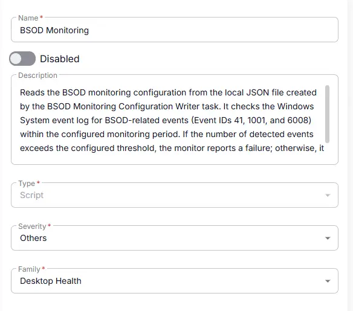
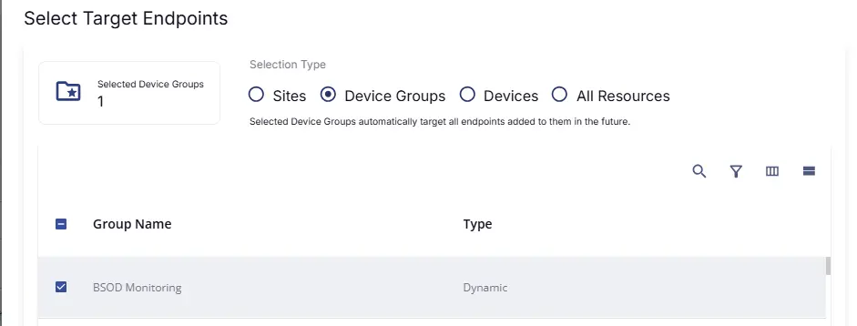
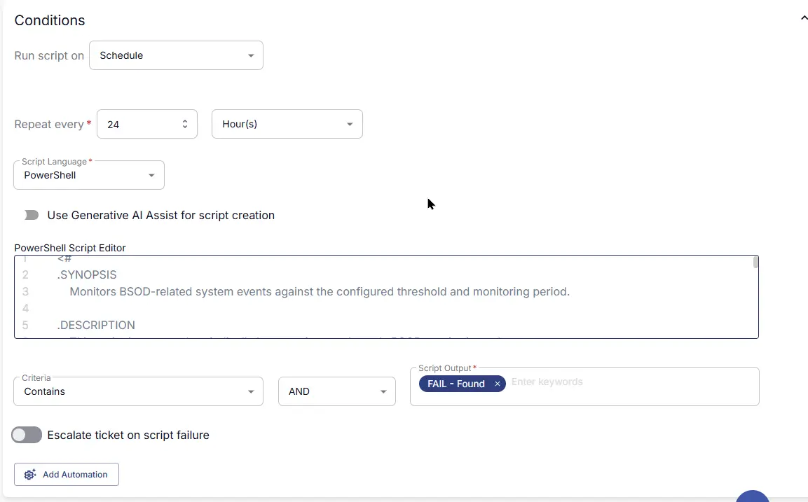
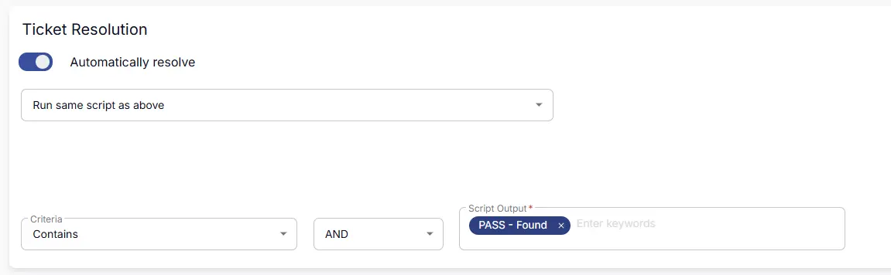
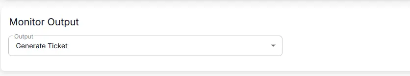
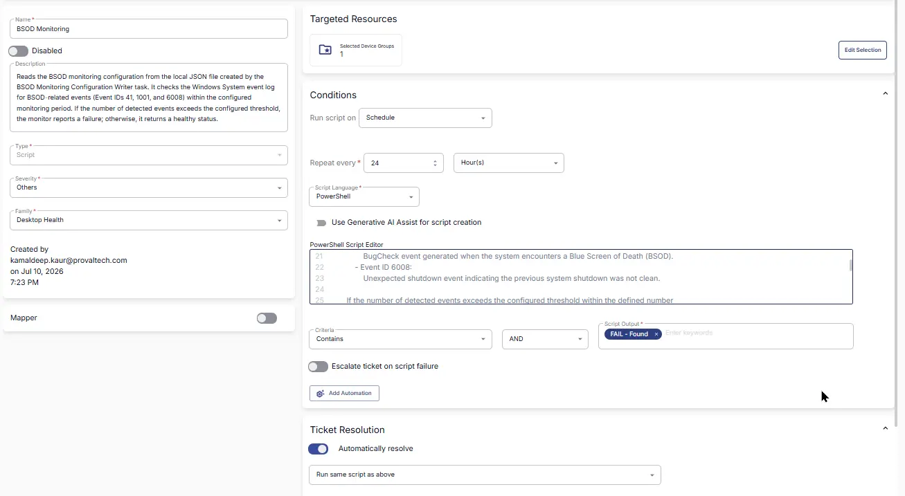

## Summary

Reads the BSOD monitoring configuration from the local JSON file created by the BSOD Monitoring Configuration Writer task. It checks the Windows System event log for BSOD-related events (Event IDs 41, 1001, and 6008) within the configured monitoring period. If the number of detected events exceeds the configured threshold, the monitor reports a failure; otherwise, it returns a healthy status.

### How It Works

1. **Configuration File**  
   At each check interval, the monitor reads the file `C:\ProgramData\_Automation\Script\BSODMonitoring\BSODMonitoring.json`. This file contains two values:

   * **Threshold** – the maximum number of BSOD-related events allowed before an alert is generated.
   * **Days** – the number of previous days to search the Windows System event log.

2. **BSOD Event Monitoring**  
   The monitor scans the Windows **System** event log for the following BSOD-related events within the configured time period:

   * **Event ID 41** – Kernel-Power (unexpected shutdown or restart).
   * **Event ID 1001** – BugCheck (Blue Screen of Death).
   * **Event ID 6008** – Unexpected shutdown.

3. **Threshold Evaluation**  
   The total number of matching events is compared against the configured **Threshold**.

   * **If the event count exceeds the threshold:** The monitor generates a failure.
   * **If the event count is within the threshold:** The monitor reports a healthy status.

4. **Alert & Resolution**  
   When a failure occurs, the monitor outputs the number of BSOD-related events detected during the configured monitoring period. Once the event count falls back within the configured threshold, the monitor returns a healthy status, allowing the monitor set to automatically resolve the alert if automatic resolution is enabled.


## Dependencies

- [Solution: BSOD Monitoring](/docs/fc85a090-94c2-4f91-8055-9c8e52d91ad1)
- [Task : BSOD Monitoring Configuration Writer](/docs/21f7afea-94a7-4bd9-b46f-7f8a20819eb7)

## Monitor Setup Location

**Monitors Path:** `ENDPOINTS` ➞ `Alerts` ➞ `Monitors`  

## Monitor Summary

- **Name:** `BSOD Monitoring`  
- **Description:** `Reads the BSOD monitoring configuration from the local JSON file created by the BSOD Monitoring Configuration Writer task. It checks the Windows System event log for BSOD-related events (Event IDs 41, 1001, and 6008) within the configured monitoring period. If the number of detected events exceeds the configured threshold, the monitor reports a failure; otherwise, it returns a healthy status.`  
- **Type:** `Script`  
- **Severity:** `Others`  
- **Family:** `Desktop Health`



## Targeted Resources

- **Target Type:**  `Device Groups`  
- **Group Name:** `[Group : BSOD Monitoring](/docs/607ed709-2b00-4f6c-a1aa-6d234d0a5c0e)`



## Conditions

- **Run script on:** `Schedule`  
- **Repeat every:** `24` `Hour(s)`  
- **Script Language:** `PowerShell`  
- **Use Generative AI Assist for script creation:** `False`  

- **PowerShell Script Editor:**  

```PowerShell
<#
.SYNOPSIS
    Monitors BSOD-related system events against the configured threshold and monitoring period.

.DESCRIPTION
    This script is executed periodically by a monitor set. It reads BSOD monitoring values
    from the local JSON configuration file placed by the BSOD Monitoring Configuration Writer task.

    The configuration file contains the following settings:
        Threshold:
            Defines the maximum number of BSOD-related events allowed within the configured
            monitoring period. If the event count exceeds this value, the monitor reports a failure.
        Days:
            Defines the number of previous days to check for BSOD-related events in the Windows
            System event log.

    The script checks the Windows System event log for the following BSOD-related events:
        - Event ID 41:
            Kernel-Power event indicating an unexpected system shutdown or restart.
        - Event ID 1001:
            BugCheck event generated when the system encounters a Blue Screen of Death (BSOD).
        - Event ID 6008:
            Unexpected shutdown event indicating the previous system shutdown was not clean.

    If the number of detected events exceeds the configured threshold within the defined number
    of days, the script generates a failure output with the event count.

    If the number of detected events is within the configured threshold, the script returns a
    healthy status message.

.NOTES
    Script Name   = BSOD Monitoring
    Configuration = $env:ProgramData\_Automation\Script\BSODMonitoring\BSODMonitoring.json
    Configuration Values:
        Threshold = Maximum allowed BSOD-related events before triggering an alert.
        Days      = Number of previous days to evaluate BSOD-related events.
    Monitored Log = Windows System Event Log
    Event IDs     = 41, 1001, 6008

.OUTPUTS
    - On alert:
        FAIL - Found <Count> BSOD-related events (Event IDs: 41, 1001, 6008) in the last <Days> days.
    - On healthy state:
        PASS - Found <Count> BSOD-related events (Event IDs: 41, 1001, 6008) in the last <Days> days.
#>

#region globals
$ProgressPreference = 'SilentlyContinue'
$WarningPreference = 'SilentlyContinue'
#endregion

#region variables
$projectName = 'BSODMonitoring'
$workingDirectory = '{0}\_Automation\Script\{1}' -f $env:ProgramData, $projectName
$configPath = '{0}\{1}.json' -f $workingDirectory, $projectName
#endregion

#region config import
if (-not (Test-Path -Path $configPath)) {
    return 'BSOD monitoring configuration file not found. Skipping check.'
}

try {
    $rawJson = Get-Content -Path $configPath -Raw -Encoding UTF8 -ErrorAction Stop
    $config = $rawJson | ConvertFrom-Json -ErrorAction Stop
} catch {
    return ('Failed to read or parse the configuration file. Error: {0}' -f $Error[0].Exception.Message)
}

[int]$Threshold = $config.Threshold
[int]$Days= $config.Days
#endregion

$Count = (Get-WinEvent -FilterHashtable @{
    LogName   = 'System'
    Id        = 41,1001,6008
    StartTime = (Get-Date).AddDays(-$Days)
} -ErrorAction SilentlyContinue).Count

if ($Count -gt $Threshold) {
    write-output "FAIL - Found $Count BSOD-related events (Event IDs: 41, 1001, 6008) in the last $Days days."
    exit 1
}
else {
    write-output "PASS - Found $Count BSOD-related events (Event IDs: 41, 1001, 6008) in the last $Days days."
    exit 0
}
```

- **Criteria:**  `Contains`  
- **Operator:** `AND`  
- **Script Output:**  `Fail - Found`   
- **Escalate ticket on script failure:** `Disabled`  
- **Add Automation:**  `<Leave it untouched>`



## Ticket Resolution

- **Automatically Resolve:** `Enabled`  
- **Dropdown Option:** `Run same script as above`
- **Criteria:**  `Contain`  
- **Operator:** `AND`  
- **Script Output:**  `PASS - Found`  



## Monitor Output

**Output:** `Generate Ticket`



## Completed Monitor



## Changelog

### 2026-07-21

- Initial version of the document