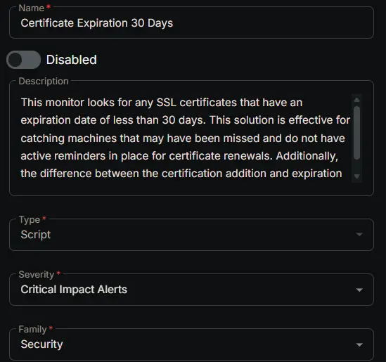
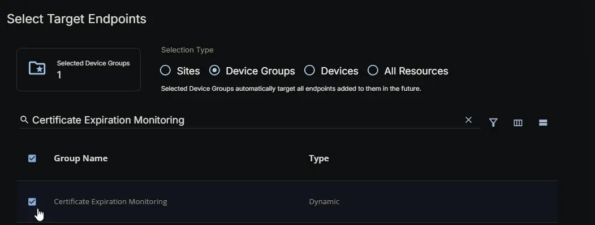
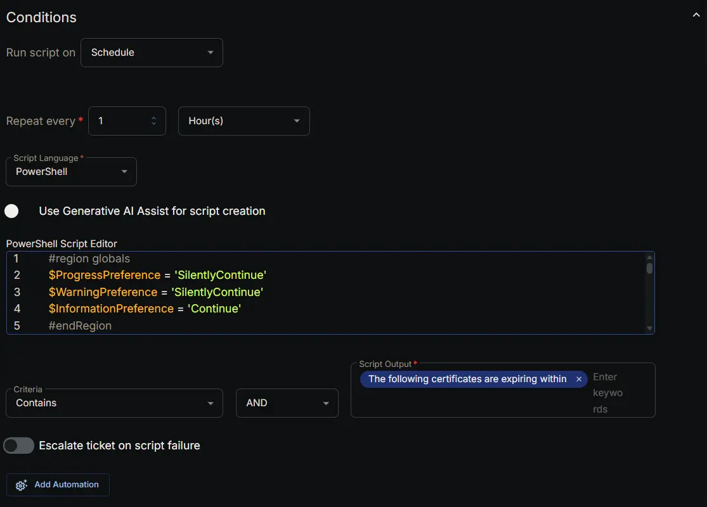
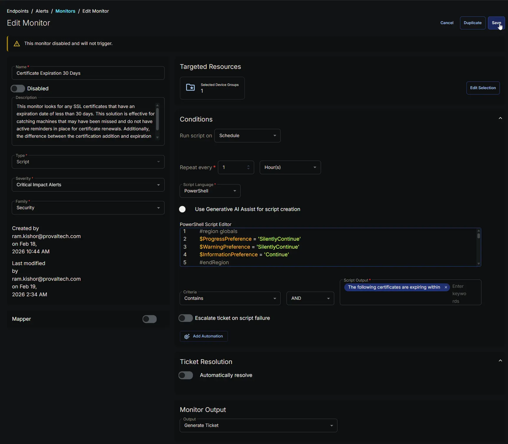

## Summary

This monitor looks for any SSL certificates that have an expiration date of less than 30 days. This solution is effective for catching machines that may have been missed and do not have active reminders in place for certificate renewals. Additionally, the difference between the certification addition and expiration should be at least 30 days to trigger an alert.

## Dependencies

- [Custom Field: Certificate Expiration Alert](/docs/41d685b3-0e7c-41b6-802d-2d1a9b25593c)
- [Custom Field: Disable Cert Expiration Alerts](/docs/9fa7d829-75c9-455d-9908-d695e0ae0a96)
- [Custom Field: Disable Cert Expiration Alert](/docs/f329bc75-50a0-497a-bfa9-4d54a281101c)
- [Group: Certificate Expiration Monitoring](/docs/0cf27d9a-8aeb-4555-92a2-45e993e1bd87)
- [Solution: HyperV - Snapshot Age > 3 Days Monitoring](/docs/4712590e-18e7-47f7-a038-ab704f5859c2)

## Monitor Setup Location

**Monitors Path:** `ENDPOINTS` ➞ `Alerts` ➞ `Monitors`  

## Monitor Summary

- **Name:** `Certificate Expiration 30 Days`  
- **Description:** `This monitor looks for any SSL certificates that have an expiration date of less than 30 days. This solution is effective for catching machines that may have been missed and do not have active reminders in place for certificate renewals. Additionally, the difference between the certification addition and expiration should be at least 30 days to trigger an alert.`  
- **Type:** `Script`  
- **Severity:** `Critical Impact Alerts`  
- **Family:** `Security`



## Targeted Resources

- **Target Type:**  `Device Groups`  
- **Group Name:** `Certificate Expiration Monitoring`



## Conditions

- **Run Script on:** `Schedule`  
- **Repeat every:** `1` `Hours`  
- **Script Language:** `PowerShell`  
- **Use Generative AI Assist for script creation:** `False`  
- **PowerShell Script Editor:**  

```PowerShell
#region globals
$ProgressPreference = 'SilentlyContinue'
$WarningPreference = 'SilentlyContinue'
$InformationPreference = 'Continue'
#endRegion

#region variables
$threshold = 30 # days
$certPath = 'Cert:\LocalMachine\My'
$tableName = 'expiringCerts'
#endRegion

#region set tls policy
$supportedTLSversions = [enum]::GetValues('Net.SecurityProtocolType')
if (($supportedTLSversions -contains 'Tls13') -and ($supportedTLSversions -contains 'Tls12')) {
    [System.Net.ServicePointManager]::SecurityProtocol = [System.Net.ServicePointManager]::SecurityProtocol::Tls13 -bor [System.Net.SecurityProtocolType]::Tls12
} elseif ($supportedTLSversions -contains 'Tls12') {
    [System.Net.ServicePointManager]::SecurityProtocol = [System.Net.SecurityProtocolType]::Tls12
} else {
    Write-Information 'TLS 1.2 and/or TLS 1.3 are not supported on this system. This download may fail!' -InformationAction Continue
    if ($PSVersionTable.PSVersion.Major -lt 3) {
        Write-Information 'PowerShell 2 / .NET 2.0 doesn''t support TLS 1.2.' -InformationAction Continue
    }
}
#endRegion

#region strapper
Get-PackageProvider -Name NuGet -ForceBootstrap | Out-Null
Set-PSRepository -Name PSGallery -InstallationPolicy Trusted
try {
    Update-Module -Name Strapper -ErrorAction Stop
} catch {
    Install-Module -Name Strapper -Repository PSGallery -SkipPublisherCheck -Force
    Get-Module -Name Strapper -ListAvailable | Where-Object { $_.Version -ne (Get-InstalledModule -Name Strapper).Version } | ForEach-Object { Uninstall-Module -Name Strapper -MaximumVersion $_.Version }
}
(Import-Module -Name 'Strapper') 3>&1 2>&1 1>$null
Set-StrapperEnvironment
#endRegion

#region get information
$expiredCerts = Get-ChildItem -Path $certPath -ErrorAction SilentlyContinue |
    Where-Object {
        $_.NotAfter -le (Get-Date).AddDays($threshold) -and
        $_.NotAfter -ge (Get-Date) -and
        $_.NotBefore -le (Get-Date).AddDays(-$threshold) -and
        $_.Thumbprint -notin ('-4', 'NA', 'PowerShell_Outdated') -and
        $_.Subject -notmatch [regex]::Escape($Env:COMPUTERNAME) -and
        $_.Issuer -notmatch 'Microsoft|wmsvc' -and
        $_.Subject -notmatch '[0-9A-z]{8}-([0-9A-z]{4}-){3}[0-9A-z]{12}'
    } |
    Select-Object -Property FriendlyName, Subject, Issuer, Thumbprint, SerialNumber, Version, NotBefore, NotAfter
#endRegion

#region get stored data from table
$alertedCerts = try {
    Get-StoredObject -TableName $tableName -WarningAction SilentlyContinue -ErrorAction Stop
} catch {
    $null
}
$expiredCerts | Write-StoredObject -TableName $tableName -WarningAction SilentlyContinue -Clobber -Depth 10
#endRegion

#region get expired certs that haven't been alerted on
if ($alertedCerts) {
    $expiredCerts = $expiredCerts | Where-Object { $_.Thumbprint -notin ($alertedCerts | Select-Object -ExpandProperty Thumbprint) }
}
#endRegion

#region output
if ($expiredCerts) {
    return ('The following certificates are expiring within {0} days:{1}{2}' -f $threshold, [char]10, ($expiredCerts | Format-List | Out-String))
} else {
    return ('No new certificates are expiring within {0} days.' -f $threshold)
}
#endRegion
```

- **Criteria:**  `Contains`  
- **Operator:** `AND`  
- **Script Output:**  `The following certificates are expiring within`  
- **Escalate ticket on script failure:** `False`  
- **Add Automation:**  ` `



## Ticket Resolution

**Automatically resolve:** `False`


## Monitor Output

**Output:** `Generate Ticket`


## Completed Monitor


