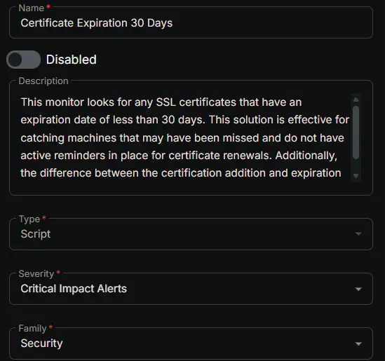
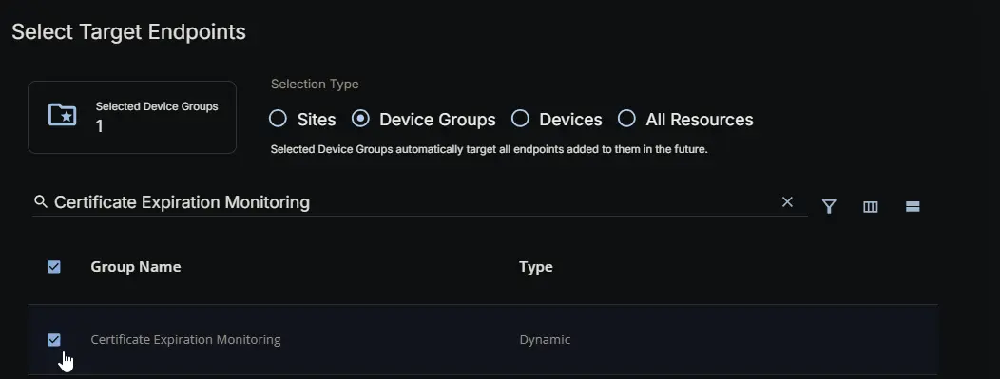
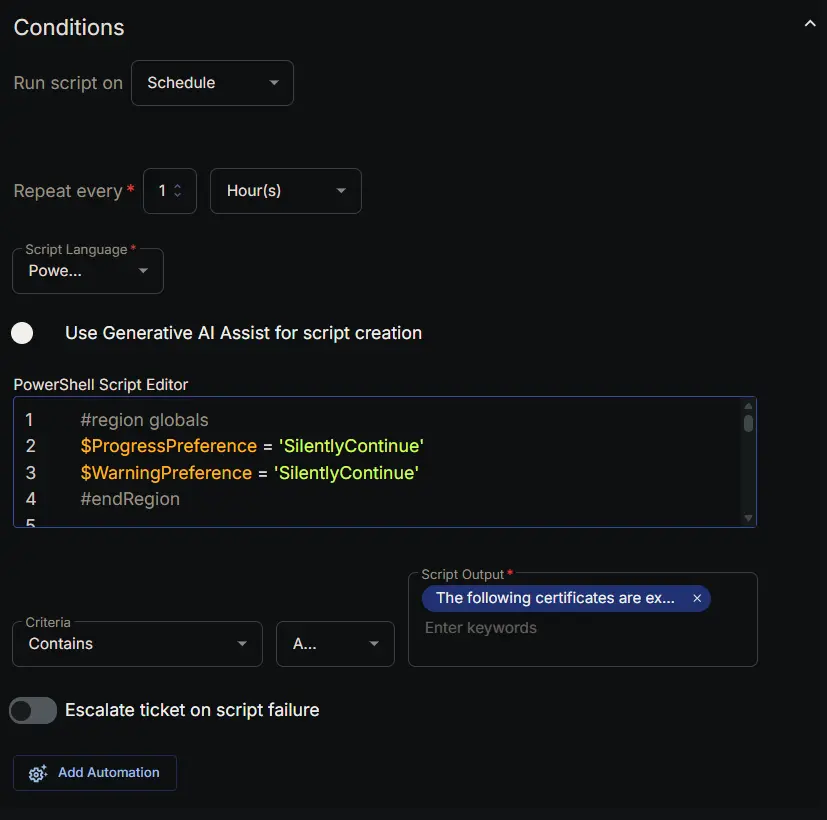

## Summary

This monitor looks for any SSL certificates that have an expiration date of less than 30 days. This solution is effective for catching machines that may have been missed and do not have active reminders in place for certificate renewals. Additionally, the difference between the certification addition and expiration should be at least 30 days to trigger an alert.

## Dependencies

- [Custom Field: Certificate Expiration Alert](/docs/41d685b3-0e7c-41b6-802d-2d1a9b25593c)
- [Custom Field: Disable Cert Expiration Alerts](/docs/9fa7d829-75c9-455d-9908-d695e0ae0a96)
- [Custom Field: Disable Cert Expiration Alert](/docs/f329bc75-50a0-497a-bfa9-4d54a281101c)
- [Group: Certificate Expiration Monitoring](/docs/0cf27d9a-8aeb-4555-92a2-45e993e1bd87)
- [Solution: Certificate Expiration Monitoring](/docs/4712590e-18e7-47f7-a038-ab704f5859c2)

## Monitor Setup Location

**Monitors Path:** `ENDPOINTS` ➞ `Alerts` ➞ `Monitors`  

## Monitor Summary

- **Name:** `Certificate Expiration 30 Days`  
- **Description:** `This monitor looks for any SSL certificates that have an expiration date of less than 30 days. This solution is effective for catching machines that may have been missed and do not have active reminders in place for certificate renewals. Additionally, the difference between the certification addition and expiration should be at least 30 days to trigger an alert.`  
- **Type:** `Script`  
- **Severity:** `Critical Impact Alerts`  
- **Family:** `Security`

## Targeted Resources

- **Target Type:**  `Device Groups`  
- **Group Name:** `Certificate Expiration Monitoring`

## Conditions

- **Run Script on:** `Schedule`  
- **Repeat every:** `1` `Hours`  
- **Script Language:** `PowerShell`  
- **Use Generative AI Assist for script creation:** `False`  
- **PowerShell Script Editor:**  

[PowerShell Script](https://github.com/ProVal-Tech/cw-rmm/blob/main/monitors/certificate-expiration-30-days/script.ps1)

- **Criteria:**  `Contains`  
- **Operator:** `AND`  
- **Script Output:**  `The following certificates are expiring within`  
- **Escalate ticket on script failure:** `False`  
- **Add Automation:**  ` `

## Ticket Resolution

**Automatically resolve:** `False`

## Monitor Output

**Output:** `Generate Ticket`

## Completed Monitor

## Changelog

### 2026-08-24

- Updated the Strapper module import method.
- Excluded certificates whose friendly name contains "TenantEncryptionCert".

### 2026-02-19

- Initial version of the document
