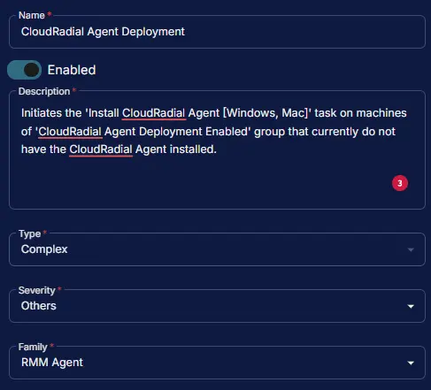
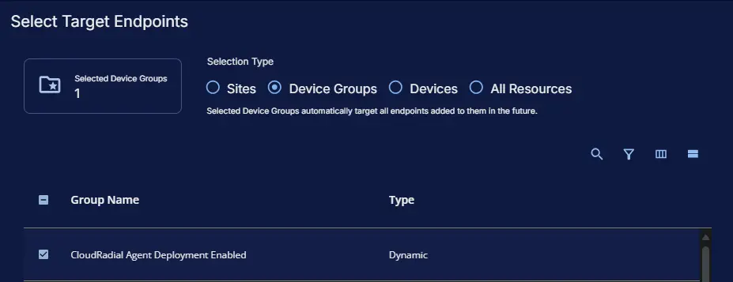
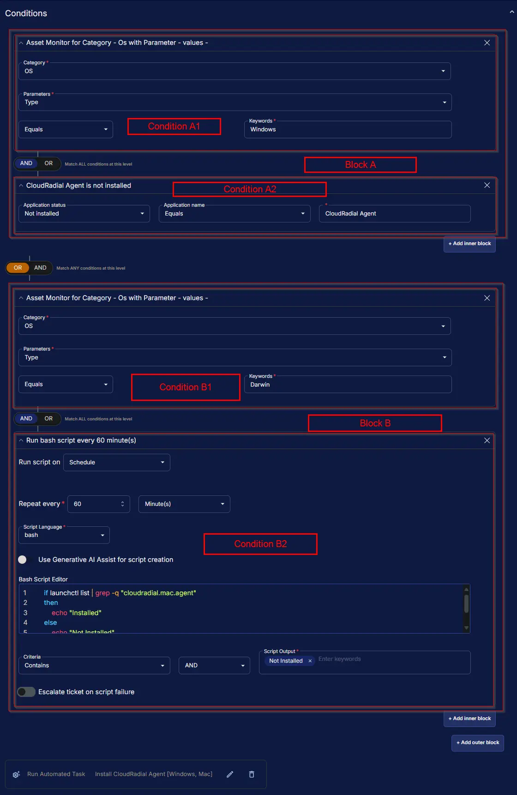
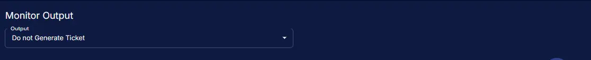
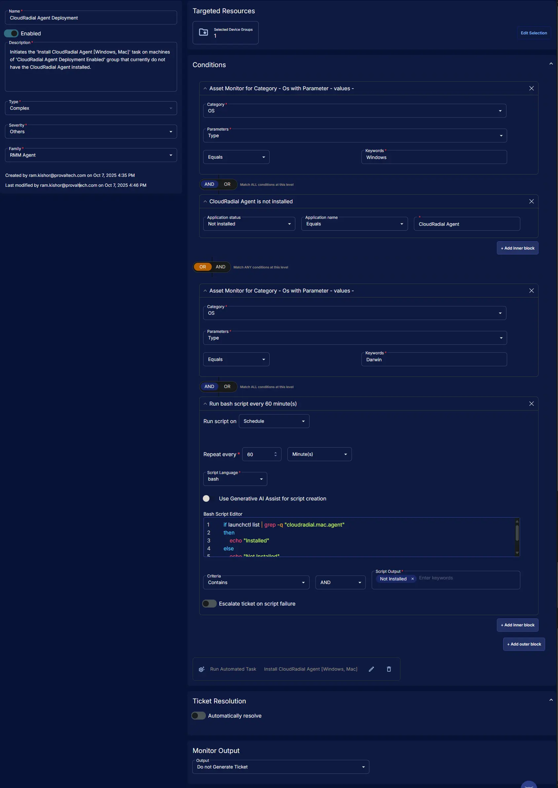

## Summary

Initiates the [Task - Install CloudRadial Agent [Windows, Mac]](/docs/76612d42-c62d-4d43-b7fd-227e350b420c) task on machines of [CloudRadial Agent Deployment Enabled](/docs/20f0900a-a34c-46c3-9181-ba89b17c14cb) group that currently do not have the CloudRadial Agent installed.

## Dependencies

- [Group - CloudRadial Agent Deployment Enabled](/docs/20f0900a-a34c-46c3-9181-ba89b17c14cb)
- [Task - Install CloudRadial Agent [Windows, Mac]](/docs/76612d42-c62d-4d43-b7fd-227e350b420c)
- [Solution - CloudRadial Agent Deployment](/docs/9e861bf3-2a05-46ef-9f7f-a46f33b675c5)

## Monitor Setup Location

**Monitors Path:** `ENDPOINTS` ➞ `Alerts` ➞ `Monitors`  

## Monitor Summary

- **Name:** `CloudRadial Agent Deployment`  
- **Description:** `Initiates the 'Install CloudRadial Agent [Windows, Mac]' task on machines of 'CloudRadial Agent Deployment Enabled' group that currently do not have the CloudRadial Agent installed.`  
- **Type:** `Complex`  
- **Severity:** `Others`  
- **Family:** `RMM Agent`



## Targeted Resources

- **Target Type:**  `Device Groups`  
- **Group Name:** `CloudRadial Agent Deployment Enabled`



## Conditions

### Logic

**Block A:** `Condition A1` `AND` `Condition A2`  
**OR**  
**Block B:** `Condition B1` `AND` `Condition B2`  

### Block A

#### **Condition A1**

**Asset:**

**Category:** `OS`  
**Parameters:** `Type`  
**Check:** `Equals`  
**Keywords:** `Windows`

**AND**

#### **Condition A2**

**Application:**

**Application Status:** `Not Installed`  
**Check:** `Equals`  
**Application Name:** `CloudRadial Agent`  

### OR

### Block B

#### **Condition B1**

**Asset:**

**Category:** `OS`  
**Parameters:** `Type`  
**Check:** `Equals`  
**Keywords:** `Darwin`

**AND**

#### **Condition B2**

**Script:**

**Run Script on:** `Schedule`  
**Run Every:** `60 Minute(s)`  
**Script Language:** `bash`  
**Use Generative AI Assist for script creation:** `False`  
**Criteria:** `Contains`  
**Check:** `AND`  
**Script Output:** `Not Installed`  
**Escalate ticket on script failure:** `False`  
**Bash Script Editor:**

```bash
if launchctl list | grep -q "cloudradial.mac.agent"
then
    echo "Installed"
else
    echo "Not Installed"
fi
```

### Add Automation

**Run Automated Task:**  `Install CloudRadial Agent [Windows, Mac]`



## Ticket Resolution

**Automatically resolve:** `False`


## Monitor Output

**Output:** `Do not Generate Ticket`



## Completed Monitor


