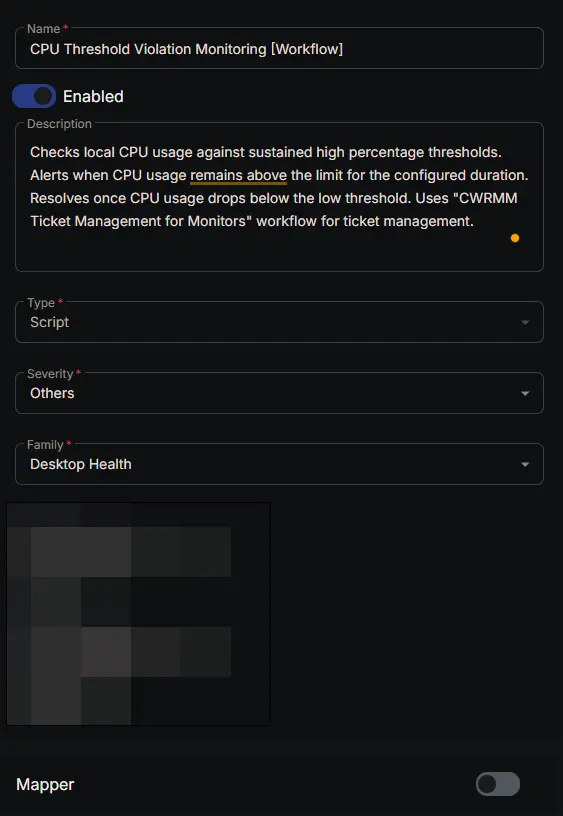
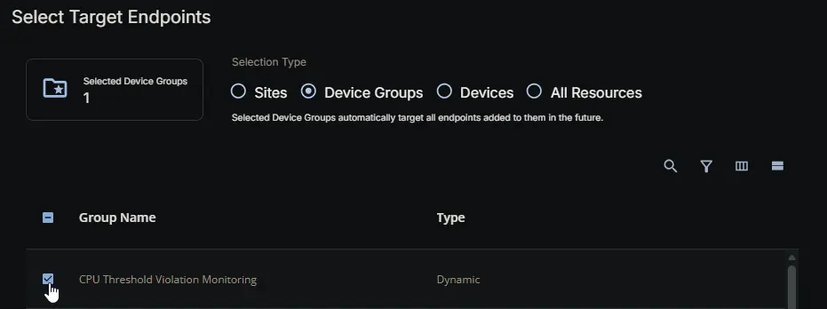
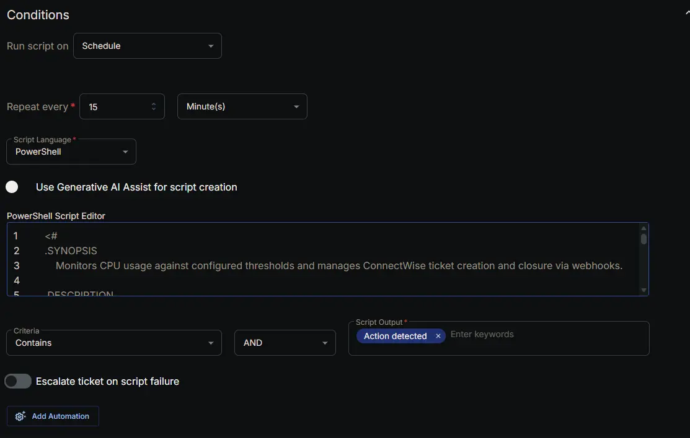
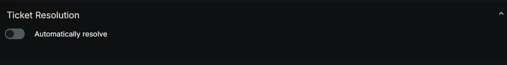
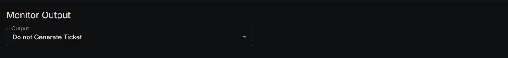
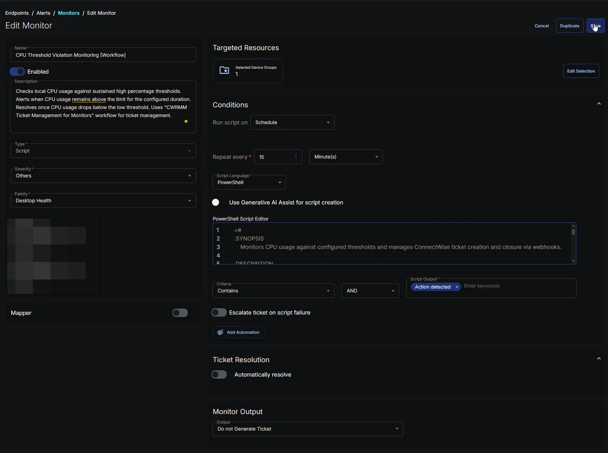

---
id: '92d7aa9c-c75b-4dba-94b4-f1d4f44e9ba9'
slug: /92d7aa9c-c75b-4dba-94b4-f1d4f44e9ba9
title: 'CPU Threshold Violation Monitoring [Workflow]'
title_meta: 'CPU Threshold Violation Monitoring [Workflow]'
keywords: ['cpu', 'monitoring', 'windows', 'alerts', 'thresholds', 'performance', 'workflow', 'trigger']
description: 'Checks local CPU usage against sustained high percentage thresholds. Alerts when CPU usage remains above the limit for the configured duration. Resolves once CPU usage drops below the low threshold. Uses "CWRMM Ticket Management for Monitors" workflow for ticket management.'
tags: ['performance', 'monitoring', 'windows']
draft: false
unlisted: false
last_update:
  date: 2026-07-23
---

## Summary

The **CPU Threshold Violation Monitoring [Workflow]** monitor continuously checks local CPU usage on Windows endpoints against the sustained‑usage thresholds defined in the configuration file generated by the [CPU Threshold Violation Monitoring Configuration Writer](/docs/5e7c137d-1750-492c-9a66-0359a04c6d3a) task. It does **not** read custom fields directly; it relies on the pre‑built JSON configuration — which also carries the ticketing webhook URL (`TicketWebhookUrl`) — to know when to alert, when to consider the condition resolved, and where to send ticket actions.

This is the **workflow‑based** variant of the monitor. The original [CPU Threshold Violation Monitoring](/docs/b03e0a64-8e91-4d2b-b08a-d320713e295b) set uses the monitor's built‑in ticketing: it raises one ticket per incident and auto‑resolves it on recovery (via the monitor set's automatic resolution rule), but the ticket subject and body are monitor‑generated and not customizable, and a comment is appended on every detection while the alert persists, making the ticket bulky. This variant instead manages the ticket lifecycle through the [CWRMM Ticket Management for Monitors](/docs/57daa951-2acc-4be7-a025-0d0ca729ef57) workflow: it tracks ticket state locally and fires webhooks to **create** a clean ticket when a sustained high‑CPU condition is confirmed and **close** it when usage recovers. Like the original, it creates a single ticket per incident and closes it automatically on recovery — but with a controlled subject and body (including the top CPU‑consuming processes), **no per‑detection comment spam**, and a standardized, workflow‑managed lifecycle.

### How It Works

1. **Configuration File**  
   At each scheduled run (every 15 minutes, as configured), the monitor reads `C:\ProgramData\_Automation\Script\Test-CPUUsage\Test-CPUUsage.json`. This file contains:
   - **HighThreshold** – the CPU usage percentage that starts the timer.
   - **LowThreshold** – the CPU percentage the usage must stay above to keep the timer running (and below which the timer resets).
   - **UsageMins** – how many minutes the CPU must remain above the low threshold (after first exceeding the high threshold) before an alert is raised.
   - **TicketWebhookUrl** – the workflow webhook URL that ticket actions are POSTed to.  
   If the file is missing or cannot be parsed, the monitor returns a failure message and skips the run without changing any state or firing any webhooks.

2. **CPU Sampling**  
   The monitor samples the `\Processor Information(_Total)\% Processor Time` counter once per second for 10 seconds and averages the result to get a stable current CPU percentage. If counter sampling fails or returns no data, the monitor returns early **without modifying any ticket state** — a safeguard so a transient counter failure never accidentally closes an open ticket.

3. **Two‑Threshold Hysteresis with a Marker File**  
   To distinguish a brief spike from a genuinely sustained condition, the monitor uses two thresholds and a small marker file (`Test-CPUUsage.flag`) that records when the current event began:
   - **No marker file:** the active threshold is the **HighThreshold**. When CPU usage first reaches or exceeds it, the marker file is created and the timer starts.
   - **Marker file present:** the active threshold drops to the **LowThreshold**. As long as CPU usage stays at or above the low threshold, the marker remains and the elapsed time (measured from the marker's creation time) keeps accumulating.
   - **Usage drops below the active threshold:** the marker file is deleted and the timer resets immediately, so the event must begin again from the high threshold.
   - **Elapsed time reaches `UsageMins`:** the sustained condition is confirmed and an alert is built for this run.

4. **Sustained‑Breach Alert Content**  
   Once the sustained condition is confirmed, the monitor builds a ticket subject (`CPU Threshold Violation - CPU - <ComputerName> - <HighThreshold> Percent`) and a body that records how long ago the spike began, the low threshold the CPU has stayed above, the current CPU percentage, and the **top five CPU‑consuming processes** (normalized across all processor cores). If PowerShell appears among those processes, the command lines of the running `powershell.exe` instances (excluding the monitor's own process) are appended to assist investigation. The CPU is then marked as "detected" for this run.

5. **Ticket State Machine (duplicate prevention)**  
   This is the core of the variant. The monitor maintains three local state files alongside the config:
   - `CPU_To_Create_Ticket.json`
   - `CPU_With_Existing_Ticket.json`
   - `CPU_To_Close_Ticket.json`

   Because the monitor tracks a single component (`CPU`), there is **at most one open CPU ticket per device**. For that component, it applies the following transitions each run:

   | CPU condition this run | Previous state | Transition | Webhook |
   | --- | --- | --- | --- |
   | Sustained breach detected | not tracked | Added to **Create** | `Create` fires |
   | Sustained breach detected | Create | Moved to **Existing** | none |
   | Sustained breach detected | Existing | Kept in **Existing** | none |
   | Recovered (below low threshold) | Create or Existing | Moved to **Close** (subject kept, body replaced with a recovery message) | `Close` fires |
   | Recovered | Close | Cleared from **Close** | none |
   | No active event | not tracked | No record | none |

   Because a confirmed breach fires `Create` only on the run it first appears and is then promoted to **Existing**, a sustained high‑CPU event produces **exactly one ticket**, no matter how many 15‑minute runs occur while it persists. On recovery, `Close` fires once and the record is then cleared, so it never fires twice.

6. **Webhook Execution**  
   When the component is newly in the **Create** list, the monitor POSTs `Action = Create`; when it is newly in the **Close** list, it POSTs `Action = Close`. Each payload carries `Action`, `TicketSubject`, `TicketBody`, and `DeviceId` (read from the endpoint's registry). The webhook URL is the `TicketWebhookUrl` value from the config file. The [CWRMM Ticket Management for Monitors](/docs/57daa951-2acc-4be7-a025-0d0ca729ef57) workflow receives the payload and performs the actual ticket creation or closure in ConnectWise. This monitor uses only the `Create` and `Close` actions; it does not send `Comment`.

7. **Reporting and Alert Signal**  
   If a `Create` or `Close` webhook fired, the monitor returns `Action detected - N component(s) for ticket creation and M component(s) for ticket closure`; otherwise it returns `CPU monitoring state evaluated successfully`. The monitor's success criteria is configured as *Script Output contains `Action detected`*, so CW RMM only flags the monitor on runs where a ticket action actually occurred. Because RMM's own ticketing is set to **Do not Generate Ticket**, **Escalate ticket on script failure = Disabled**, and **Automatically Resolve = Disabled** (closure is handled by the workflow's `Close` webhook, not by RMM), that flag is purely informational — the real ticket lives in ConnectWise and is owned by the workflow, not by RMM.

8. **Failure Handling**  
   - Missing/invalid config → run skipped, no state change, no webhooks.  
   - CPU counter sampling failure → early return that preserves existing ticket state.  
   - Webhook failure → logged, the run is reported as `Failure`, but processing continues.  
   - Note: state files are written **before** the webhooks fire, so a failed `Create` or `Close` is **not** automatically retried on the next run — the CPU condition must change state again (re‑breach or re‑recover) for a new webhook to be sent.

### Scenario – Alert Triggered (Create)

A server's CPU spikes to 98% at 10:00 AM. The configured thresholds are HighThreshold = 95%, LowThreshold = 90%, UsageMins = 30 minutes. Because 98% exceeds the high threshold, the marker file is created and the timer starts. The CPU stays above 90%, so the marker persists. On the first 15‑minute run after 30 minutes have elapsed (≈10:30 AM), the sustained condition is confirmed: the CPU is added to the **Create** list and a `Create` webhook fires. The workflow creates a ticket such as *"CPU Threshold Violation - CPU - SERVER01 - 95 Percent"* whose body lists the current usage and the top five CPU‑consuming processes.

### Scenario – Sustained Breach (No Duplicate)

The CPU remains above 90% on the following runs. The marker file still exists and the elapsed time still exceeds 30 minutes, so the CPU is "detected" again each run — but it is now found in the **Create** list (then **Existing**), so it is promoted to **Existing** and **no webhook fires**. Only the single original ticket exists for the device, regardless of how long the condition persists — no duplicates, no repeated comments.

### Scenario – Timer Reset (No Alert)

The server spikes to 98% and the marker file is created, but after 20 minutes the CPU drops to 85%. Because 85% is below the low threshold (the active threshold while the marker exists), the marker file is deleted and the timer resets before 30 minutes ever elapse. The CPU is never "detected," so no webhook fires and no ticket is created. A future spike must exceed the high threshold again to start a new event.

### Scenario – Automatic Resolution (Close)

After a ticket has been created and the CPU is in **Existing**, usage eventually drops to 10% and stays low. The marker file is removed and the CPU is no longer detected, so it is moved to the **Close** list — keeping the original ticket subject (so the workflow can match the open ticket) but replacing the body with *"CPU usage has recovered and is now below the threshold. The ticket can be closed."* A `Close` webhook fires and the workflow closes the ticket. On the following run the record is cleared from **Close**, so no further webhook is sent.

This design produces clean, workflow‑managed tickets — one per incident per device, no comment spam, and self‑closing on recovery — without the monitor‑generated formatting and per‑detection comments of the built‑in path, and without any native RMM ticketing tasks. It does depend on a valid `TicketWebhookUrl` in the configuration file (set via the [Ticket_Mgmt_Webhook_Url](/docs/8e55deb6-bef8-4501-9e64-7b25e7fcd1ab) custom field) and on the [CWRMM Ticket Management for Monitors](/docs/57daa951-2acc-4be7-a025-0d0ca729ef57) workflow being installed and reachable; if the URL is missing or invalid, webhooks fail and tickets will not be created or closed.

## Dependencies

- [Group: CPU Threshold Violation Monitoring](/docs/006889e2-8977-4957-9c4d-7381bdbea9a0)
- [Task: CPU Threshold Violation Monitoring Configuration Writer](/docs/5e7c137d-1750-492c-9a66-0359a04c6d3a)
- [Triggers: CWRMM Ticket Management for Monitors](/docs/05c811e6-c6d0-4652-b4b6-2aa83f9605c7)
- [Workflow: CWRMM Ticket Management for Monitors](/docs/57daa951-2acc-4be7-a025-0d0ca729ef57)
- [Solution: CPU Threshold Violation Monitoring](/docs/49b06af7-af3b-4aaa-a90c-8efb28a65c9e)

## Monitor Setup Location

**Monitors Path:** `ENDPOINTS` ➞ `Alerts` ➞ `Monitors`  

## Monitor Summary

- **Name:** `CPU Threshold Violation Monitoring [Workflow]`  
- **Description:** `Checks local CPU usage against sustained high percentage thresholds. Alerts when CPU usage remains above the limit for the configured duration. Resolves once CPU usage drops below the low threshold. Uses "CWRMM Ticket Management for Monitors" workflow for ticket management.`  
- **Type:** `Script`  
- **Severity:** `Others`  
- **Family:** `Desktop Health`

## Targeted Resources

- **Target Type:**  `Device Groups`  
- **Group Name:** `CPU Threshold Violation Monitoring`

## Conditions

- **Run script on:** `Schedule`  
- **Repeat every:** `15` `Minute(s)`  
- **Script Language:** `PowerShell`  
- **Use Generative AI Assist for script creation:** `False`  

- **PowerShell Script Editor:**  

[PowerShell Script](https://github.com/ProVal-Tech/cw-rmm/blob/main/monitors/cpu-threshold-violation-monitoring-workflow/script.ps1)

- **Criteria:**  `Contains`  
- **Operator:** `AND`  
- **Script Output:**  `Action detected`  
- **Escalate ticket on script failure:** `Disabled`  
- **Add Automation:**  `<Leave it untouched>`

## Ticket Resolution

- **Automatically Resolve:** `Disabled`  

## Monitor Output

**Output:** `Do not Generate Ticket`

## Completed Monitor

## Changelog

### 2026-07-23

- Initial version of the document

