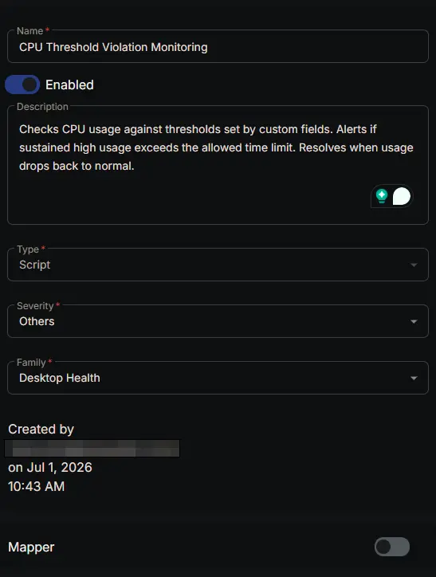
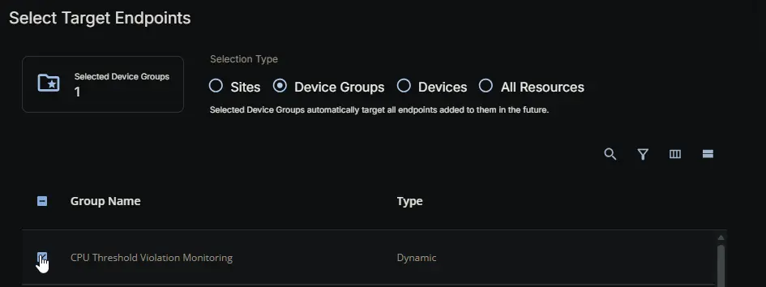
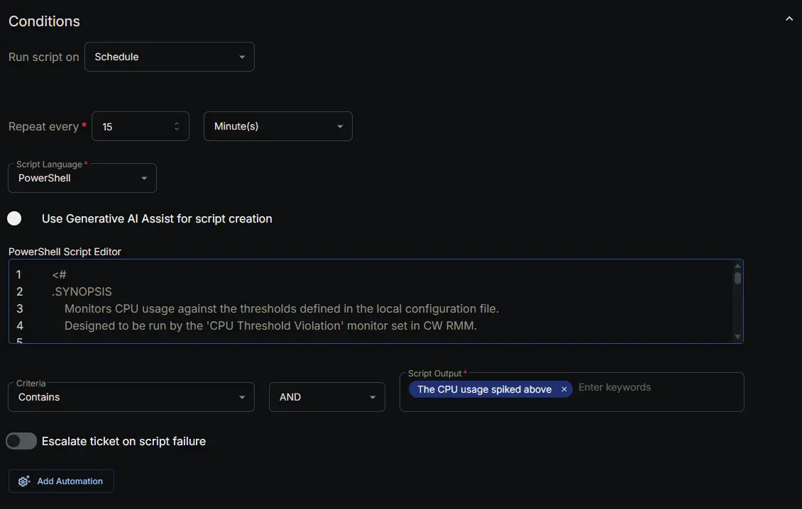
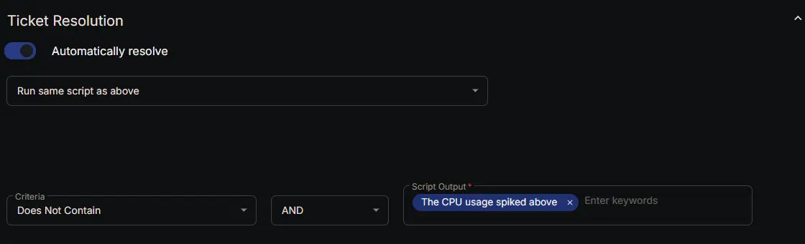
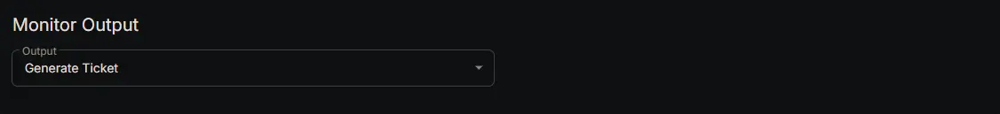
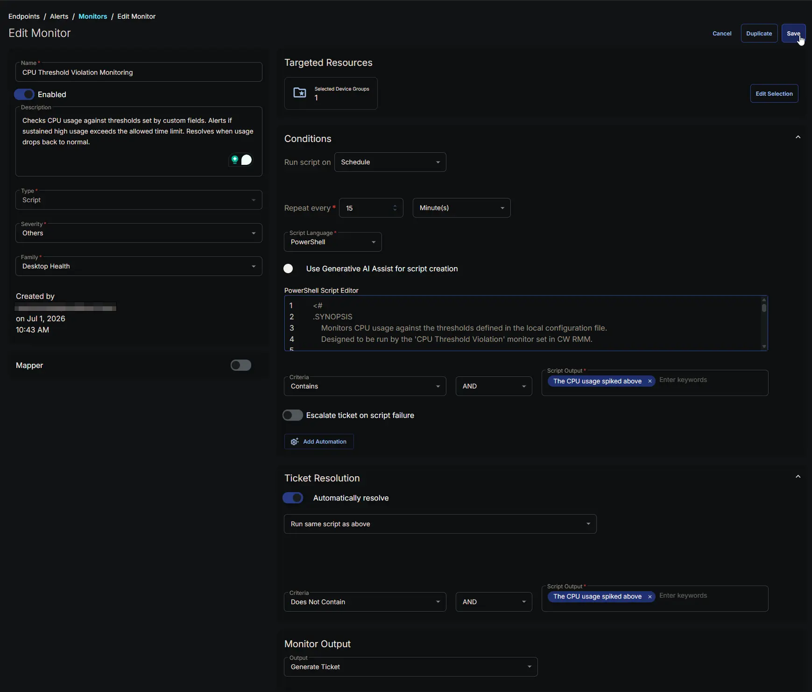

## Summary

The **CPU Threshold Violation Monitoring** monitor continuously checks the local CPU usage on Windows endpoints against the thresholds defined in the configuration file generated by the CPU Threshold Violation Configuration Writer task. It does **not** read custom fields directly; instead, it relies on the pre‑built JSON configuration to know when to alert and when to consider the situation resolved.

### How It Works

1. **Configuration File**  
   At each check interval, the monitor reads the file `C:\ProgramData\_Automation\Script\Test-CPUUsage\Test-CPUUsage.json`. This file contains three values:
   - **HighThreshold** – the CPU usage percentage that starts the timer.
   - **LowThreshold** – the CPU percentage that resets the timer if usage drops below it.
   - **UsageMins** – the number of minutes the CPU must remain above the low threshold (after initially exceeding the high threshold) before an alert is raised.

2. **Two‑Threshold Logic with a Marker File**  
   The monitor uses a small flag file (`Test-CPUUsage.flag`) to remember that a high‑CPU event has started.
   - **When the CPU usage first exceeds `HighThreshold`:** The marker file is created. The timer begins.
   - **While CPU usage remains above `LowThreshold`:** The marker file stays in place and the elapsed time is continuously measured.
   - **If the elapsed time reaches `UsageMins`:** An alert is generated.
   - **If CPU usage drops below `LowThreshold` at any point:** The marker file is deleted and the timer is immediately reset. No alert is produced.

3. **Alert Message**  
   When the sustained condition is met, the monitor outputs a detailed message that includes:
   - The high threshold that was breached and how long ago it was exceeded.
   - The low threshold that the CPU has remained above.
   - The current CPU usage percentage.
   - A list of the top five processes consuming CPU resources.
   - If PowerShell is among those processes, its full command line is appended to assist with investigation.

4. **Resolution**  
   Once the CPU usage falls back below the low threshold, the marker file is deleted. The monitor produces no output, which the monitor set interprets as a healthy state. If automatic resolution is enabled (as configured in the monitor set), the corresponding ticket is closed automatically.

### Scenario – Alert Triggered

A server’s CPU usage spikes to 98% at 10:00 AM. The configured thresholds are:

- HighThreshold = 95%
- LowThreshold = 90%
- UsageMins = 30 minutes

The CPU stays above 90% for the next 35 minutes. At approximately 10:35 AM, the monitor detects that the sustained time has exceeded 30 minutes and returns an alert message. A ticket is created with the CPU percentage and the list of top processes.

### Scenario – Alert Not Triggered (Timer Reset)

The same server experiences a spike to 98%, but after 20 minutes the CPU drops to 85%. Because 85% is below the low threshold, the marker file is deleted. The timer resets. When the monitor next runs, it sees no marker file and uses the high threshold again. No alert is generated.

### Scenario – Automatic Resolution

Later in the day, the CPU usage drops to 10% and stays low. On the next check, the marker file (if it existed) is removed. The monitor outputs nothing, indicating a healthy state. The monitor set’s automatic resolution rule then closes any open ticket for this machine.

This design ensures that brief spikes or momentary dips do not cause unnecessary tickets, while truly sustained high CPU usage is reliably flagged for investigation.

## Dependencies

- [Group: CPU Threshold Violation Monitoring](/docs/006889e2-8977-4957-9c4d-7381bdbea9a0)
- [Task: CPU Threshold Violation Monitoring Configuration Write](/docs/5e7c137d-1750-492c-9a66-0359a04c6d3a)
- [Solution: CPU Threshold Violation Monitoring](/docs/49b06af7-af3b-4aaa-a90c-8efb28a65c9e)

## Monitor Setup Location

**Monitors Path:** `ENDPOINTS` ➞ `Alerts` ➞ `Monitors`  

## Monitor Summary

- **Name:** `CPU Threshold Violation Monitoring`  
- **Description:** `Checks CPU usage against thresholds set by custom fields. Alerts if sustained high usage exceeds the allowed time limit. Resolves when usage drops back to normal.`  
- **Type:** `Script`  
- **Severity:** `Others`  
- **Family:** `Desktop Health`



## Targeted Resources

- **Target Type:**  `Device Groups`  
- **Group Name:** `CPU Threshold Violation Monitoring`



## Conditions

- **Run script on:** `Schedule`  
- **Repeat every:** `15` `Minute(s)`  
- **Script Language:** `PowerShell`  
- **Use Generative AI Assist for script creation:** `False`  

- **PowerShell Script Editor:**  

```PowerShell
<#
.SYNOPSIS
    Monitors CPU usage against the thresholds defined in the local configuration file.
    Designed to be run by the 'CPU Threshold Violation' monitor set in CW RMM.

.DESCRIPTION
    This script is executed periodically by a monitor set. It reads CPU threshold values
    from the JSON configuration file placed by the CPU Threshold Violation Monitoring Configuration Writer task.
    The logic uses a marker file to track how long CPU has remained above the low threshold
    after spiking above the high threshold.

    If the sustained period is exceeded, an alert message is generated with the current CPU
    value and the top CPU‑consuming processes. Otherwise, the script returns silently,
    signalling a healthy state.

.NOTES
    Script Name   = CPU Threshold Violation Monitor
    Configuration = $env:ProgramData\_Automation\Script\Test-CPUUsage\Test-CPUUsage.json
    Marker File   = $env:TEMP\cpu_over_t

.OUTPUTS
    - On alert: multi‑line string containing the alert details.
    - On healthy state or resolution: no output.
#>

#region globals
$ProgressPreference = 'SilentlyContinue'
$WarningPreference = 'SilentlyContinue'
#endregion

#region variables
$projectName = 'Test-CPUUsage'
$workingDirectory = '{0}\_Automation\Script\{1}' -f $env:ProgramData, $projectName
$configPath = '{0}\{1}.json' -f $workingDirectory, $projectName
$markerFile = '{0}\{1}.flag' -f $workingDirectory, $projectName
#endregion

#region config import
if (-not (Test-Path -Path $configPath)) {
    return 'CPU monitoring configuration file not found. Skipping check.'
}

try {
    $rawJson = Get-Content -Path $configPath -Raw -Encoding UTF8 -ErrorAction Stop
    $config = $rawJson | ConvertFrom-Json -ErrorAction Stop
} catch {
    return ('Failed to read or parse the configuration file. Error: {0}' -f $Error[0].Exception.Message)
}

[int]$highThreshold = $config.HighThreshold
[int]$lowThreshold = $config.LowThreshold
[int]$usageMinutes = $config.UsageMins
#endregion

#region monitoring
# Decide which threshold to use based on the marker file
if (Test-Path -Path $markerFile) {
    [int]$activeThreshold = $lowThreshold
} else {
    [int]$activeThreshold = $highThreshold
}

# Sample CPU over 10 seconds
$cpuSamples = Get-Counter -Counter '\Processor Information(_Total)\% Processor Time' -SampleInterval 1 -MaxSamples 10 -ErrorAction SilentlyContinue
if (-not $cpuSamples) {
    return 'Unable to retrieve CPU performance counter data.'
}

$currentCpu = ($cpuSamples.CounterSamples.CookedValue | Measure-Object -Average).Average

if ($currentCpu -ge $activeThreshold) {
    # Sustained high CPU - create marker if missing and calculate elapsed time
    if (-not (Test-Path -Path $markerFile)) {
        $null > $markerFile
    }

    $markerCreationTime = (Get-Item -Path $markerFile -ErrorAction SilentlyContinue).CreationTime
    $elapsedMinutes = [Math]::Round((New-TimeSpan -Start $markerCreationTime -End (Get-Date)).TotalMinutes)

    if ($elapsedMinutes -ge $usageMinutes) {
        # Build the top‑processes string
        $processSamples = Get-Counter -Counter '\Process(*)\% Processor Time' -ErrorAction SilentlyContinue
        $topProcessesString = ''
        if ($processSamples) {
            $topProcesses = $processSamples.CounterSamples |
                Where-Object { $_.InstanceName -notin '_total', 'idle' } |
                Group-Object InstanceName |
                ForEach-Object {
                    [PSCustomObject]@{
                        Process  = $_.Name
                        CPUUsage = [math]::Round(($_.Group | Measure-Object -Property CookedValue -Sum).Sum / [System.Environment]::ProcessorCount, 2)
                    }
                } |
                Sort-Object -Property CPUUsage -Descending |
                Select-Object -First 5

            $topProcessesString = ($topProcesses | Format-Table -AutoSize | Out-String).TrimEnd()
        } else {
            $topProcessesString = '(Unable to collect per-process CPU data)'
        }

        # Build the alert message
        $alertMessage = 'The CPU usage spiked above {0}% {1} minutes ago and has remained consistently above {2}% since then.{3}Current CPU Usage: {4}%{3}{3}Top 5 Processes utilizing CPU:{3}{5}' -f $highThreshold, $elapsedMinutes, $lowThreshold, [System.Environment]::NewLine, [Math]::Round($currentCpu, 2), $topProcessesString

        # Append PowerShell command line if PowerShell is among top processes
        if ($topProcessesString -match 'powershell') {
            $alertMessage += '{0}{0}PowerShell Process Command Line:{0}' -f [System.Environment]::NewLine
            try {
                $psProcesses = Get-CimInstance -Class Win32_Process -Filter 'Name = ''powershell.exe''' -ErrorAction SilentlyContinue |
                    Where-Object -FilterScript {
                        $_.ProcessId -ne $pid
                    }
                $psLines = $psProcesses.CommandLine -join [System.Environment]::NewLine
                $alertMessage += $psLines
            } catch {
                $alertMessage += '(Could not retrieve PowerShell command lines)'
            }
        }

        return ($alertMessage | Out-String)
    }
} else {
    # CPU dropped below active threshold - reset the timer
    if (Test-Path -Path $markerFile) {
        Remove-Item -Path $markerFile -Force -ErrorAction SilentlyContinue
    }
    # No output = success
}
#endregion
```

- **Criteria:**  `Contains`  
- **Operator:** `AND`  
- **Script Output:**  `The CPU Usage spiked above`  
- **Escalate ticket on script failure:** `Disabled`  
- **Add Automation:**  `<Leave it untouched>`



## Ticket Resolution

- **Automatically Resolve:** `Enabled`  
- **Dropdown Option:** `Run same script as above`

- **Criteria:**  `Does Not Contain`  
- **Operator:** `AND`  
- **Script Output:**  `The CPU Usage spiked above`  



## Monitor Output

**Output:** `Generate Ticket`



## Completed Monitor



## Changelog

### 2026-07-01

- Initial version of the document
