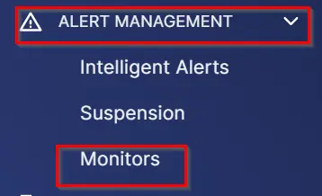
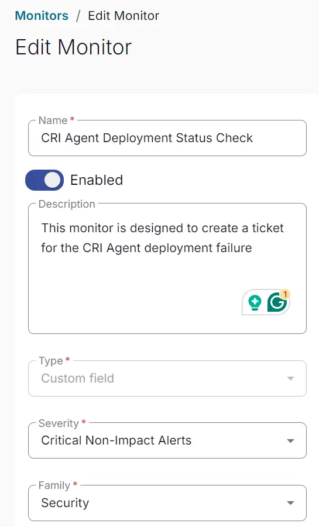
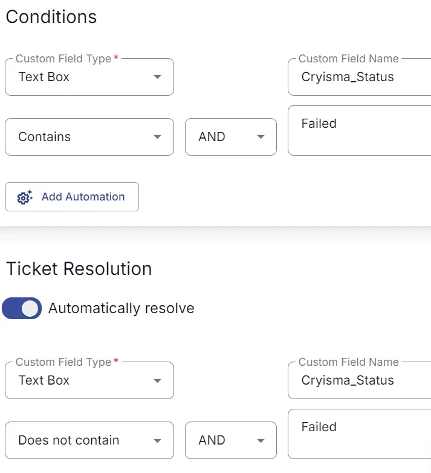
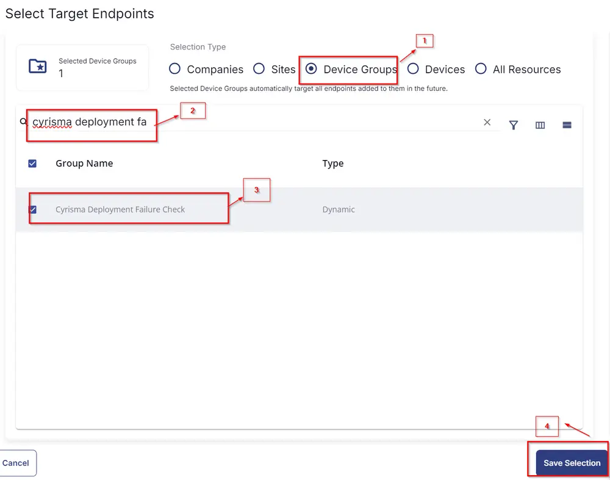

## Summary

This monitor is designed to create a ticket for the CRI Agent deployment failure.

## Create and Implement Monitor

- Click on **Alert Management** -> **Monitors** -> **Create Monitor**  
    
    

- **Name**: CRI Agent Deployment Status Check  
  **Description**: This monitor is designed to create a ticket for the CRI Agent deployment failure  
  **Type**: Custom Field  
  **Severity**: Critical Non-Impact Alerts  
  **Family**: Security  
    

- Set the **Conditions** as shown below:  
    

- Set **Target** as shown below:  
    

- Once all is done, click **Save**. The monitor will be created, and ticket creation will be set for the [CW RMM - Task - CRI Agent Deployment](/docs/344a3ab5-d05c-41a5-9303-45fc387ec2e8) status check.

## Target

Dynamic Group: Cyrisma Deployment Failure Check
