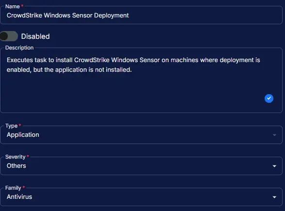
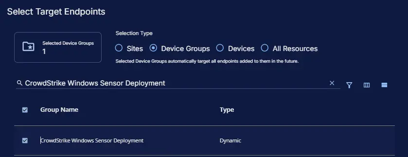
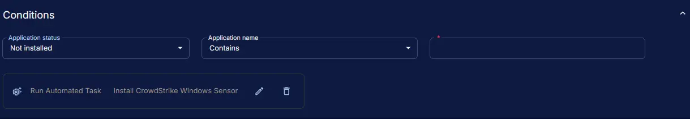
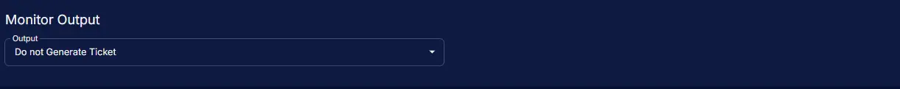
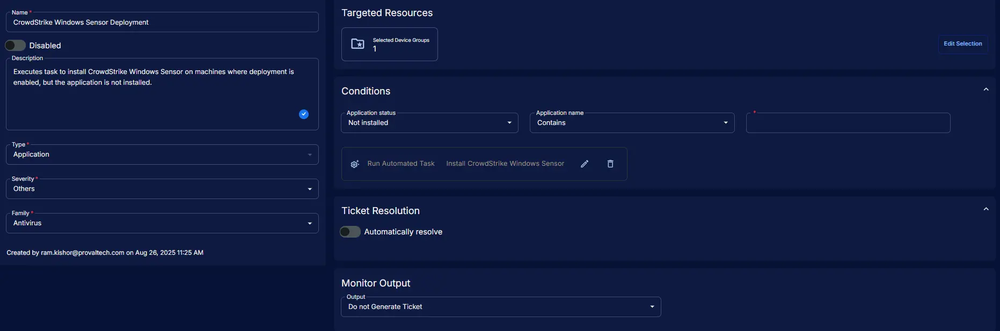

## Summary

Executes [task](/docs/7eb5860d-08e2-41cb-b22b-48505618f1ae) to install CrowdStrike Windows Sensor on machines where deployment is enabled, but the application is not installed.

## Dependencies

- [DeployCrowdStrikeWindowsSensor](/docs/ffe13fcc-700f-41ea-9fdf-20ea4d253326)
- [ExcludeCrowdStrikeInstallDevice](/docs/cde64225-1c67-4483-9c39-580b315dd30a)
- [ExcludeCrowdStrikeInstallSite](/docs/8d9498e0-4392-471e-93da-b546e0934b89)
- [CrowdStrikeDownloadUrl](/docs/ae84e56d-df98-42da-b293-7412c01d7db7)
- [CrowdStrikeCustomerId](/docs/28f5fdfd-c11e-4643-ae07-62d6f7007805)
- [CrowdStrike Windows Sensor Deployment](/docs/406c6d18-a948-45f6-897b-b1d0174e21de)
- [Install CrowdStrike Windows Sensor](/docs/7eb5860d-08e2-41cb-b22b-48505618f1ae)
- [Solution: Deploy CrowdStrike Windows Sensor](/docs/dec6391a-c159-4b45-8c3a-9df4d88dd1c5)

## Monitor Setup Location

**Monitors Path:** `ENDPOINTS` ➞ `Alerts` ➞ `Monitors`  

## Monitor Summary

- **Name:** `CrowdStrike Windows Sensor Deployment`  
- **Description:** `Executes task to install CrowdStrike Windows Sensor on machines where deployment is enabled, but the application is not installed.`  
- **Type:** `Application`  
- **Severity:** `Others`  
- **Family:** `Antivirus`

## Targeted Resources

- **Target Type:**  `Device Groups`  
- **Group Name:** `CrowdStrike Windows Sensor Deployment`

## Conditions

- **Application Status:** `Not Installed`  
- **Application Name:** `Contains`  
- **Enter Value:** `CrowdStrike Windows Sensor`
- **Add Automation:**  `Install CrowdStrike Windows Sensor`

## Ticket Resolution

**Automatically Resolve:** `Disabled`

## Monitor Output

**Output:** `Do not Generate Ticket`

## Completed Monitor

