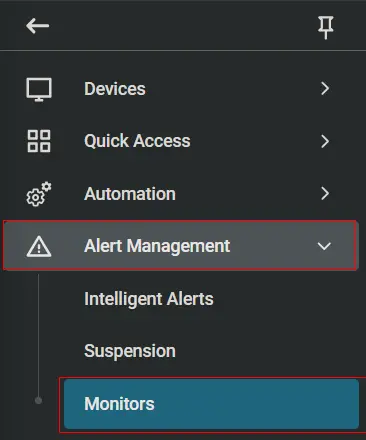
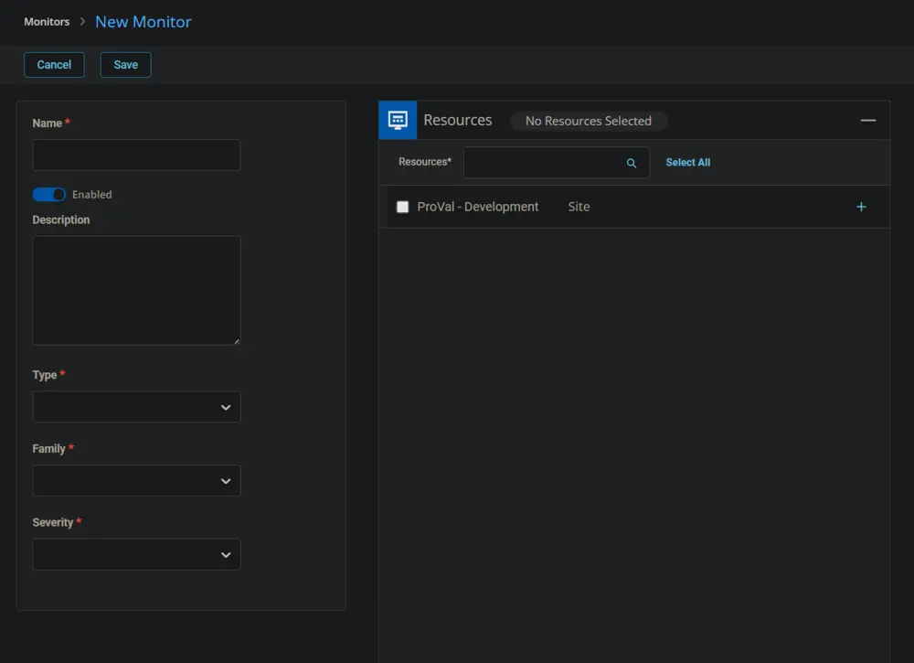
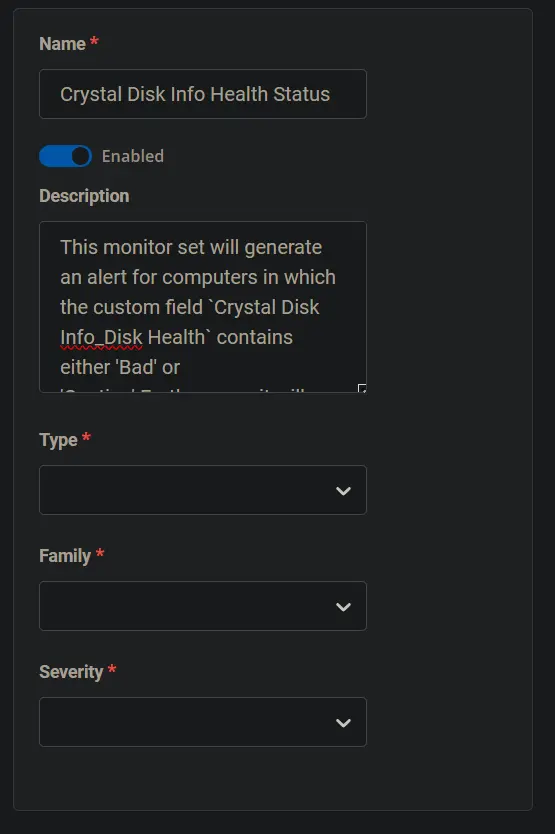
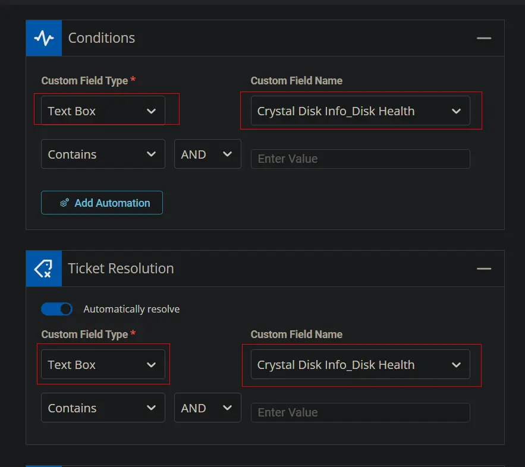
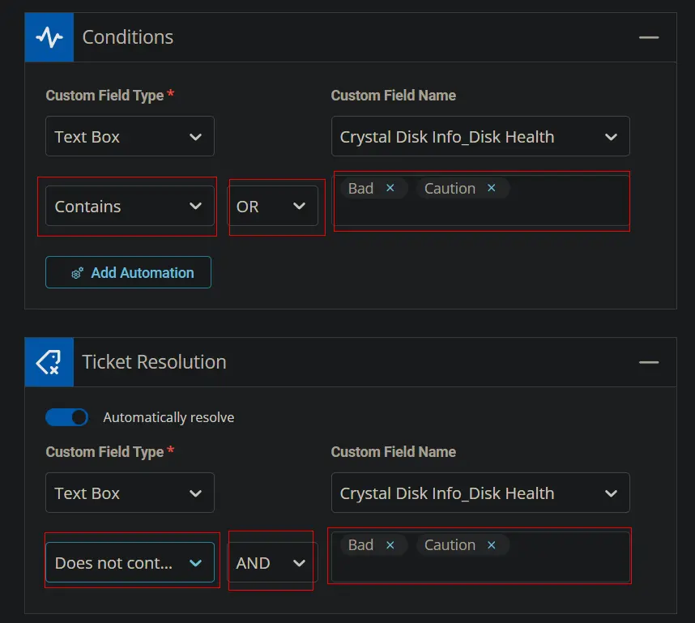
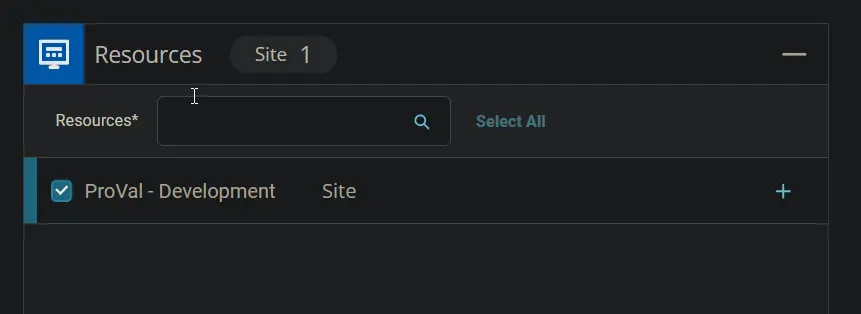
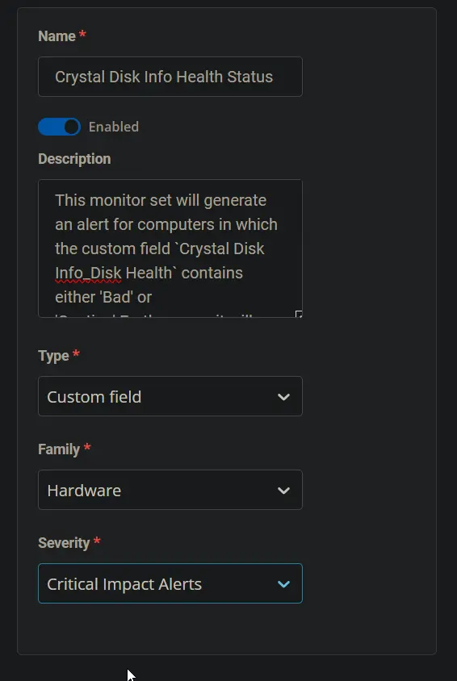
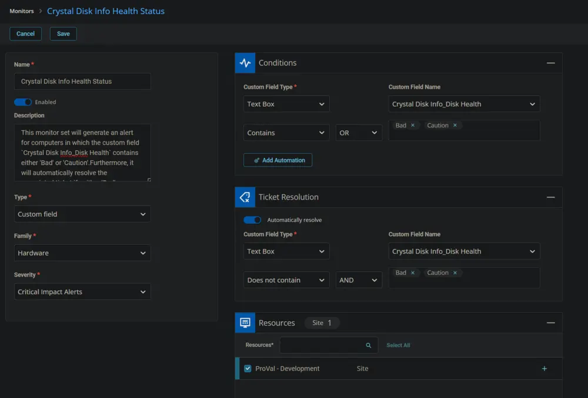
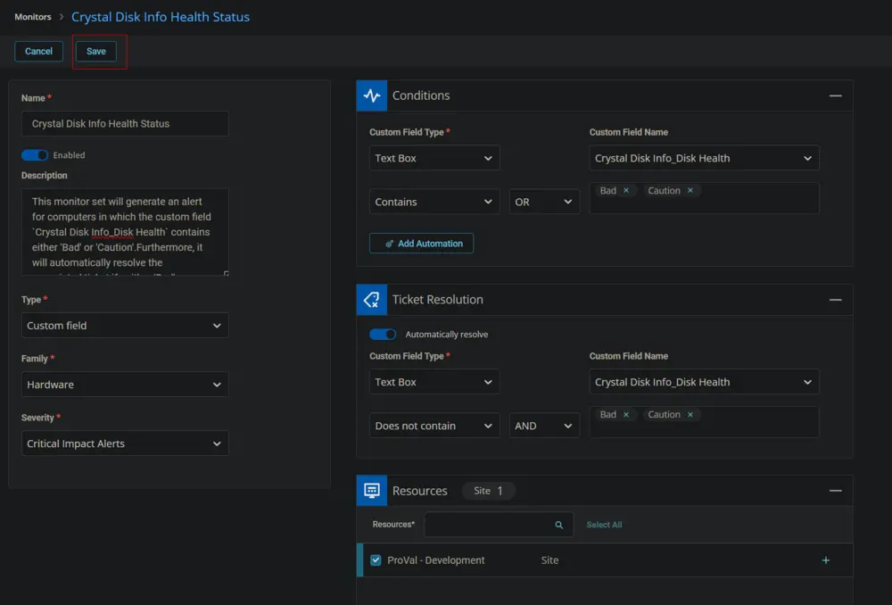

## Summary

The monitor set will generate an alert for computers in which the custom field [CW RMM - Custom Field - Crystal Disk Info_Disk Health](/docs/1e713ef3-1378-4601-a00a-c8a8ecd60c01) contains either 'Bad' or 'Caution.' Furthermore, it will automatically resolve the associated ticket if neither 'Bad' nor 'Caution' is present in the aforementioned custom field.

## Monitor

1. Go to **Alert Management > Monitors**.  
   

2. Click the **Add Monitor** button.  
   

3. This screen will appear.  
   

4. Fill in the Name and Description boxes.  
   **Name:** Crystal Disk Info Health Status  
   **Description:** This monitor set will generate an alert for computers in which the custom field `Crystal Disk Info_Disk Health` contains either 'Bad' or 'Caution'. Furthermore, it will automatically resolve the associated ticket if neither 'Bad' nor 'Caution' is present in the aforementioned custom field.  
   

5. Select the **Custom Field** in the Type dropdown.  
   

6. Select the **Text Box** from the **Custom Field Type** dropdown and **Crystal Disk Info_Disk Health** from the **Custom Field Name** dropdown for both **Conditions** and **Ticket Resolution** sections.  
   

7. Leave the **Conditions** section condition as `Contains` and select `Does not contain` condition for the **Ticket Resolution** section. Select `OR` for the operator in the **Conditions** section and `AND` as the operator in the **Ticket Resolution** section. For the **value field**, type `Bad`, then press Enter, and type `Caution`, pressing Enter for both sections.  
   

8. Select the Resources/Clients to apply the monitor set against.  
   

9. Select **Hardware** for the **Family** and **Critical Impact Alerts** or any relevant option for the **Severity**.  
   

10. This is how the monitor set should look before saving it.  
    

11. Click the **Save** button to save the monitor set.  
    

## Dependencies

- [CW RMM - Custom Field - Crystal Disk Info_Disk Health](/docs/1e713ef3-1378-4601-a00a-c8a8ecd60c01)  
- [CW RMM - Task - Get Crystal Disk Info (Disk Health)](/docs/37220488-64d2-4de9-8e65-1cd53f5dee3b)