## Summary

The monitor set will generate an alert for computers in which the custom field [CW RMM - Custom Field - Latest Cumulative Update](/docs/67416ac2-2311-43c4-8fbf-c5b0c9a48e71) contains 'Failed.' Furthermore, it will automatically resolve the associated ticket if 'Success' is present in the aforementioned custom field.

`Failed` in the custom field indicates that a Cumulative Update has not been installed on the machine for `75` days. This threshold can be updated in `Row 1` of the [CW RMM - Task - Cumulative Update Audit](/docs/685b1f1d-527a-4d66-acb2-d1329ee8a368) task.

## Monitor

1. Go to **Alert Management > Monitors**.  
   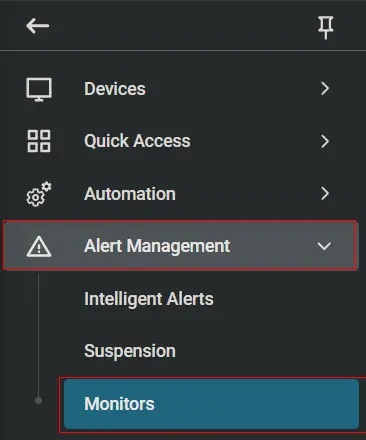

2. Click the **Add Monitor** button.  
   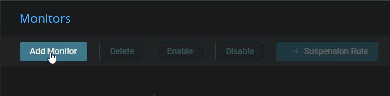

3. This screen will appear.  
   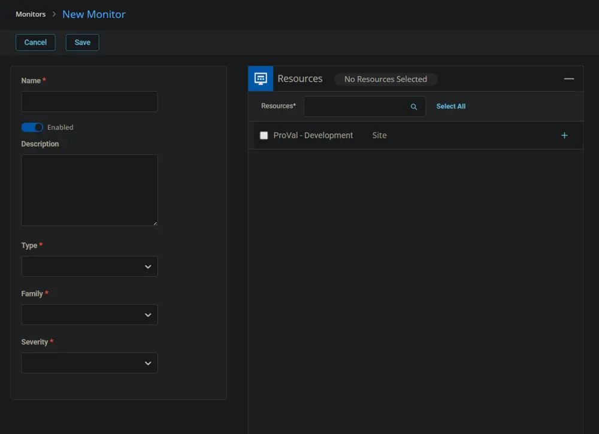

4. Fill in the Name and Description boxes.  
   **Name:** Cumulative Update Audit  
   **Description:** The monitor set will generate an alert for computers in which the custom field `Latest Cumulative Update` contains 'Failed.' Furthermore, it will automatically resolve the associated ticket if 'Success' is present in the aforementioned custom field.  
   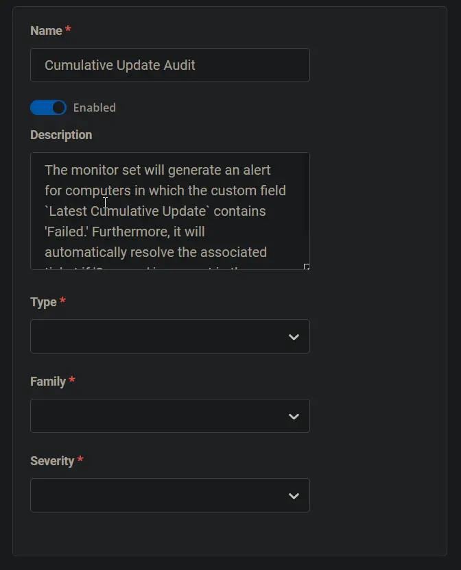

5. Select the **Custom Field** in the Type dropdown.  
   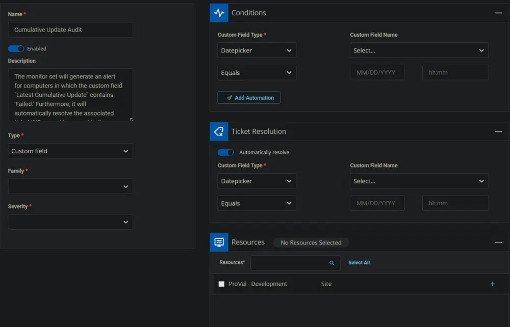

6. Select **Text Box** from the **Custom Field Type** dropdown and **Latest Cumulative Update** from the **Custom Field Name** dropdown for both **Conditions** and **Ticket Resolution** sections.  
   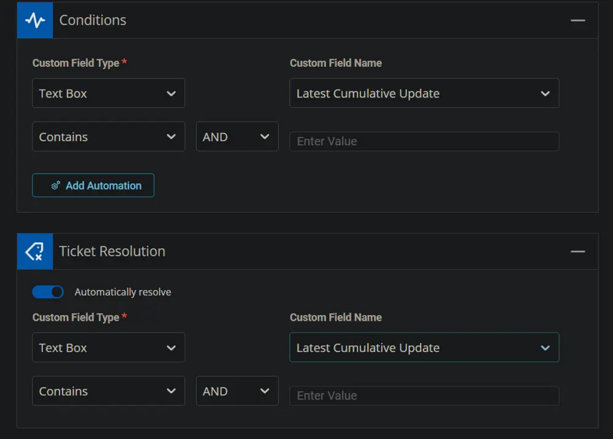

7. Add **Failed** in the **Enter Value Field** of the **Conditions** section and **Success** in the **Enter Value Field** of the **Ticket Resolution** section.  
   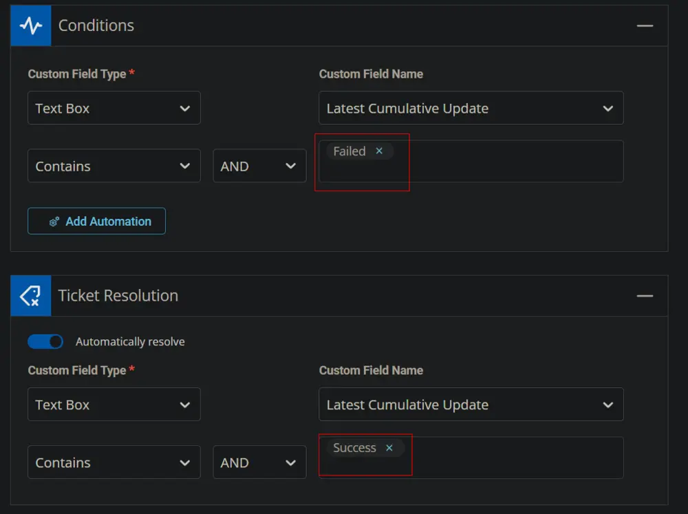

8. Select the Resources/Clients to apply the monitor set against.  
   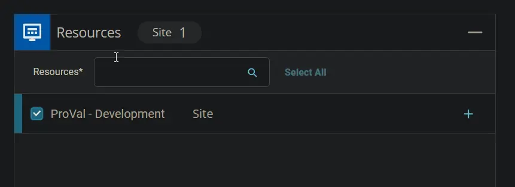

9. Select **Patch Management** for the **Family** and **Others** or any relevant option for the **Severity**.  
   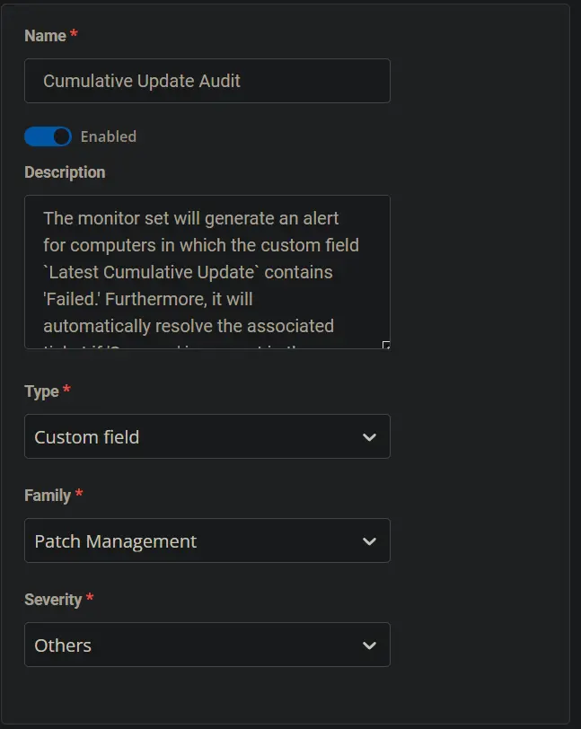

10. This is how the monitor set should look before saving it.  
    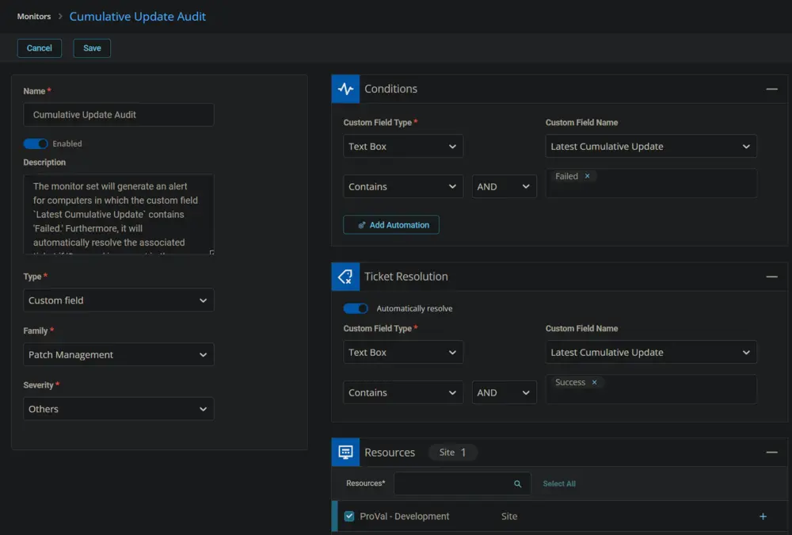

11. Click the **Save** button to save the monitor set.  
    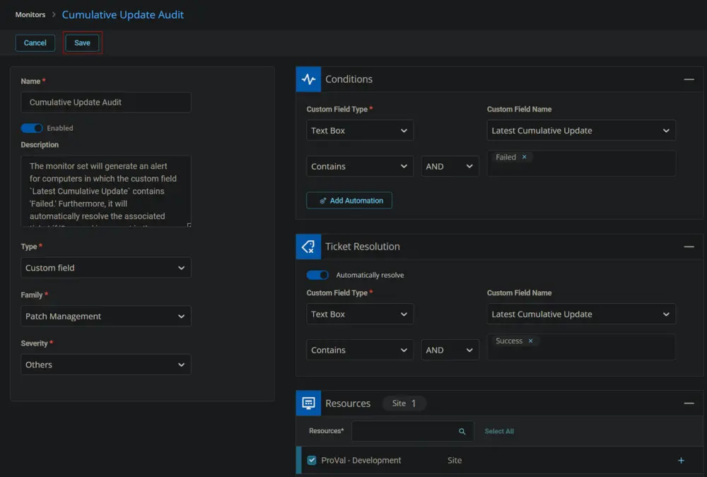

## Dependencies

- [CW RMM - Custom Field - Latest Cumulative Update](/docs/67416ac2-2311-43c4-8fbf-c5b0c9a48e71)
- [CW RMM - Task - Cumulative Update Audit](/docs/685b1f1d-527a-4d66-acb2-d1329ee8a368)

