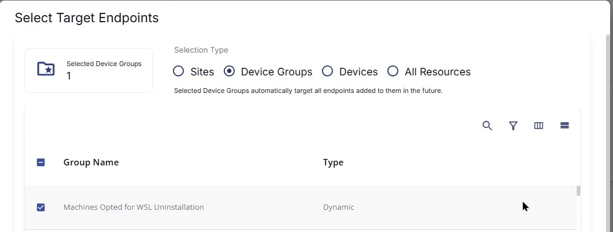
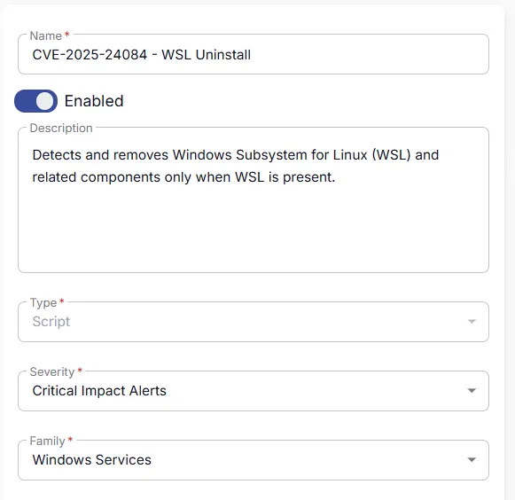
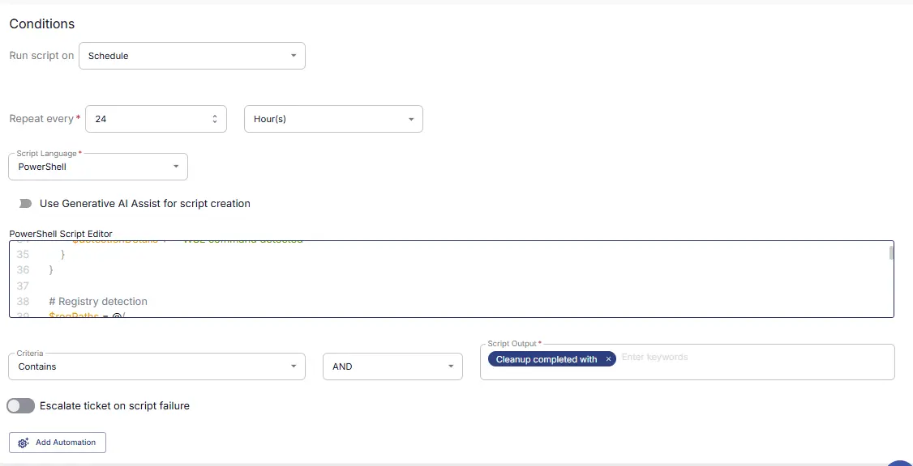
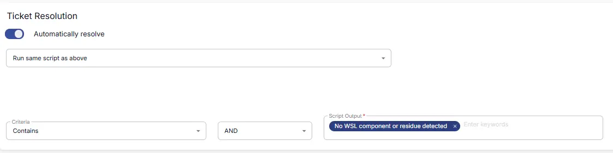
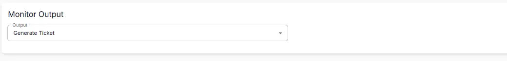
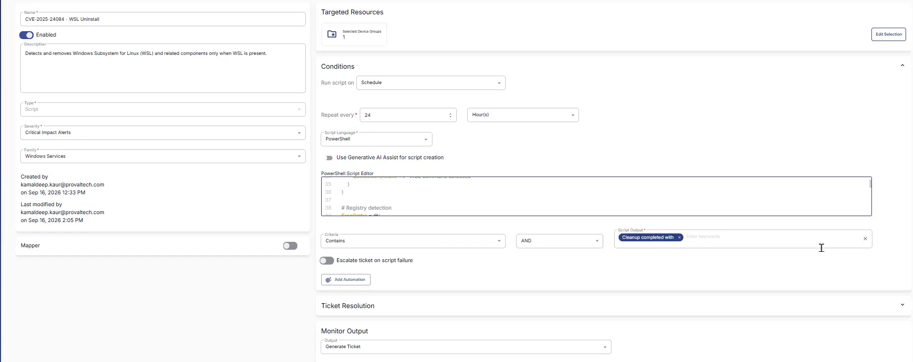

## Summary
Detects and removes Windows Subsystem for Linux (WSL) and related components only when WSL is present.

## Dependencies

- [Solution - CVE-2025-24084 - WSL Uninstall](/docs/cc418b50-c30e-4319-950e-ffa6347dd74e)  

## Target

This monitor should target the group shown below:  

## Monitor Creation

### Step 1

Navigate to `ENDPOINTS` ➞ `Alerts` ➞ `Monitors`  

### Step 2

Locate the `Create Monitor` button on the right-hand side of the screen and click on it.  

This page will appear after clicking on the `Create Monitor` button:  

### Step 3

Fill in the mandatory columns on the left side  
**Name:** `CVE-2025-24084 - WSL Uninstall`  
**Description:** `Detects and removes Windows Subsystem for Linux (WSL) and related components only when WSL is present.`  
**Type:** `Script`  
**Severity:** `Critical Impact Alerts`  
**Family:** `Windows Services`  

### Step 4

Click the `Select Target` button to choose the endpoints for running the monitor set.  

This page will appear after clicking on the `Select Target` button:  

Click on Device Groups and select `Machines Opted for WSL Uninstallation`

## Conditions

- **Run script on:** `Schedule`
- **Repeat every:** `24 Hours`
- **Script Language:** `PowerShell`
- **Use Generative AI Assist for script creation:** `False`
- **PowerShell Script Editor:**

  Navigate to the [`cw-rmm` repository](https://github.com/ProVal-Tech/cw-rmm), open the script linked below, copy the raw code, and paste it into the RMM script editor:
  
  [PowerShell Script](https://github.com/ProVal-Tech/cw-rmm/blob/main/monitors/cve-2025-24084-wsl-uninstall/script.ps1)

- **Criteria:** `Contains`
- **Operator:** `AND`
- **Script Output:** `Cleanup completed with`
- **Escalate ticket on script failure:** `Disabled`
- **Add Automation:** ``

## Ticket Resolution

- **Automatically Resolve:** `Enabled`
- **Dropdown Option:** `Run same script as above`
- **Criteria:** `Contains`
- **Operator:** `AND`
- **Script Output:** `No WSL component or residue detected.`

## Monitor Output

- **Output:** `Generate Ticket`

## Completed Monitor

## Changelog

### 2026-09-16

- Initial version of the document
