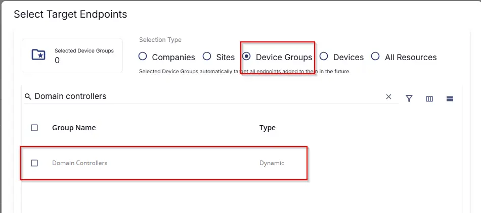
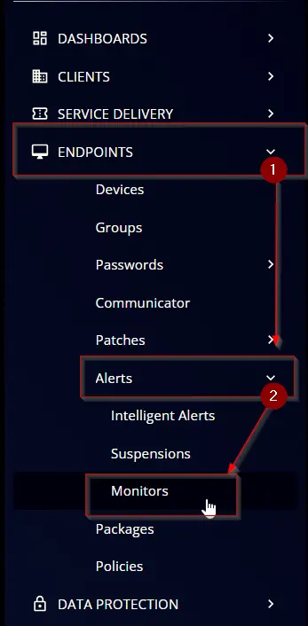
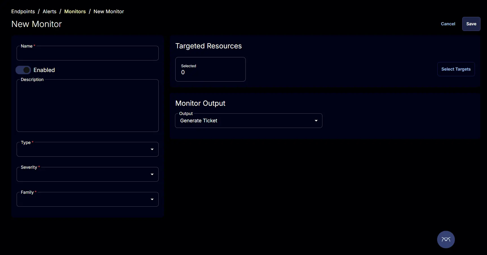
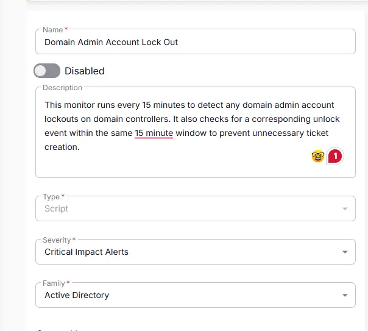
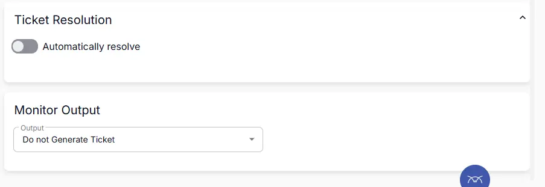
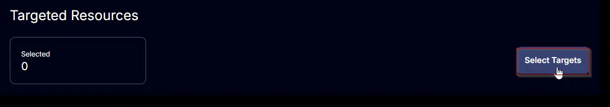
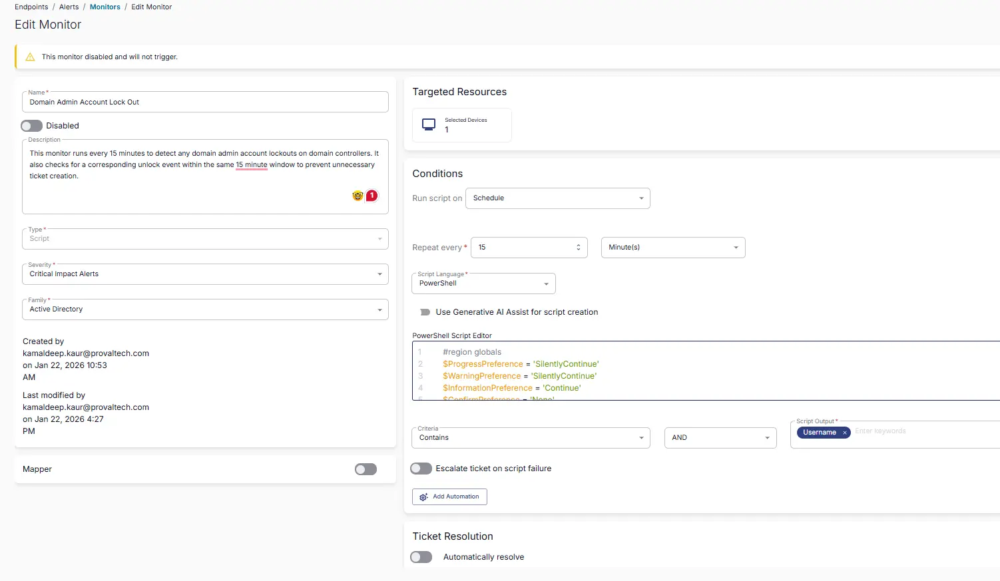

## Summary
This monitor runs every 15 minutes to detect any domain admin account lockouts on domain controllers. It also checks for a corresponding unlock event within the same 15 minute window to prevent unnecessary ticket creation.


## Target

`Domain Controllers`  
This should target the group 'Domain Controllers' as shown below:



## Monitor Creation

### Step 1

Navigate to `ENDPOINTS` ➞ `Alerts` ➞ `Monitors`  


### Step 2

Locate the `Create Monitor` button on the right-hand side of the screen and click on it.  


This page will appear after clicking on the `Create Monitor` button:  


### Step 3

### Fill in the mandatory columns on the left side  
- Name: `Domain Admin Account LockOut`  
- Description: `This monitor runs every 15 minutes to detect any domain admin account lockouts on domain controllers. It also checks for a corresponding unlock event within the same 15 minute window to prevent unnecessary ticket creation.`  
- Type: `Script`  
- Severity: `Critical Impact Results`  
- Family: `Active Directory`  



 
   **Conditions:**
   - **Run script on:** Schedule
   - **Repeat every:** 15 minutes
   - **Script Language:** PowerShell
   - **PowerShell Script:**

  ```powershell
  #region globals
$ProgressPreference = 'SilentlyContinue'
$WarningPreference = 'SilentlyContinue'
$InformationPreference = 'Continue'
$ConfirmPreference = 'None'
#endRegion

#region constants
$logName = 'Security'
$lockedOutId = 4740
$unlockedId = 4767
$intervalMinutes = 15
#endRegion

#region variables
$startTime = (Get-Date).AddMinutes(-$intervalMinutes)
$lockedOutFilterHashTable = @{
    LogName   = $logName
    Id        = $lockedOutId
    StartTime = $startTime
}
$unlockedFilterHashTable = @{
    LogName   = $logName
    Id        = $unlockedId
    StartTime = $startTime
}
$lockedOutAdminsEventInfo = @()
$unlockedAdminsEventInfo = @()
#endRegion

#region get locked out event info
$domainAdmins = Get-ADGroupMember -Identity 'Domain Admins' -Recursive | Select-Object -ExpandProperty SamAccountName

$lockedOutInfo = Get-WinEvent -ErrorAction SilentlyContinue -FilterHashtable $lockedOutFilterHashTable
if (-not $lockedOutInfo) {
    return
}

$lockedOutEventsInfo = $lockedOutInfo | ForEach-Object {
    $lockedOutXml = ([xml]$_.ToXml()).Event
    $lockedOutObject = [ordered]@{
        EventDate = [DateTime]$lockedOutXml.System.TimeCreated.SystemTime
    }
    $lockedOutXml.EventData.ChildNodes | ForEach-Object {
        $lockedOutObject[$_.Name] = $_.'#text'
    }
    [PsCustomObject]$lockedOutObject
}
$lockedOutAdmins = $lockedOutEventsInfo | Where-Object { $domainAdmins -contains $_.TargetUserName }

$lockedOutAdmins | ForEach-Object {
    $user = $_.TargetUserName
    $lastLogin = (Get-ADUser -Identity $user -Properties LastLogonDate).LastLogonDate
    $lockoutTime = $_.EventDate
    $endpoint = $_.TargetDomainName
    $domain = $_.SubjectDomainName
    $lockedOutAdminsEventInfo += [PSCustomObject]@{
        Username    = $user
        LastLogin   = $lastLogin
        LockoutTime = $lockoutTime
        Endpoint    = $endpoint
        Domain      = $domain
    }
}

$lockedOutAdminsEventInfoUnique = $lockedOutAdminsEventInfo |
    Group-Object -Property Username |
    ForEach-Object {
        $_.Group |
            Sort-Object -Property LockoutTime -Descending |
            Select-Object -First 1
        }
#endRegion

#region get unlocked event info
$unlockedInfo = Get-WinEvent -ErrorAction SilentlyContinue -FilterHashtable $unlockedFilterHashTable
if (-not $unlockedInfo) {
    return $lockedOutAdminsEventInfoUnique
}

$unlockEventsInfo = $unlockedInfo | ForEach-Object {
    $unlockXml = ([xml]$_.ToXml()).Event
    $unlockObject = [ordered]@{
        EventDate = [DateTime]$unlockXml.System.TimeCreated.SystemTime
    }
    $unlockXml.EventData.ChildNodes | ForEach-Object {
        $unlockObject[$_.Name] = $_.'#text'
    }
    [PsCustomObject]$unlockObject
}
$unlockedAdmins = $unlockEventsInfo | Where-Object { $domainAdmins -contains $_.TargetUserName }

$unlockedAdmins | ForEach-Object {
    $user = $_.TargetUserName
    $unlockTime = $_.EventDate

    $domain = $_.SubjectDomainName
    $unlockedAdminsEventInfo += [PSCustomObject]@{
        Username   = $user
        UnlockTime = $unlockTime
        Domain     = $domain
    }
}

$unlockedOutAdminsEventInfoUnique = $unlockedAdminsEventInfo |
    Group-Object -Property Username |
    ForEach-Object {
        $_.Group |
            Sort-Object -Property UnlockTime -Descending |
            Select-Object -First 1
        }
#endRegion

#region compare lockedout time
$lockedOutAdminsEventInfoUnique | Where-Object {
    $lockedOutUser = $_
    $unlockedUser = $unlockedOutAdminsEventInfoUnique | Where-Object { $_.Username -eq $lockedOutUser.Username }
    if (-not $unlockedUser) {
        $true
    } else {
        $lockedOutUser.LockoutTime -gt $unlockedUser.UnlockTime
    }
}
#endRegion
```

 - **Criteria:** Contains
   - **Operator:** AND
   - **Script Output:** `Username`
   - **Escalate ticket on script failure:** Disabled
   - **Automatically resolve:** Disabled
   - **Monitor Output:** Generate Ticket


- Turn On Ticket Resolution
And Select `Generate Ticket` from the monitor Output DropDown.



### Step 5

Click the `Select Target` button to choose the endpoints for running the monitor set.  


This page will appear after clicking on the `Select Target` button:  


## Completed Monitor
