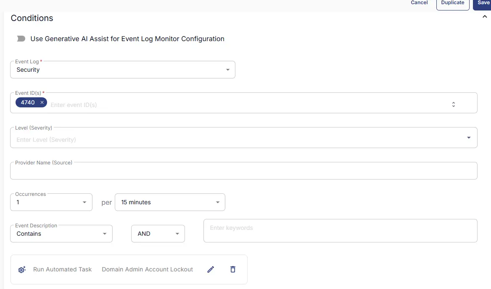
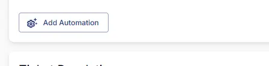
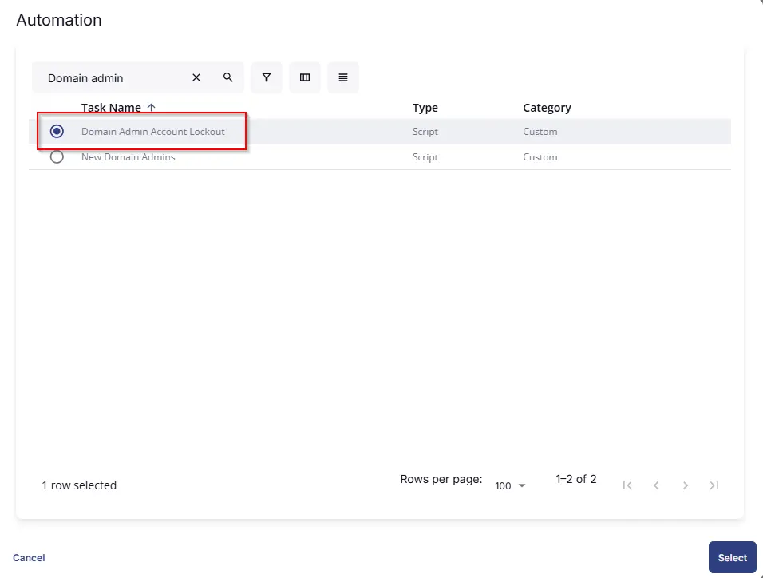
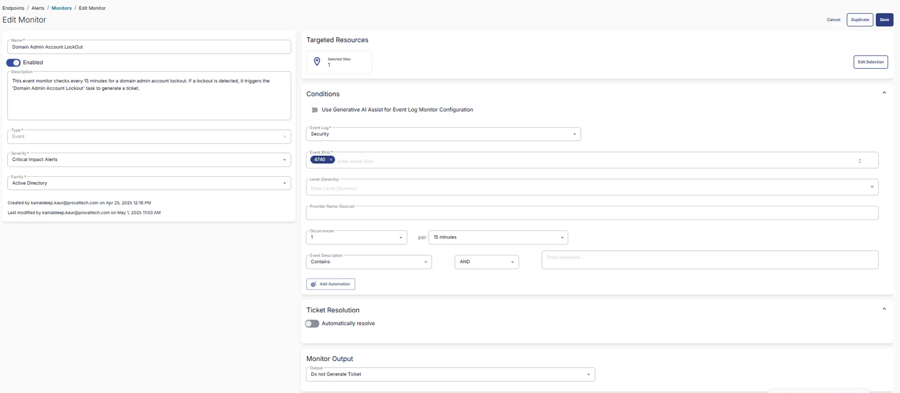

## Summary
This event monitor checks every 15 minutes for a domain admin account lockout. If a lockout is detected, it triggers the [CWRMM - Task - Domain Admin Account Lockout](/docs/b194bbed-fe64-4ced-8410-21281b08de07) task to generate a ticket

## Dependencies
[CWRMM - Task - Domain Admin Account Lockout](/docs/b194bbed-fe64-4ced-8410-21281b08de07)

## Target

`Domain Controllers`  
This should target the group 'Domain Controllers' as shown below:

## Monitor Creation

### Step 1

Navigate to `ENDPOINTS` ➞ `Alerts` ➞ `Monitors`  

### Step 2

Locate the `Create Monitor` button on the right-hand side of the screen and click on it.  

This page will appear after clicking on the `Create Monitor` button:  

### Step 3

- Fill in the mandatory columns on the left side  
- Name: `Domain Admin Account LockOut`  
- Description: `This event monitor checks every 15 minutes for a domain admin account lockout. If a lockout is detected, it triggers the 'Domain Admin Account Lockout' task to generate a ticket.`  
- Type: `Event`  
- Severity: `Critical Impact Results`  
- Family: `Active Directory`  

 
### Step 4

- Fill in the condition on the right side.  
- Follow the screenshot:  

- Click on `Add Automation` and select `Domain Admin Account Lockout` task. 

- Turn Off Ticket Resolution
And Select `Do not Generate Ticket` from the monitor Output DropDown.

### Step 5

Click the `Select Target` button to choose the endpoints for running the monitor set.  

This page will appear after clicking on the `Select Target` button:  

## Completed Monitor
