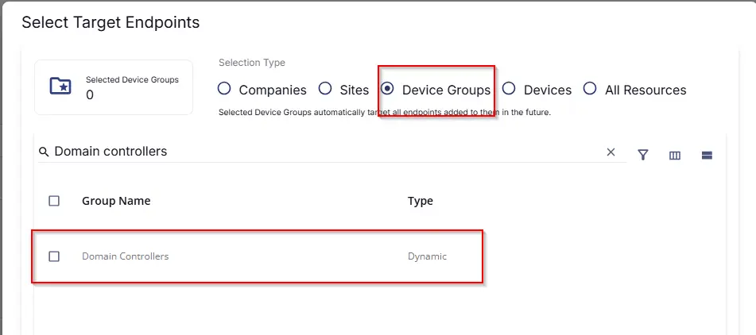
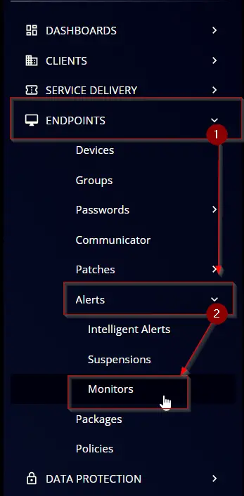
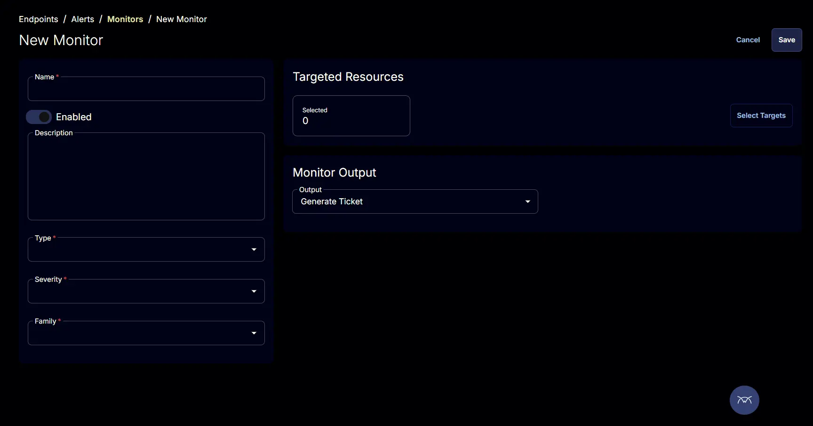
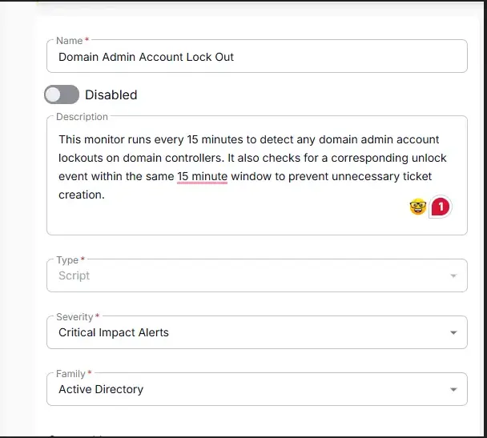
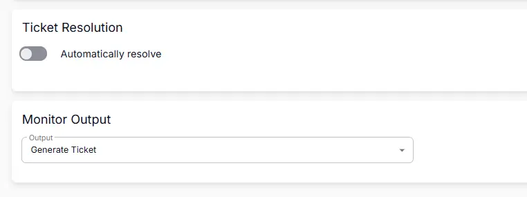
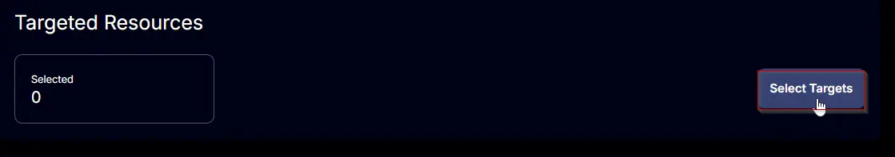
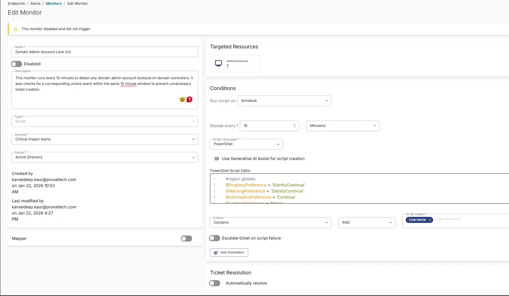

---
id: '5605eb10-68b5-4334-aedb-d52885a13671'
slug: /5605eb10-68b5-4334-aedb-d52885a13671
title: 'Domain Admin Account LockOut'
title_meta: 'Domain Admin Account LockOut'
keywords: ['Domain','Admin','Account','Lockout']
description: 'This monitor runs every 15 minutes to detect any domain admin account lockouts on domain controllers. It also checks for a corresponding unlock event within the same 15 minute window to prevent unnecessary ticket creation.'
tags: ['domain','active-directory']
draft: false
unlisted: false
last_update:
  date: 2026-01-30
---

## Summary
This monitor runs every 15 minutes to detect any domain admin account lockouts on domain controllers. It also checks for a corresponding unlock event within the same 15 minute window to prevent unnecessary ticket creation.

## Target

`Domain Controllers`  
This should target the group 'Domain Controllers' as shown below:

## Monitor Creation

### Step 1

Navigate to `ENDPOINTS` ➞ `Alerts` ➞ `Monitors`  

### Step 2

Locate the `Create Monitor` button on the right-hand side of the screen and click on it.  

This page will appear after clicking on the `Create Monitor` button:  

### Step 3

#### Fill in the mandatory columns on the left side  
- Name: `Domain Admin Account LockOut`  
- Description: `This monitor runs every 15 minutes to detect any domain admin account lockouts on domain controllers. It also checks for a corresponding unlock event within the same 15 minute window to prevent unnecessary ticket creation.`  
- Type: `Script`  
- Severity: `Critical Impact Results`  
- Family: `Active Directory`  

 
   **Conditions:**
   - **Run script on:** Schedule
   - **Repeat every:** 15 minutes
   - **Script Language:** PowerShell
   - **PowerShell Script:**

  [PowerShell Script](https://github.com/ProVal-Tech/cw-rmm/blob/main/monitors/domain-admin-account-lockout/script.ps1)

 - **Criteria:** Contains
   - Operator: `AND`
   - Script Output: `Username`
- **Escalate ticket on script failure:** Disabled
- **Automatically resolve:** Disabled
- **Monitor Output:** Generate Ticket

### Step 5

Click the `Select Target` button to choose the endpoints for running the monitor set.  

Select `Device Groups` as selection type and search for `Domain Controller`. This should target the group 'Domain Controllers' as shown below:

## Completed Monitor

## Changelog

### 2026-01-30

- Added ticket creation logic and eliminated use of automation to generate a ticket.

### 2025-05-01

- Initial version of the document

