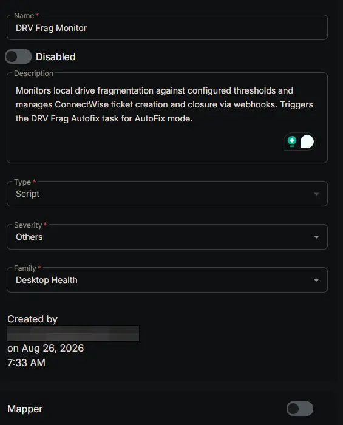
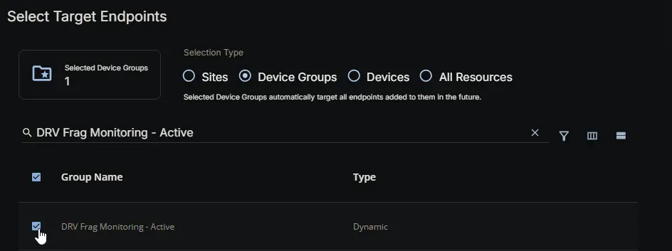
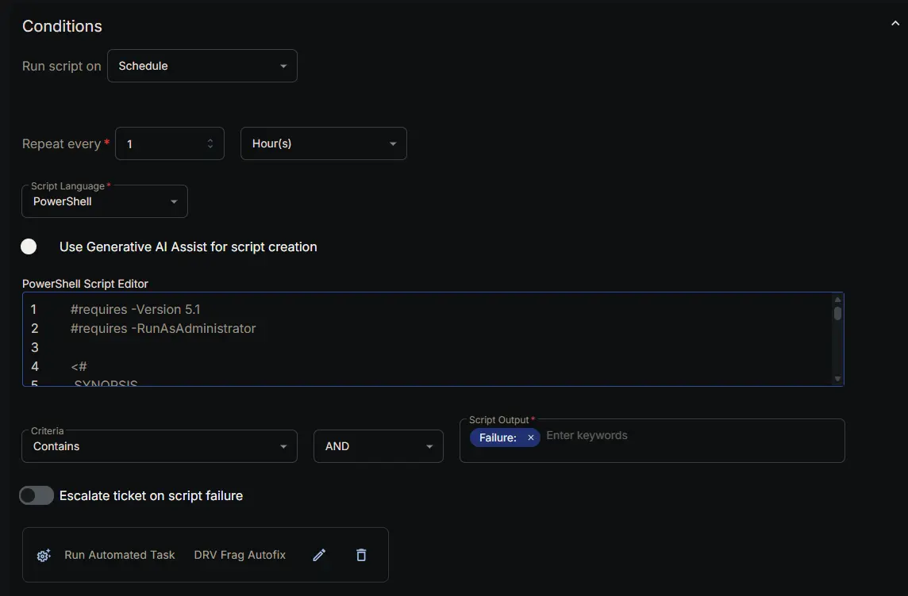
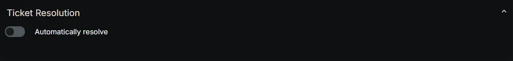
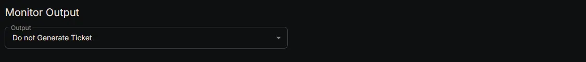
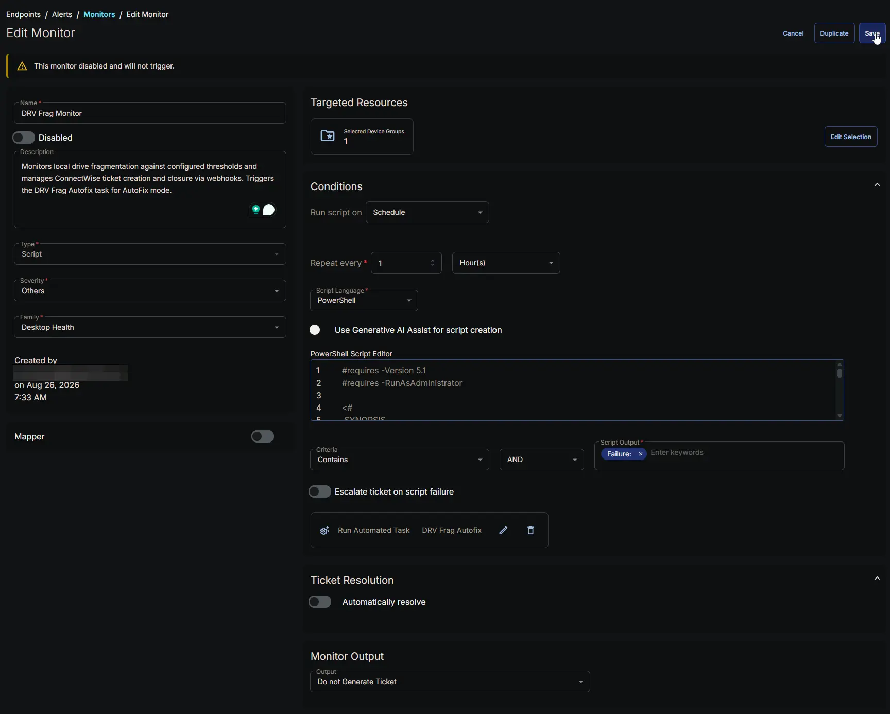

## Summary

The **DRV - Frag Monitoring** monitor continuously checks the fragmentation level of eligible fixed HDD drives on Windows endpoints against the threshold and drive selection defined in the configuration file generated by the [DRV Frag Monitoring Configuration Writer](/docs/cb957f04-2261-465c-babf-4fc6106d7039) task. It does **not** read custom fields directly; it relies on the pre‑built JSON configuration to know which drives to monitor, what fragmentation threshold to enforce, and where to send ticket actions.

Depending on the effective mode, the monitor behaves differently:

- **AlertOnly mode:** The monitor creates a ticket via webhook when a drive first breaches the threshold, and closes that ticket when the drive recovers. It returns a failure string only on the first detection so that the [DRV Frag Autofix](/docs/bfa10078-375c-44ee-8741-2e11fa2a2031) task runs once (and exits immediately without doing anything). Subsequent cycles return success while the breach remains open.

- **AutoFix mode (workstations only):** The monitor never creates tickets. It records the breach state and returns a failure string to launch the [DRV Frag Autofix](/docs/bfa10078-375c-44ee-8741-2e11fa2a2031) task, which performs the actual defragmentation and manages ticket creation/comments/closure. The monitor tracks the remediation attempt count and only re‑triggers the autofix task when a retry is due (24 hours after the previous attempt) and the maximum attempts (4) have not been exhausted. When the drive eventually recovers, the monitor closes the ticket if one exists.

**Server AutoFix policy note:** Although the configuration writer includes logic to allow server AutoFix when the endpoint override is `Enabled - Autofix`, in practice this solution **never monitors servers in AutoFix mode**. The [DRV Frag Monitoring - Active](/docs/f7b6eeec-bde1-4eb1-ba2f-0a0d42e7dcc7) group, which is the only target for this monitor, **excludes servers whose endpoint `DRV_Frag_Mode` is `Enabled - Autofix`**. Therefore, servers are always in AlertOnly mode (or Disabled) and never trigger the autofix task. The server autofix policy is a safeguard in the scripts but is never exercised.

### How It Works

1. **Configuration File**  
   At each scheduled run, the monitor reads:  
   `C:\ProgramData\_Automation\Script\DRVFragmentationMonitoring\DRVFragmentationMonitoring.json`.  
   This file contains:
   - **Mode** – `AutoFix`, `AlertOnly`, or `Disabled`
   - **Role** – `Server` or `Workstation`
   - **Drives** – `All`, `None`, or a normalized drive letter string
   - **Threshold** – fragmentation percentage (1–100)
   - **AutoFixAllowed** – boolean policy flag
   - **TicketWebhookUrl** – the workflow webhook URL for ticket actions

   If the file is missing or cannot be parsed, the monitor returns a failure message and skips the run without changing any state or firing webhooks. If the mode is `Disabled`, the monitor closes any open ticket (if ticketing is available) and then returns success.

   > **Note on AutoFixAllowed for servers:** The flag may be `true` for a server if the endpoint override is `Enabled - Autofix`, but such a server is not in the Active group and therefore never runs this monitor. In the context of this solution, the monitor will only encounter servers with `Mode = AlertOnly` or `Disabled`.

2. **Drive Discovery and Filtering**  
   The monitor enumerates all local fixed drives (`Win32_LogicalDisk`, `DriveType = 3`), applies the drive selection from configuration (`All`, `None`, or specific letters), and checks media eligibility. Only fixed rotational HDDs are considered; SSDs, SCM, removable, and unknown media (unless `$includeUnknownMediaType` is true) are skipped. Drive eligibility uses `MSFT_PhysicalDisk.MediaType`: value `3` (HDD) is eligible; values `4` (SSD) and `5` (SCM) are excluded.

3. **Fragmentation Analysis and Caching**  
   Fragmentation is measured using `Win32_Volume.DefragAnalysis`, which is locale‑independent and returns `TotalPercentFragmentation`. To avoid expensive repeated analyses, the monitor maintains a fragmentation cache (`Drive_Fragmentation_Cache.json`) with a configurable lifetime (default 4 hours). If a fresh cache entry exists, that value is used; otherwise a new analysis is performed and the cache is updated. The [DRV Frag Autofix](/docs/bfa10078-375c-44ee-8741-2e11fa2a2031) script also writes its post‑remediation measurement into this cache so the monitor observes the change immediately.

4. **Threshold Comparison**  
   A drive is considered breached when its fragmentation percentage is **greater than or equal to** the configured threshold. For example, with a threshold of 30, 29% is healthy and 30% is a breach.

5. **State Machine (duplicate prevention and retry logic)**  
   The monitor maintains three local state files:
   - `Drives_To_Create_Ticket.json`
   - `Drives_With_Existing_Ticket.json`
   - `Drives_To_Close_Ticket.json`

   For each drive letter (detected this run plus any letter already tracked), the monitor applies the following logic based on its current status and previous state:

   **AlertOnly mode:**
   - Breached and not tracked → add to **Create** list, return failure (first detection only)
   - Breached and in **Create** list → keep in **Create** (webhook retry pending), return success
   - Breached and in **Existing** list → keep in **Existing**, return success
   - Healthy and in **Create** or **Existing** → move to **Close** list, return success

   **AutoFix mode:**
   - Breached and not tracked → add to **Existing** list with attempt count 0, return failure
   - Breached and in **Existing** list:
     - If attempt count ≥ 4 → keep in **Existing**, mark exhausted, return success
     - If a failure string was already returned for the current attempt and within the launch request timeout (6 hours) → return success
     - If the retry interval has not elapsed → return success
     - Otherwise → increment failure tracking, return failure (triggers autofix task)
   - Healthy and in **Existing** list → if ticket exists, move to **Close** list; else clear state
   - Healthy and in **Create** or **Close** list → clear state

   The monitor also handles drives that go out of scope or cannot be evaluated: their state is preserved untouched to avoid accidental ticket closure.

6. **Webhook Execution**  
   After updating the state files, the monitor processes any pending webhooks:
   - For drives in the **Create** list, it sends a `Create` webhook (only if ticketing is enabled). On success, the drive is moved to the **Existing** list with `TicketExists` set to `true`.
   - For drives in the **Close** list, it sends a `Close` webhook. On success, the drive is removed from the close list.
   - Failed webhooks remain in the appropriate list and are retried on later cycles.

   The webhook payload always includes `Action`, `TicketSubject`, `TicketBody`, and `DeviceId` (read from the endpoint registry). The webhook URL is taken from the configuration file.

7. **Alert Signal**  
   - If any failure strings were generated (new AlertOnly breach, new AutoFix breach, or an autofix retry due), the monitor returns a string starting with `Failure:`. This triggers the RMM to launch the [DRV Frag Autofix](/docs/bfa10078-375c-44ee-8741-2e11fa2a2031) task (which exits immediately for AlertOnly).
   - Otherwise, the monitor returns `Success:` with details. The monitor's success criteria is configured as *Script Output contains `Success:`* so that normal operation does not raise an alert. The RMM alert is only raised when a `Failure:` is present, which corresponds to a new incident or a required autofix action. Because RMM's built‑in ticketing is set to **Do not Generate Ticket**, the actual tickets are created and managed by the [CWRMM Ticket Management for Monitors](/docs/57daa951-2acc-4be7-a025-0d0ca729ef57) workflow via webhooks.

8. **Autofix Lock and Task Coordination**  
   The [DRV Frag Autofix](/docs/bfa10078-375c-44ee-8741-2e11fa2a2031) script creates a lock file (`Autofix.lock`) while it runs. The monitor checks for this lock file and, if fresh, defers its evaluation for that cycle to avoid concurrent state modifications.

### Scenario – AlertOnly New Breach

A workstation drive C: reaches 42% fragmentation (threshold 30%). The monitor detects it, creates a state entry in **Create**, fires a `Create` webhook to the workflow, and returns `Failure: New fragmentation breach detected on drive C. Fragmentation is 42 percent. Threshold is 30 percent. Mode is AlertOnly.`. The RMM raises an alert and launches the [DRV Frag Autofix](/docs/bfa10078-375c-44ee-8741-2e11fa2a2031) task, which sees AlertOnly and exits immediately. The ticket remains open in ConnectWise.

### Scenario – AlertOnly Sustained Breach

On the next hourly run, drive C: is still at 42%. The state entry is now in **Create** (if the webhook is pending) or **Existing** (if the webhook succeeded). The monitor returns success and does **not** fire another webhook or trigger autofix again. No duplicate ticket is created.

### Scenario – AlertOnly Recovery

After defragmentation (or manual action), drive C: drops to 10% fragmentation. The monitor detects it as healthy, moves the state to **Close**, and fires a `Close` webhook. The workflow closes the ticket. The monitor returns success.

### Scenario – AutoFix New Breach and Retries (Workstation)

A workstation (with endpoint override `Enabled - Autofix`) has drive D: at 38% fragmentation (threshold 30%). The monitor detects the breach, creates an **Existing** state with attempt count 0, and returns a failure. The RMM launches the [DRV Frag Autofix](/docs/bfa10078-375c-44ee-8741-2e11fa2a2031) task. The task attempts defragmentation; if it fails, it creates a ticket via webhook and sets the next retry time to +24 hours. The monitor then returns success on subsequent runs until the retry time is reached. When the retry is due and the drive is still above threshold, the monitor returns failure again, triggering the autofix task for attempt 2. This repeats until the drive recovers or the maximum attempts (4) are exhausted. If exhausted, the monitor stops triggering autofix and returns success while keeping the ticket open.

## Dependencies

- [Custom Field: DRV_Frag_Mode_Wks](/docs/07b326ab-b7b1-4a31-b91b-22119dd41ec8)
- [Custom Field: DRV_Frag_Mode_Svr](/docs/edc708ab-b61a-44d0-a563-d5f2571faf55)
- [Custom Field: DRV_Frag_Drives_Wks](/docs/e60834f5-f158-48e6-b2aa-0e83132c7613)
- [Custom Field: DRV_Frag_Drives_Svr](/docs/dc296d51-d58b-4164-8bb7-1c60786449cb)
- [Custom Field: DRV_Frag_Threshold_Wks](/docs/dafbbfd1-ae21-4c4f-9e97-6be2bee4cc77)
- [Custom Field: DRV_Frag_Threshold_Svr](/docs/5fe9b606-2dad-40a9-93d3-b53db9fc8824)
- [Custom Field: DRV_Frag_Mode_Wks_Site](/docs/1f925f10-61f7-4db7-824f-f955d252342b)
- [Custom Field: DRV_Frag_Mode_Svr_Site](/docs/4e70913e-811f-4238-b804-04726145b2d0)
- [Custom Field: DRV_Frag_Drives_Wks_Site](/docs/5b3093b3-6a9e-4502-aac1-93cdb3714870)
- [Custom Field: DRV_Frag_Drives_Svr_Site](/docs/e9a25222-7108-454a-ad76-a224a1b69b47)
- [Custom Field: DRV_Frag_Threshold_Wks_Site](/docs/f3597302-8bb5-440c-8dc6-600a34506bb5)
- [Custom Field: DRV_Frag_Threshold_Svr_Site](/docs/70f41848-2ea5-4deb-b3cf-53edf0c9bf22)
- [Custom Field: DRV_Frag_Mode](/docs/563f1ad1-79df-47c7-ac99-b56566cd8634)
- [Custom Field: DRV_Frag_Drives](/docs/a06d0792-44dd-4946-addc-4b27ca275686)
- [Custom Field: DRV_Frag_Threshold](/docs/ea02dd10-c313-4636-a4e9-40edc4ae7357)
- [Custom Field: Ticket_Mgmt_Webhook_Url](/docs/8e55deb6-bef8-4501-9e64-7b25e7fcd1ab)
- [Device Group: DRV Frag Monitoring - Active](/docs/f7b6eeec-bde1-4eb1-ba2f-0a0d42e7dcc7)
- [Device Group: DRV Frag Monitoring - Alert Only [Workstations]](/docs/1eb19953-1b8c-4191-92df-c3e57f272063)
- [Task: DRV Frag Monitoring Configuration Writer](/docs/cb957f04-2261-465c-babf-4fc6106d7039)
- [Task: DRV Frag Autofix](/docs/bfa10078-375c-44ee-8741-2e11fa2a2031)
- [Workflow: CWRMM Ticket Management for Monitors](/docs/57daa951-2acc-4be7-a025-0d0ca729ef57)
- [Trigger: CWRMM Ticket Management for Monitors](/docs/05c811e6-c6d0-4652-b4b6-2aa83f9605c7)
- [Solution: Drive Fragmentation Monitoring](/docs/fb923e51-3cca-4b32-9066-51fbef06953f)

## Monitor Setup Location

**Monitors Path:** `ENDPOINTS` ➞ `Alerts` ➞ `Monitors`  

## Monitor Summary

- **Name:** `DRV - Frag Monitoring`  
- **Description:** `Monitors local drive fragmentation against configured thresholds and manages ConnectWise ticket creation and closure via webhooks. Triggers the DRV Frag Autofix task for AutoFix mode.`  
- **Type:** `Script`  
- **Severity:** `Others`  
- **Family:** `Desktop Health`

## Targeted Resources

- **Target Type:**  `Device Groups`  
- **Group Name:** [DRV Frag Monitoring - Active](/docs/f7b6eeec-bde1-4eb1-ba2f-0a0d42e7dcc7)

## Conditions

- **Run script on:** `Schedule`  
- **Repeat every:** `1` `Hour(s)`  
- **Script Language:** `PowerShell`  
- **Use Generative AI Assist for script creation:** `False`  
- **PowerShell Script Editor:**  

[PowerShell Script](https://github.com/ProVal-Tech/cw-rmm/blob/main/monitors/drv-frag-monitoring/script.ps1)

- **Criteria:**  `Contains`  
- **Operator:** `AND`  
- **Script Output:**  `Failure:`  
- **Escalate ticket on script failure:** `Disabled`  
- **Add Automation:**  [DRV Frag Autofix](/docs/bfa10078-375c-44ee-8741-2e11fa2a2031)

## Ticket Resolution

- **Automatically Resolve:** `Disabled`  

## Monitor Output

**Output:** `Do not Generate Ticket`

## Completed Monitor

## Changelog

### 2026-08-26

- Initial version of the document
