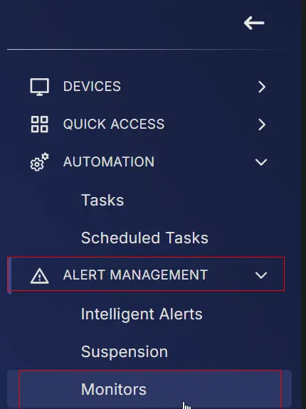
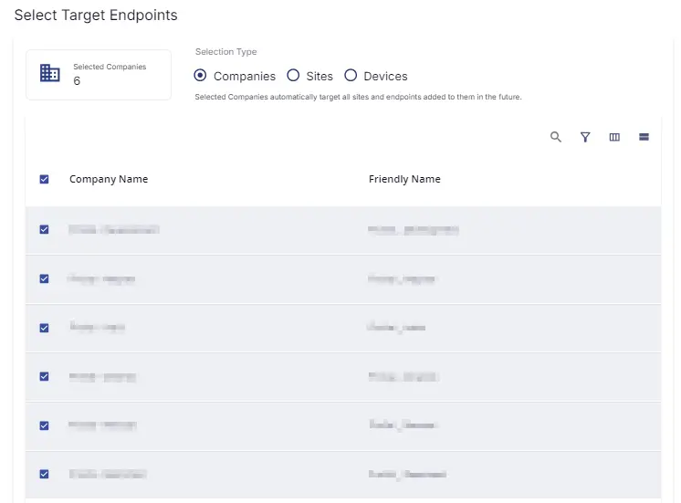
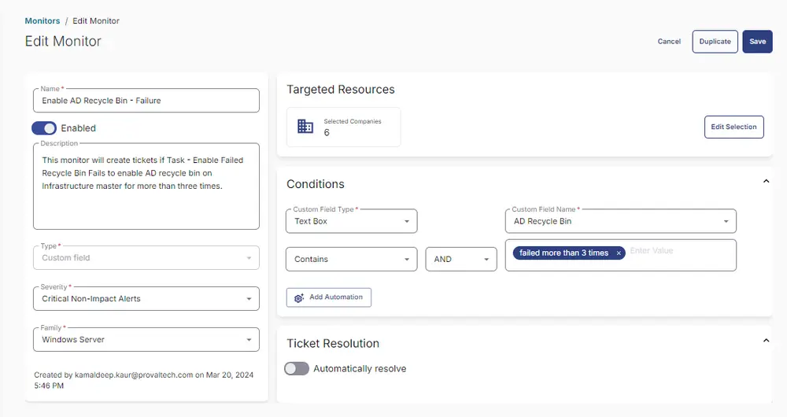

## Summary

This monitor will create tickets if the [Task - Enable AD Recycle Bin](/docs/bb53445d-532a-4ec4-b4c5-3f8d0610d6f7) fails to enable the AD Recycle Bin on the Infrastructure master for more than three attempts.

## Dependencies

- [Task - Enable AD Recycle Bin](/docs/bb53445d-532a-4ec4-b4c5-3f8d0610d6f7)
- [CW RMM - Custom Fields - AD Recycle Bin](/docs/e4801a6f-1945-4aee-bd39-1601a185b9eb)

## Monitor

1. Go to **Alert Management > Monitors**.  
     

2. Click the **Create Monitor** button.  
     

3. This screen will appear.  
     

4. Fill in the following details:  
   - **Name:** Enable AD Recycle Bin - Failure  
   - **Description:** This monitor will create tickets if the Task - Enable AD Recycle Bin fails to enable the AD Recycle Bin on the Infrastructure master for more than three attempts.  
   - **Type:** Custom Fields  
   - **Severity:** Critical Non-Impact Alerts  
   - **Family:** Windows Server  
     

5. Select **Text Box** in the Custom Field Type.  
   - Select **AD Recycle Bin** from the Custom Field Name dropdown.  
   - Add **failed more than 3 times** in the Value.  
     

6. Click the **Select Targets** button to select the clients to monitor.  
     

7. Select all companies and click the **Save Selection** button.  
     

8. Confirm that this is the final appearance of the monitor set, then save it by clicking the **Save** button.  
     