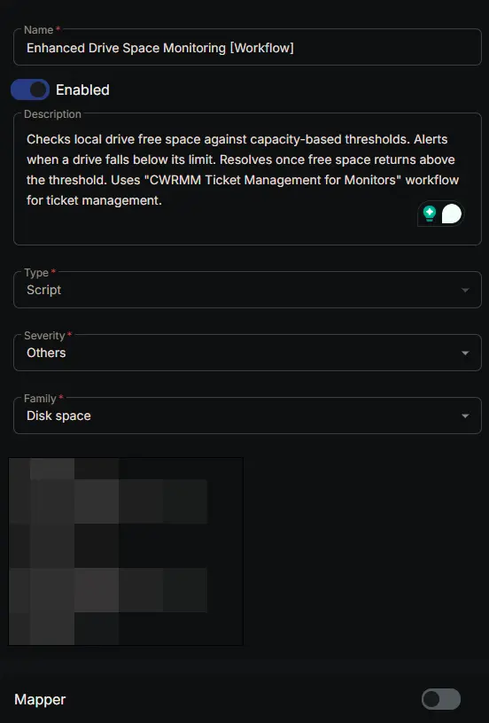
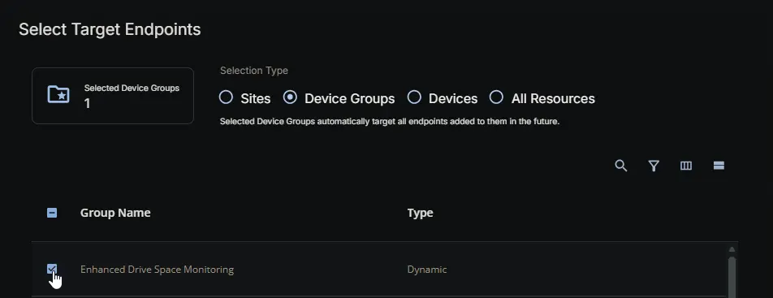
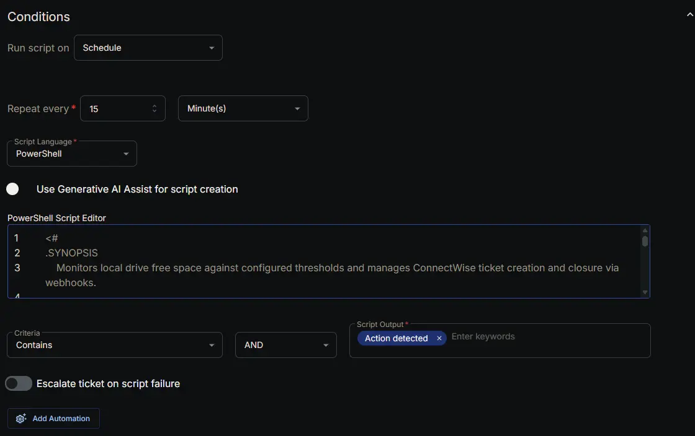
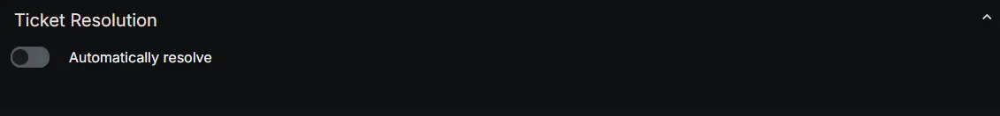
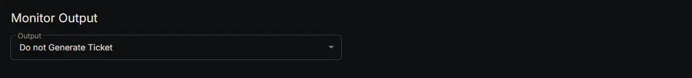
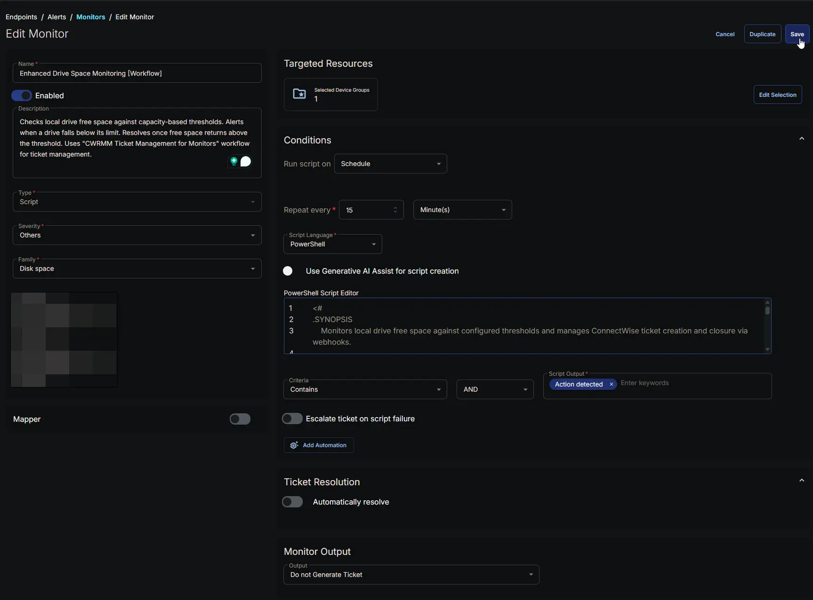

---
id: '2c9dd7bc-f5aa-48c2-be76-1348e13cda07'
slug: /2c9dd7bc-f5aa-48c2-be76-1348e13cda07
title: 'Enhanced Drive Space Monitoring [Workflow]'
title_meta: 'Enhanced Drive Space Monitoring [Workflow]'
keywords: ['monitoring', 'drive', 'space', 'thresholds', 'tickets', 'workflow', 'trigger']
description: 'Checks local drive free space against capacity-based thresholds. Alerts when a drive falls below its limit. Resolves once free space returns above the threshold. Uses "CWRMM Ticket Management for Monitors" workflow for ticket management.'
tags: ['disk', 'monitoring', 'windows']
draft: false
unlisted: false
last_update:
  date: 2026-07-23
---

## Summary

The **Enhanced Drive Space Monitoring [Workflow]** monitor continuously checks the free space of local drives on Windows endpoints against the thresholds and drive lists defined in the configuration file generated by the [Enhanced Drive Space Monitoring Configuration Writer](/docs/b2a4b9ec-08bd-4bce-8db7-b155c6bc03bc) task. It does **not** read custom fields directly; it relies on the pre‑built JSON configuration — which also carries the ticketing webhook URL (`TicketWebhookUrl`) — to know which drives to monitor, what limits to enforce, and where to send ticket actions.

This is the **workflow‑based** variant of the monitor. Unlike the original [Enhanced Drive Space Monitoring](/docs/70d7b9fd-8311-4470-9e7a-674cf577d371) set, which relies on the monitor's built‑in ticketing, this variant manages the entire ticket lifecycle itself: it tracks ticket state locally and fires webhooks to the [CWRMM Ticket Management for Monitors](/docs/57daa951-2acc-4be7-a025-0d0ca729ef57) workflow to **create** a ticket when a drive first breaches its threshold and **close** it when the drive recovers. The result is a clean ticket with a controlled subject and body, **no per‑detection comment spam**, and **automatic closure on recovery** — with no duplicate tickets and no manual intervention.

### How It Works

1. **Configuration File**  
   At each scheduled run (hourly, as configured), the monitor reads:  
   `C:\ProgramData\_Automation\Script\EnhancedDriveSpaceMonitoring\EnhancedDriveSpaceMonitoring.json`.  
   This file contains:
   - **Thresholds** – an array of capacity buckets (16–300 GB, 300–1024 GB, 1024–4096 GB, 4096+ GB), each with a numeric limit and a unit (%, MB, or GB).
   - **IncludeDrives** – which drive letters to monitor (`All`, `None`, or a sequence like `CDEF`).
   - **ExcludeDrives** – which drive letters to ignore (`None`, `All`, or specific letters like `Z`).
   - **TicketWebhookUrl** – the workflow webhook URL that ticket actions are POSTed to.  
   If the file is missing or cannot be parsed, the monitor returns a failure message and skips the run without changing any state or firing any webhooks.

2. **Drive Discovery and Filtering**  
   The monitor enumerates all local fixed drives (`Win32_LogicalDisk`, `DriveType=3`) and filters them by the **IncludeDrives** / **ExcludeDrives** settings. If drive enumeration fails or returns nothing, the monitor returns early **without modifying any ticket state** — a safeguard so a transient WMI hiccup never accidentally closes open tickets.

3. **Capacity Bucket Assignment**  
   Each drive's total capacity is calculated and assigned to a bucket (16–300 GB, 300–1024 GB, 1024–4096 GB, or 4096+ GB). Drives smaller than 16 GB, or with no readable size, are skipped.

4. **Threshold Comparison**  
   The monitor looks up the threshold for the drive's bucket; a threshold of `0` disables that bucket. It compares current free space (converted to the configured unit) against the limit. For every drive that falls below its threshold, it builds a ticket subject (`Enhanced Drive Space Monitoring - <Letter> - <ComputerName> - <Threshold>`) and a body detailing total, used, and free space plus the breached threshold, and marks the drive as "detected low" for this run.

5. **Ticket State Machine (duplicate prevention)**  
   This is the core of the variant. The monitor maintains three local state files alongside the config:
   - `Drives_To_Create_Ticket.json`
   - `Drives_With_Existing_Ticket.json`
   - `Drives_To_Close_Ticket.json`

   For every drive letter (detected this run plus any letter already tracked), it applies the following transitions:

   | Drive this run | Previous state | Transition | Webhook |
   | --- | --- | --- | --- |
   | Low | not tracked | Added to **Create** | `Create` fires |
   | Low | Create | Moved to **Existing** | none |
   | Low | Existing | Kept in **Existing** | none |
   | Healthy | Create or Existing | Moved to **Close** (subject kept, body replaced with a recovery message) | `Close` fires |
   | Healthy | Close | Cleared from **Close** | none |
   | Healthy | not tracked | No record | none |

   Because a freshly detected drive fires `Create` only on the run it first appears and is then promoted to **Existing**, a sustained breach (e.g., a drive sitting at 95% full for hours) produces **exactly one ticket**, no matter how many hourly runs occur. On recovery, `Close` fires once and the record is then cleared, so it never fires twice.

6. **Webhook Execution**  
   For each drive newly in the **Create** list, the monitor POSTs `Action = Create`; for each drive newly in the **Close** list, it POSTs `Action = Close`. Each payload carries `Action`, `TicketSubject`, `TicketBody`, and `DeviceId` (read from the endpoint's registry). The webhook URL is the `TicketWebhookUrl` value from the config file. The [CWRMM Ticket Management for Monitors](/docs/57daa951-2acc-4be7-a025-0d0ca729ef57) workflow receives the payload and performs the actual ticket creation or closure in ConnectWise. This monitor uses only the `Create` and `Close` actions; it does not send `Comment`.

7. **Reporting and Alert Signal**  
   If any `Create` or `Close` webhook fired, the monitor returns `Action detected - N drive(s) for ticket creation and M drive(s) for ticket closure`; otherwise it returns `Drive space monitoring state evaluated successfully`. The monitor's success criteria is configured as *Script Output contains `Action detected`*, so CW RMM only flags the monitor on runs where a ticket action actually occurred. Because RMM's own ticketing is set to **Do not Generate Ticket**, **Escalate ticket on script failure = Disabled**, and **Automatically Resolve = Disabled**, that flag is purely informational — the real ticket lives in ConnectWise and is owned by the workflow, not by RMM.

8. **Failure Handling**  
   - Missing/invalid config → run skipped, no state change, no webhooks.  
   - Drive enumeration failure → early return that preserves existing ticket state.  
   - Webhook failure → logged, the run is reported as `Failure`, but remaining drives are still processed.  
   - Note: state files are written **before** the webhooks fire, so a failed `Create` or `Close` is **not** automatically retried on the next run — the drive must change state again (re‑breach or re‑recover) for a new webhook to be sent.

### Scenario – Alert Triggered (Create)

A server has a 500 GB D: drive (bucket 300–1024 GB) with a `30GB` threshold. Free space drops to 22 GB. On the next run the drive is detected low for the first time, so it is added to the **Create** list and a `Create` webhook fires. The workflow creates a ticket such as *"Enhanced Drive Space Monitoring - D - SERVER01 - 30 GB"* with the total/used/free/threshold details in the body.

### Scenario – Sustained Breach (No Duplicate)

An hour later the D: drive is still at 22 GB. It is now found in the **Create** list, so it is promoted to **Existing** and **no webhook fires**. It remains in **Existing** on every subsequent low run, so only the single original ticket exists — no duplicates, no repeated comments.

### Scenario – Healthy (No Action)

A drive that has 45 GB free against a 30 GB threshold is not detected as low. If it has no tracked state, nothing happens: no webhook fires, the output is *"Drive space monitoring state evaluated successfully,"* and CW RMM raises no alert.

### Scenario – Automatic Resolution (Close)

After a technician frees up space, the D: drive rises to 60 GB. It is no longer low but is still in **Existing**, so it is moved to the **Close** list — keeping the original ticket subject (so the workflow can match the open ticket) but replacing the body with *"Drive space has recovered and is now above the threshold. The ticket can be closed."* A `Close` webhook fires and the workflow closes the ticket. On the following run the record is cleared from **Close**, so no further webhook is sent.

This design produces clean, workflow‑managed tickets — one per incident, no comment spam, and self‑closing on recovery — without any native RMM ticketing tasks. It does depend on a valid `TicketWebhookUrl` in the configuration file (set via the [Ticket_Mgmt_Webhook_Url](/docs/8e55deb6-bef8-4501-9e64-7b25e7fcd1ab) custom field) and on the [CWRMM Ticket Management for Monitors](/docs/57daa951-2acc-4be7-a025-0d0ca729ef57) workflow being installed and reachable; if the URL is missing or invalid, webhooks fail and tickets will not be created or closed.

## Dependencies

- [Group: Enhanced Drive Space Monitoring](/docs/475ce8e8-458e-4901-bdfc-18e79f62c549)
- [Task: Enhanced Drive Space Monitoring Configuration Writer](/docs/b2a4b9ec-08bd-4bce-8db7-b155c6bc03bc)
- [Triggers: CWRMM Ticket Management for Monitors](/docs/05c811e6-c6d0-4652-b4b6-2aa83f9605c7)
- [Workflow: CWRMM Ticket Management for Monitors](/docs/57daa951-2acc-4be7-a025-0d0ca729ef57)
- [Solution: Enhanced Drive Space Monitoring](/docs/e9cf4ff0-4413-447b-97dd-b8b2abd59597)

## Monitor Setup Location

**Monitors Path:** `ENDPOINTS` ➞ `Alerts` ➞ `Monitors`  

## Monitor Summary

- **Name:** `Enhanced Drive Space Monitoring [Workflow]`  
- **Description:** `Checks local drive free space against capacity-based thresholds. Alerts when a drive falls below its limit. Resolves once free space returns above the threshold. Uses "CWRMM Ticket Management for Monitors" workflow for ticket management.`  
- **Type:** `Script`  
- **Severity:** `Others`  
- **Family:** `Disk Space`

## Targeted Resources

- **Target Type:**  `Device Groups`  
- **Group Name:** `Enhanced Drive Space Monitoring`

## Conditions

- **Run script on:** `Schedule`  
- **Repeat every:** `1` `Hour(s)`  
- **Script Language:** `PowerShell`  
- **Use Generative AI Assist for script creation:** `False`  

- **PowerShell Script Editor:**  

[PowerShell Script](https://github.com/ProVal-Tech/cw-rmm/blob/main/monitors/enhanced-drive-space-monitoring-workflow/script.ps1)

- **Criteria:**  `Contains`  
- **Operator:** `AND`  
- **Script Output:**  `Action detected`  
- **Escalate ticket on script failure:** `Disabled`  
- **Add Automation:**  `<Leave it untouched>`

## Ticket Resolution

- **Automatically Resolve:** `Disabled`  

## Monitor Output

**Output:** `Do not Generate Ticket`

## Completed Monitor

## Changelog

### 2026-07-23

- Initial version of the document

