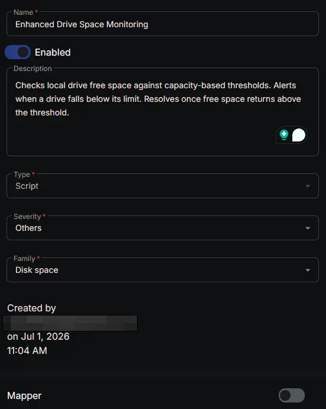
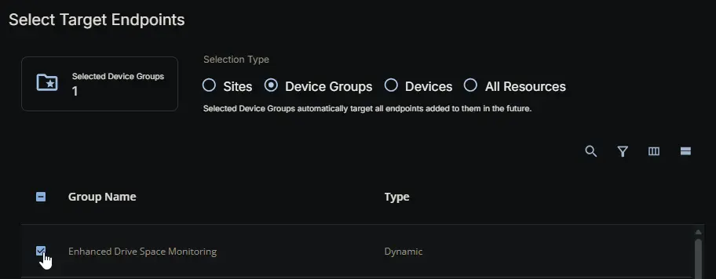
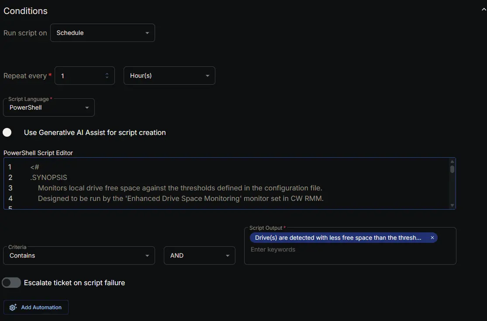
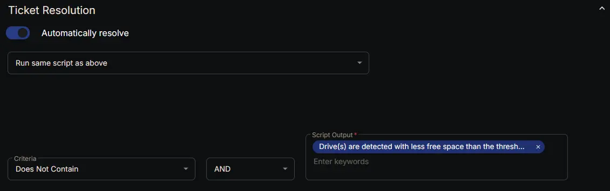
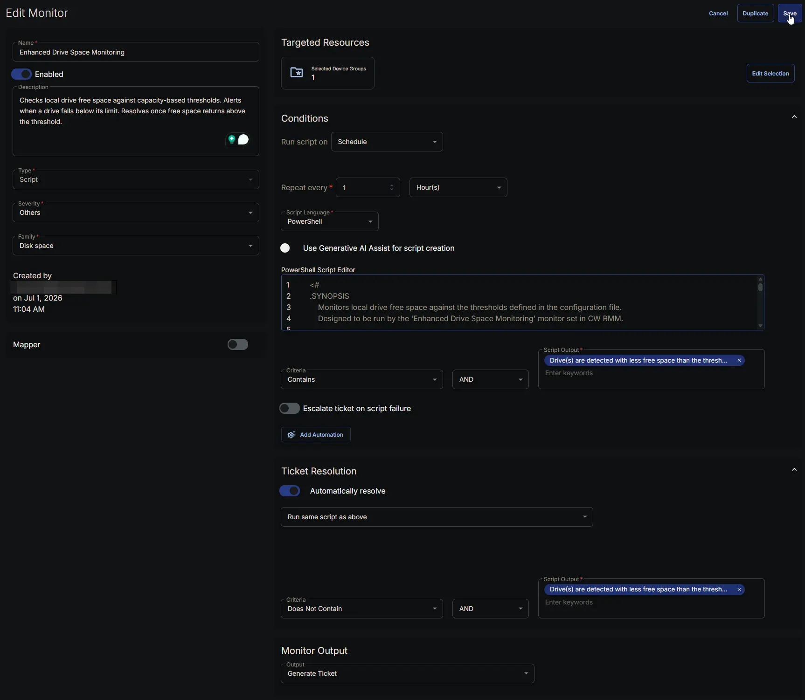

## Summary

The **Enhanced Drive Space Monitoring** monitor continuously checks the free space of local drives on Windows endpoints against the thresholds and drive lists defined in the configuration file generated by the [Enhanced Drive Space Monitoring Configuration Writer](/docs/b2a4b9ec-08bd-4bce-8db7-b155c6bc03bc) task. It does **not** read custom fields directly; instead, it relies on the pre‑built JSON configuration to know exactly which drives to monitor and what limits to enforce.

### How It Works

1. **Configuration File**  
   At each check interval, the monitor reads the file:  
   `C:\ProgramData\_Automation\Script\EnhancedDriveSpaceMonitoring\EnhancedDriveSpaceMonitoring.json`.  
   This file contains:
   - **Thresholds** – an array of capacity buckets (16–300 GB, 300–1024 GB, 1024–4096 GB, 4096+ GB), each with a numeric limit and a unit (% , MB, or GB).
   - **IncludeDrives** – a string specifying which drive letters to monitor (`All`, `None`, or a sequence like `CDEF`).
   - **ExcludeDrives** – a string specifying which drive letters to ignore (`None`, `All`, or specific letters like `Z`).

2. **Drive Discovery and Filtering**  
   The monitor finds all local fixed drives (DriveType=3). It then filters them according to the **IncludeDrives** and **ExcludeDrives** settings. For example, if IncludeDrives is `C` and ExcludeDrives is `None`, only the C: drive is evaluated.

3. **Capacity Bucket Assignment**  
   Each drive’s total capacity is calculated, and the drive is assigned to the appropriate capacity bucket (16–300 GB, 300–1024 GB, 1024–4096 GB, or 4096+ GB). Drives smaller than 16 GB are skipped.

4. **Threshold Comparison**  
   The monitor retrieves the threshold for the drive’s assigned bucket. If the threshold value is `0`, that bucket is skipped. It then compares the current free space (in the configured unit) against the threshold. The free space is also converted into the appropriate format (percent, MB, or GB) for a clear alert message.

5. **Alert Message**  
   If any drive’s free space falls below its assigned threshold, the monitor outputs a detailed message listing all problematic drives, including:
   - Drive letter
   - Total space
   - Used space
   - Free space
   - The specific threshold that was breached.

6. **Resolution**  
   When all drives are above their thresholds, the monitor outputs a success message. The monitor set interprets this as a healthy state and automatically resolves any open ticket.

### Scenario – Alert Triggered

A server has a 500 GB D: drive (capacity bucket 300–1024 GB) with a threshold of `30GB`. The current free space drops to 22 GB. When the monitor runs, it detects the free space is below the limit and outputs an alert message listing the drive, its total space, used space, free space, and the violated `30GB` threshold. A ticket is created.

### Scenario – Alert Not Triggered (Healthy)

The same D: drive later has 45 GB free, which is above the 30 GB threshold. The monitor runs and finds no low drives. It returns the success message: *"Drive space monitoring did not detect any low space drives according to the configured thresholds."* No ticket is created.

### Scenario – Automatic Resolution

After a technician cleans up the drive, the free space rises to 60 GB. On the next monitor run, the success message is returned. The monitor set's automatic resolution rule recognizes that the alert condition is no longer present and closes the ticket automatically.

This design ensures that only drives truly running out of space cause tickets, and once the issue is fixed, the alert clears itself without manual intervention.

## Dependencies

- [Group: Enhanced Drive Space Monitoring](/docs/475ce8e8-458e-4901-bdfc-18e79f62c549)
- [Task: Enhanced Drive Space Monitoring Configuration Writer](/docs/b2a4b9ec-08bd-4bce-8db7-b155c6bc03bc)
- [Solution: Enhanced Drive Space Monitoring](/docs/e9cf4ff0-4413-447b-97dd-b8b2abd59597)

## Monitor Setup Location

**Monitors Path:** `ENDPOINTS` ➞ `Alerts` ➞ `Monitors`  

## Monitor Summary

- **Name:** `Enhanced Drive Space Monitoring`  
- **Description:** `Checks local drive free space against capacity-based thresholds. Alerts when a drive falls below its limit. Resolves once free space returns above the threshold.`  
- **Type:** `Script`  
- **Severity:** `Others`  
- **Family:** `Desktop Health`



## Targeted Resources

- **Target Type:**  `Device Groups`  
- **Group Name:** `Enhanced Drive Space Monitoring`



## Conditions

- **Run script on:** `Schedule`  
- **Repeat every:** `1` `Hour(s)`  
- **Script Language:** `PowerShell`  
- **Use Generative AI Assist for script creation:** `False`  

- **PowerShell Script Editor:**  

```PowerShell
<#
.SYNOPSIS
    Monitors local drive free space against the thresholds defined in the configuration file.
    Designed to be run by the 'Enhanced Drive Space Monitoring' monitor set in CW RMM.

.DESCRIPTION
    This script is executed periodically by a monitor set. It reads the drive space thresholds
    (per capacity bucket) and inclusion/exclusion lists from the JSON configuration file
    generated by the Enhanced Drive Space Monitoring Configuration Writer task.

    The monitoring logic:
    1. Loads the configuration file. If missing or invalid, outputs a warning and returns.
    2. Enumerates all local fixed drives (DriveType=3).
    3. Filters drives based on the IncludeDrives and ExcludeDrives lists.
    4. Assigns each drive to a capacity bucket (16‑300 GB, 300‑1024 GB, 1024‑4096 GB, 4096+ GB).
    5. Compares the free space against the bucket’s threshold, skipping buckets where the
       threshold is 0.
    6. If any drive is below its threshold, a formatted alert listing those drives is returned.
    7. If all drives are healthy, a success message is returned.

.NOTES
    Script Name   = Enhanced Drive Space Monitoring
    Configuration = $env:ProgramData\_Automation\Script\EnhancedDriveSpaceMonitoring\EnhancedDriveSpaceMonitoring.json

.OUTPUTS
    - On alert: multi‑line string detailing the drives that breached their thresholds.
    - On healthy state: single‑line success message.
    - On configuration error: single‑line error message.
#>

#region globals
$ProgressPreference = 'SilentlyContinue'
$WarningPreference = 'SilentlyContinue'
#endregion

#region variables
$projectName = 'EnhancedDriveSpaceMonitoring'
$workingDirectory = '{0}\_Automation\Script\{1}' -f $env:ProgramData, $projectName
$configPath = '{0}\{1}.json' -f $workingDirectory, $projectName
#endregion

#region config import
if (-not (Test-Path -Path $configPath)) {
    return 'Drive space configuration file not found. Skipping check.'
}

try {
    $rawJson = Get-Content -Path $configPath -Raw -Encoding UTF8 -ErrorAction Stop
    $config = $rawJson | ConvertFrom-Json -ErrorAction Stop
} catch {
    return ('Failed to read or parse the configuration file. Error: {0}' -f $_.Exception.Message)
}

$includeDrives = $config.IncludeDrives
$excludeDrives = $config.ExcludeDrives
$thresholds = $config.Thresholds
#endregion

#region monitoring
$lowDrivesList = @()
$drives = Get-CimInstance -ClassName 'Win32_LogicalDisk' -Filter 'DriveType=3' -ErrorAction SilentlyContinue

foreach ($drive in $drives) {
    $letter = $drive.DeviceID.Substring(0, 1)

    # Filtering
    if ($includeDrives -ne 'All' -and $includeDrives -notmatch $letter) {
        continue
    }
    if ($excludeDrives -ne 'None' -and $excludeDrives -match $letter) {
        continue
    }

    $totalBytes = $drive.Size
    if ($null -eq $totalBytes -or $totalBytes -eq 0) {
        continue
    }

    # Calculate spaces
    $totalGB = [math]::Round($totalBytes / 1GB, 2)
    $freeBytes = $drive.FreeSpace
    $freeGB = [math]::Round($freeBytes / 1GB, 2)
    $freeMB = [math]::Round($freeBytes / 1MB, 2)
    $freePct = [math]::Round(($freeBytes / $totalBytes) * 100, 2)
    $usedBytes = $totalBytes - $freeBytes
    $usedGB = [math]::Round(($totalGB - $freeGB), 2)

    # Determine bucket
    $bucket = $null
    if ($totalGB -ge 16 -and $totalGB -le 300) {
        $bucket = '16To300'
    } elseif ($totalGB -gt 300 -and $totalGB -le 1024) {
        $bucket = '300To1024'
    } elseif ($totalGB -gt 1024 -and $totalGB -le 4096) {
        $bucket = '1024To4096'
    } elseif ($totalGB -gt 4096) {
        $bucket = '4096Plus'
    }

    if (-not $bucket) { continue }

    # Retrieve threshold for this bucket
    $thresholdEntry = $thresholds | Where-Object { $_.Bucket -eq $bucket }
    if (-not $thresholdEntry) { continue }

    [int]$thresholdValue = $thresholdEntry.Value
    $thresholdUnit = $thresholdEntry.Unit

    if ($thresholdValue -eq 0) { continue }

    # Check free space against threshold
    $isLow = $false
    $usedFormatted = ''
    $freeFormatted = ''
    $thresholdFormatted = ''

    if ($thresholdUnit -eq 'Percent') {
        if ($freePct -lt $thresholdValue) { $isLow = $true }
        $usedFormatted = '{0} %' -f [math]::Round(($usedBytes / $totalBytes) * 100, 2)
        $freeFormatted = '{0} %' -f $freePct
        $thresholdFormatted = '{0}%' -f $thresholdValue
    } elseif ($thresholdUnit -eq 'MB') {
        if ($freeMB -lt $thresholdValue) { $isLow = $true }
        $usedFormatted = '{0} MB' -f [math]::Round($usedBytes / 1MB, 2)
        $freeFormatted = '{0} MB' -f $freeMB
        $thresholdFormatted = '{0}MB' -f $thresholdValue
    } elseif ($thresholdUnit -eq 'GB') {
        if ($freeGB -lt $thresholdValue) { $isLow = $true }
        $usedFormatted = '{0} GB' -f $usedGB
        $freeFormatted = '{0} GB' -f $freeGB
        $thresholdFormatted = '{0}GB' -f $thresholdValue
    }

    if ($isLow) {
        $lowDrivesList += [PSCustomObject]@{
            Drive      = $letter
            TotalSpace = '{0} GB' -f $totalGB
            UsedSpace  = $usedFormatted
            FreeSpace  = $freeFormatted
            Threshold  = $thresholdFormatted
        }
    }
}
#endregion

#region result
if ($lowDrivesList.Count -eq 0) {
    return 'Drive space monitoring did not detect any low space drives according to the configured thresholds.'
} else {
    $header = '{0} Drive(s) are detected with less free space than the threshold.{1}{1}Detected Drives:' -f $lowDrivesList.Count, [System.Environment]::NewLine
    $table = ($lowDrivesList | Format-Table -AutoSize | Out-String).TrimEnd()
    return ('{0}{1}{2}' -f $header, [System.Environment]::NewLine, $table)
}
#endregion
```

- **Criteria:**  `Contains`  
- **Operator:** `AND`  
- **Script Output:**  `Drive(s) are detected with less free space than the threshold`  
- **Escalate ticket on script failure:** `Disabled`  
- **Add Automation:**  `<Leave it untouched>`



## Ticket Resolution

- **Automatically Resolve:** `Enabled`  
- **Dropdown Option:** `Run same script as above`

- **Criteria:**  `Does Not Contain`  
- **Operator:** `AND`  
- **Script Output:**  `Drive(s) are detected with less free space than the threshold`  



## Monitor Output

**Output:** `Generate Ticket`


## Completed Monitor



## Changelog

### 2026-07-02

- Initial version of the document
