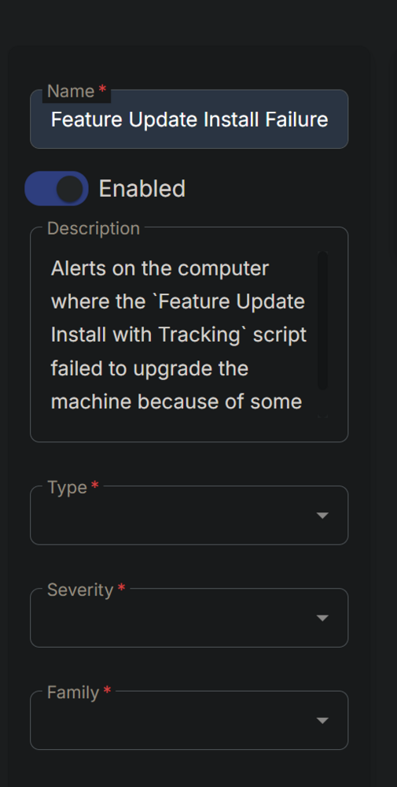
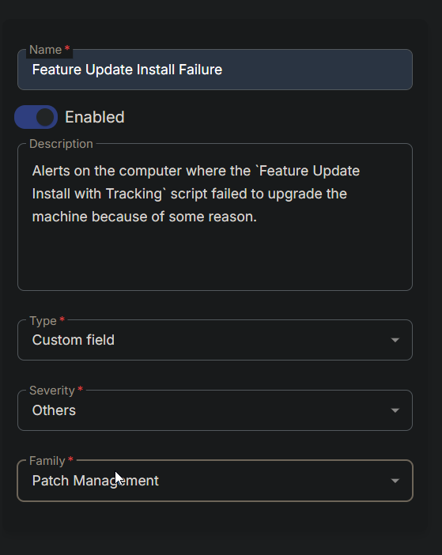
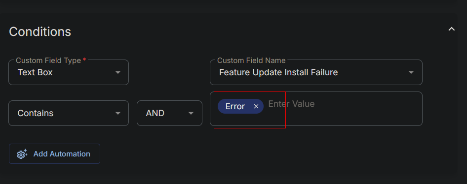
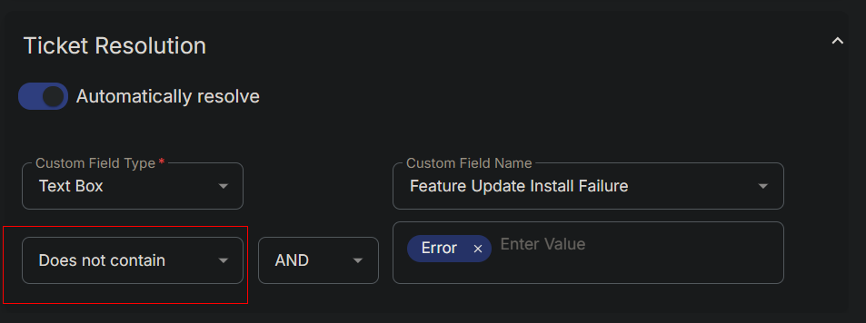
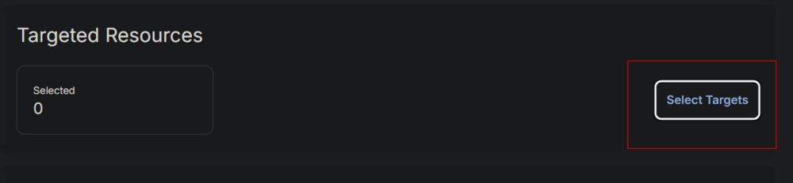
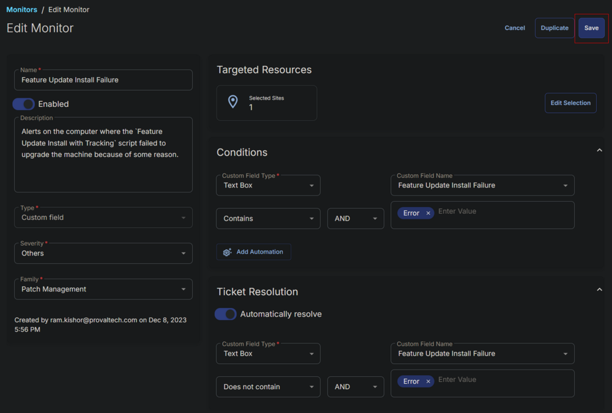

## Summary

This document outlines how to set up alerts for computers where the `Feature Update Install with Tracking` script failed to upgrade the machine for any reason.

## Dependencies

- [CW RMM - Custom Field - Feature Update Install Failure](/docs/1c9abaeb-17f0-4a3b-86ee-953b5b713dc3)
- [CW RMM - Task - Feature Update Install With Tracking](/docs/5244ac77-6926-4902-a183-b4b2aac18e2b)

## Monitor

1. Go to **Alert Management > Monitors.**  
   

2. Click the **Create Monitor** button.  
   

3. This screen will appear.  
   

4. Fill in the Name and Description boxes.  
   **Name:** Feature Update Install Failure  
   **Description:** Alerts on the computer where the `Feature Update Install with Tracking` script failed to upgrade the machine for any reason.  
   

5. Select **Custom Field** in the Type dropdown, **Others** in the Severity, and **Patch Management** for the Family.  
   

6. Select **Text Box** from the **Custom Field Type** dropdown and **Feature Update Install Failure** from the **Custom Field Name** dropdown menu. Type **Error** and press enter in the **Enter Value** field.  
   

7. Choose the same values/options in the **Ticket Resolution** section, with the only difference being to use **Does Not Contain** as the operator instead of **Contains**.  
   

8. Click the **Select Targets** button to select the clients to monitor.  
   

9. Select the relevant clients to monitor and click the **Save Selection** button.  
   

10. Confirm that this is the final appearance of the monitor set, then save it by clicking the **Save** button.  
    

