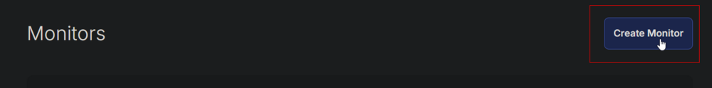
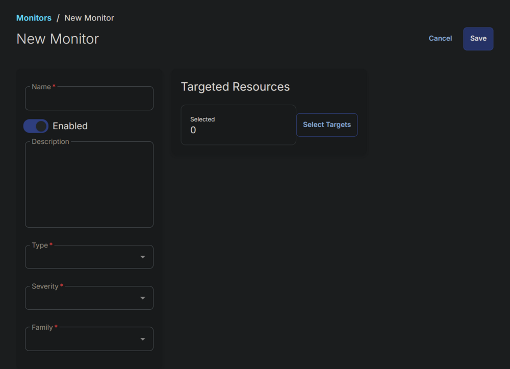
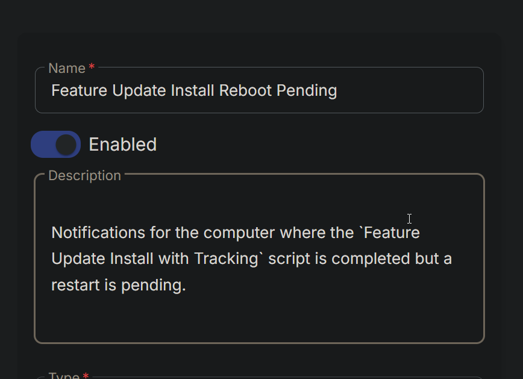
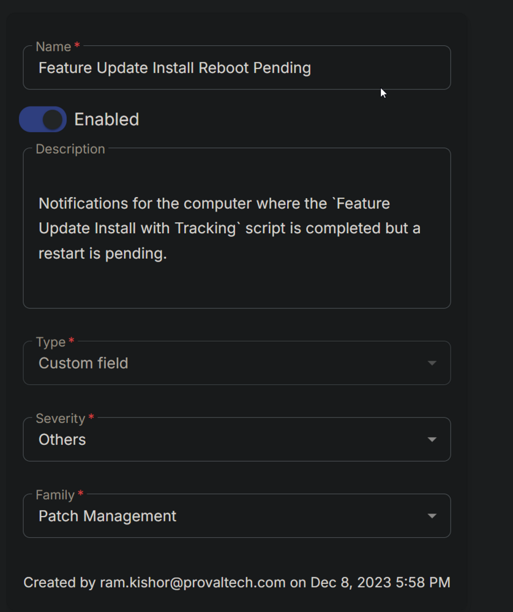
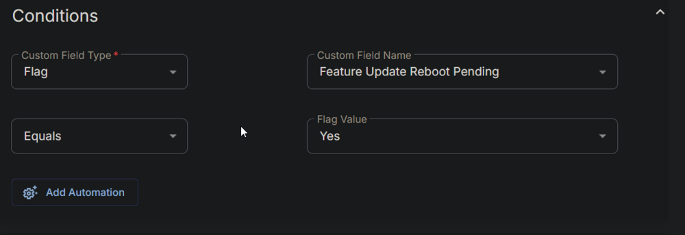
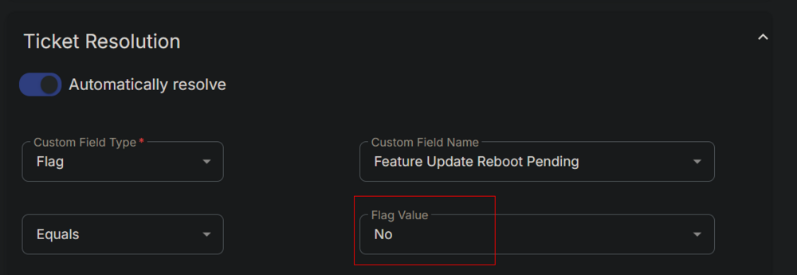
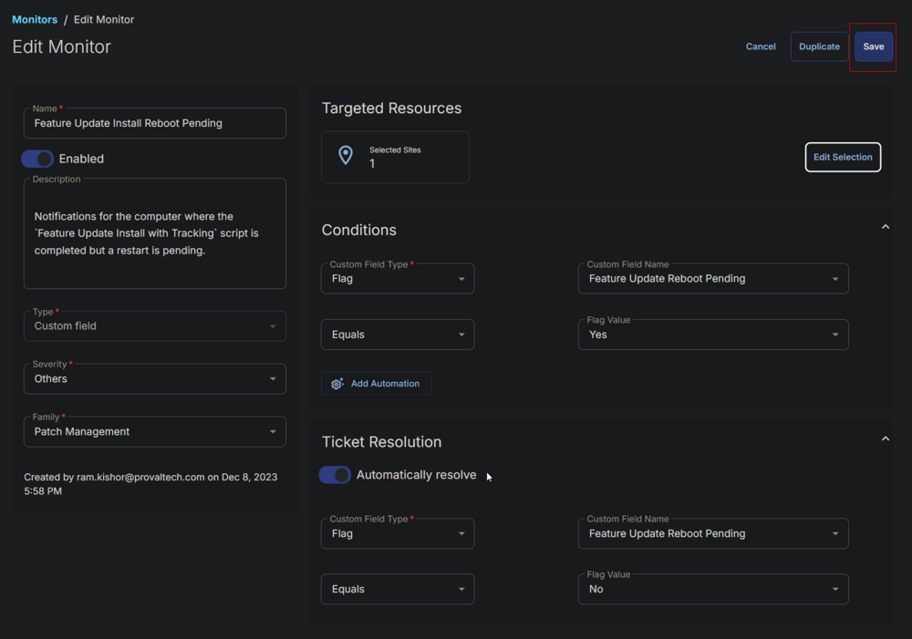

## Summary

Notifications for computers where the `Feature Update Install with Tracking` script has completed, but a restart is pending.

## Dependencies

- [CW RMM - Custom Field - Feature Update Reboot Pending](/docs/45e14854-ba83-4737-8264-b5cd809fca56)
- [CW RMM - Task - Feature Update Install With Tracking](/docs/5244ac77-6926-4902-a183-b4b2aac18e2b)

## Monitor

1. Go to Alert Management > Monitors.  
   

2. Click the `Create Monitor` button.  
   

3. This screen will appear.  
   

4. Fill in the Name and Description fields.  
   **Name:** Feature Update Install Reboot Pending  
   **Description:** Notifications for computers where the `Feature Update Install with Tracking` script has completed, but a restart is pending.  
   

5. Select `Custom Field` in the Type dropdown, `Others` in the Severity dropdown, and `Patch Management` for the Family.  
   

6. Select `Flag` from the `Custom Field Type` dropdown and `Feature Update Reboot Pending` from the `Custom Field Name` dropdown menu. Select `Yes` for the `Flag Value`.  
   

7. Choose the same values/options in the `Ticket Resolution` section, with the only difference being to use `No` for the Flag Value instead of `Yes`.  
   

8. Click the `Select Targets` button to select the clients to monitor.  
   

9. Select the relevant clients to monitor and click the `Save Selection` button.  
   

10. Confirm that this is the final appearance of the monitor set, then save it by clicking the `Save` button.  
    

