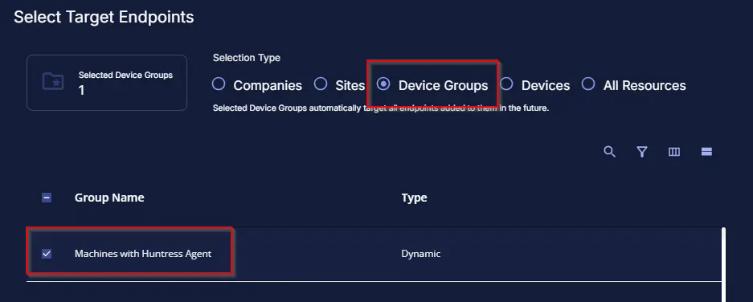
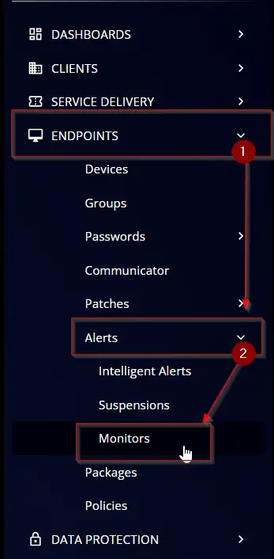
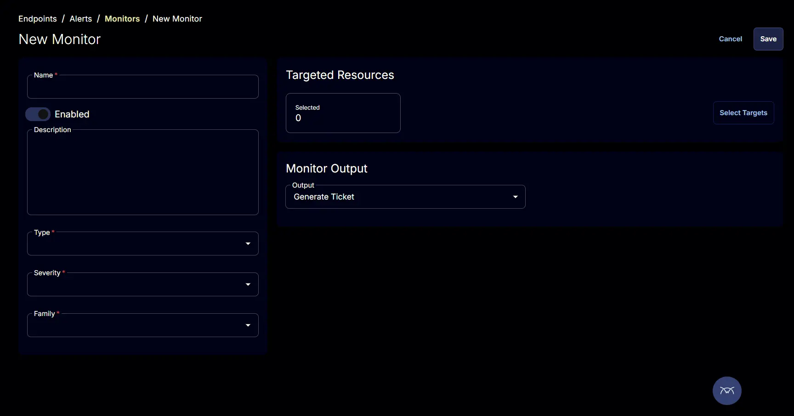
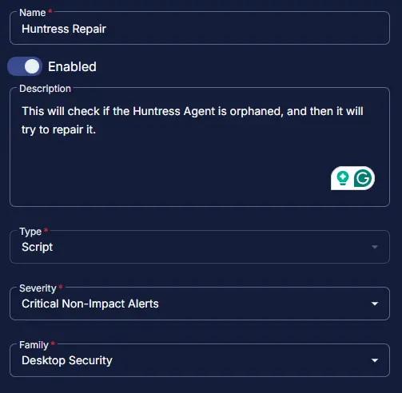
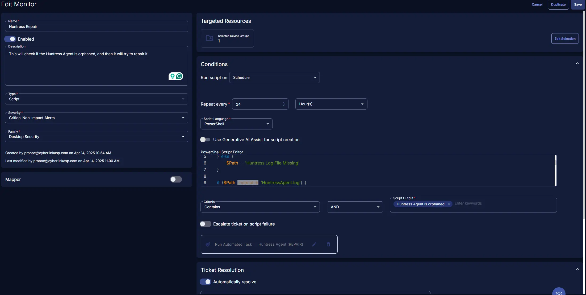

## Summary

This document provides instructions on how to set up alerts for machines where the Huntress agent has stopped functioning as intended

## Dependencies

[CW RMM - Device Group - Machines with Huntress Agent](/docs/7fc0874b-154c-49c0-aed4-a89be18798f4)   
[Huntress Agent (REPAIR)](/docs/ebe382f4-d3cb-47be-84e1-c82009fd745a)

## Target

This monitor should target the group shown below:  


## Monitor Creation

### Step 1

Navigate to `ENDPOINTS` ➞ `Alerts` ➞ `Monitors`  


### Step 2

Locate the `Create Monitor` button on the right-hand side of the screen and click on it.  


This page will appear after clicking on the `Create Monitor` button:  


### Step 3

Fill in the mandatory columns on the left side  
Name: `Huntress Repair`  
Description: `This will check if the Huntress Agent is orphaned, and then it will try to repair it.`  
Type: `Script`  
Severity: `Critical Non-Impact Alerts`  
Family: `Desktop Security`  


### Step 4

Click the `Select Target` button to choose the endpoints for running the monitor set.  


This page will appear after clicking on the `Select Target` button:  


This monitor should target the group shown below:  


### Step 5

Fill in the conditions on the right side  
Run script on: `Schedule`  
Repeat every: `24 Hours`  
Script Language: `Powershell`  
Script Output: `Huntress Agent is not Orphaned`  
Automatically resolve: `Enabled`  
Run Automated Task: `Huntress Agent (REPAIR)`   
Powershell Script:  
```powershell
   if (Test-Path 'C:\Program Files\Huntress\HuntressAgent.log') {
    $Path = 'C:\Program Files\Huntress\HuntressAgent.log'
} elseif (Test-Path 'C:\Program Files (x86)\Huntress\HuntressAgent.log') {
    $Path = 'C:\Program Files (x86)\Huntress\HuntressAgent.log'
} else {
    $Path = 'Huntress Log File Missing'
}

if ($Path -notmatch 'HuntressAgent.log') {
    Write-Output $Path
} else {
    $Log = Get-Content $Path | ForEach-Object {
        if ($_ -match '(?<time>\d+-\d+-\d+T\d+:\d+:\d+-\d+:\d+).+(?<level>(?<=level=)\w+).+(?<msg>(?<=msg=).*)') {
            $Matches.Remove(0)
            [PSCustomObject]$Matches
        }
    } | Where-Object {
        $_.level -match 'error' -and $_.msg -match 'status code:401'
    }

    if ($Log.count -ge 1) {
        Write-Output 'Huntress Agent is orphaned. Please uninstall and reinstall'
    } else {
        Write-Output 'Huntress Agent is not Orphaned'
    }
}

   ```


## Completed Monitor

