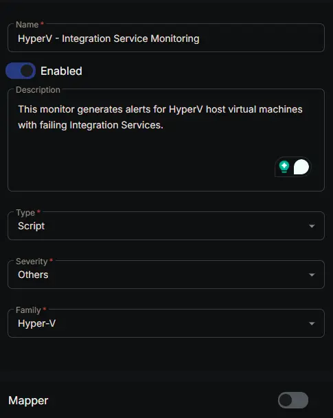
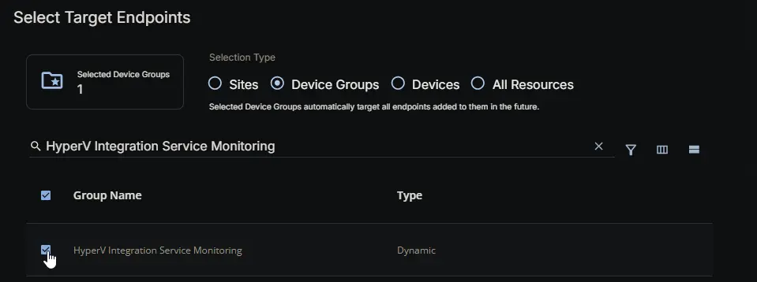
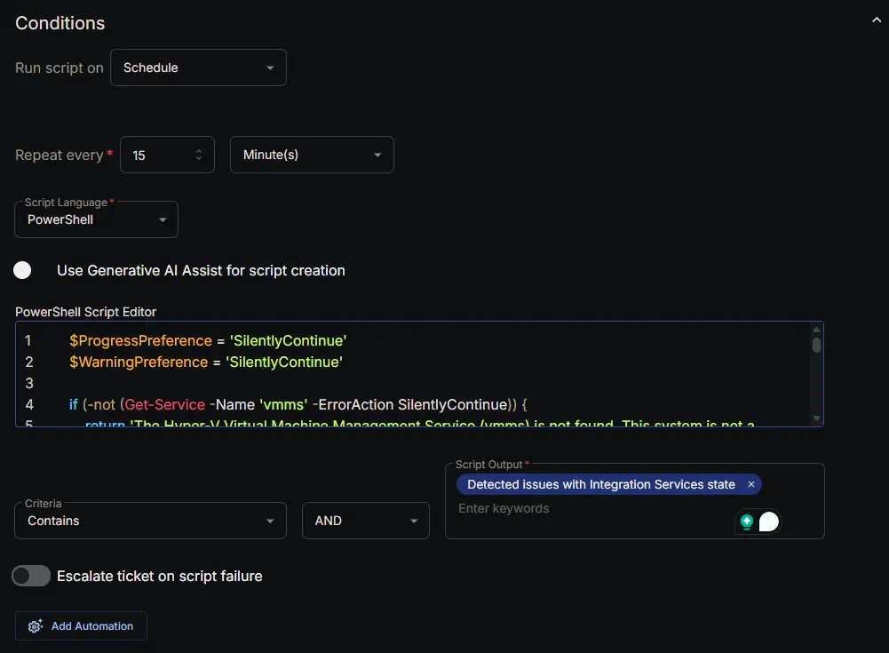
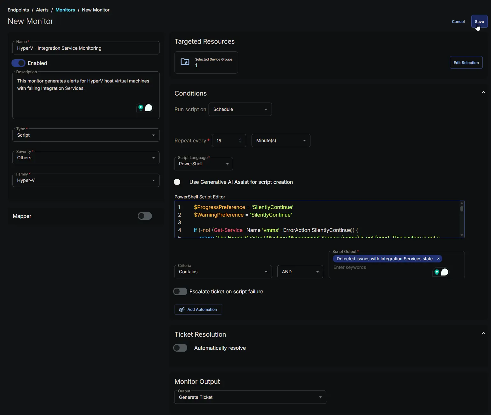

## Summary

This monitor generates alerts for HyperV host virtual machines with failing Integration Services.

## Dependencies

- [Custom Field: HyperVIntegrationSvcMonitoring](/docs/85741409-f7cd-4ec2-b8cc-fefd6f8f2e0b)
- [Group: HyperV Integration Service Monitoring](/docs/293f12ae-e79f-42be-bf8b-896f071607e6)
- [Solution: HyperV - Integration Service Monitoring](/docs/08acb7b4-3513-4231-9372-3dbd05e2f43f)

## Monitor Setup Location

**Monitors Path:** `ENDPOINTS` -> `Alerts` -> `Monitors`

## Monitor Summary

- **Name:** `HyperV - Integration Service Monitoring`
- **Description:** `This monitor generates alerts for HyperV host virtual machines with failing Integration Services.`
- **Type:** `Script`
- **Severity:** `Others`
- **Family:** `Hyper-V`



## Targeted Resources

- **Target Type:** `Device Groups`
- **Group Name:** `HyperV Integration Service Monitoring`



## Conditions

- **Run Script on:** `Schedule`
- **Repeat every:** `15` `Minutes`
- **Script Language:** `PowerShell`
- **Use Generative AI Assist for script creation:** `False`
- **PowerShell Script Editor:**

```PowerShell
$ProgressPreference = 'SilentlyContinue'
$WarningPreference = 'SilentlyContinue'

if (-not (Get-Service -Name 'vmms' -ErrorAction SilentlyContinue)) {
    return 'The Hyper-V Virtual Machine Management Service (vmms) is not found. This system is not a Hyper-V host.'
}

$output = @()
try {
    $vms = Get-VM -ErrorAction Stop |
        Where-Object -FilterScript {
            $_.State -eq 'Running'
        }

    if ($vms) {
        foreach ($vm in $vms) {
            $services = Get-VMIntegrationService -VMName $vm.Name -ErrorAction Stop

            $failingServices = $services | Where-Object -FilterScript {
                $_.Enabled -eq $true -and
                $_.PrimaryStatusDescription -ne 'OK'
            }

            if ($failingServices) {
                $badServiceNames = ($failingServices.Name) -join ', '
                $output += ('{0}: Failing ({1})' -f $vm.Name, $badServiceNames)
            }
        }

        if ($output.Count -gt 0) {
            return ('Detected issues with Integration Services state:{0}{1}' -f [Environment]::NewLine, ($output -join [Environment]::NewLine))
        }

        return 'Integration Services are UpToDate and reporting OK.'
    }

    return 'No running VMs found.'
} catch {
    return ('Script failed to run properly. Reason: {0}' -f $Error[0].Exception.Message)
}
```

- **Criteria:** `Contains`
- **Operator:** `AND`
- **Script Output:** `Detected issues with Integration Services state`
- **Escalate ticket on script failure:** `False`
- **Add Automation:** `NONE`



## Ticket Resolution

**Automatically resolve:** `False`


## Monitor Output

**Output:** `Generate Ticket`


## Completed Monitor



## Changelog

### 2026-06-17

- Initial version of the document
