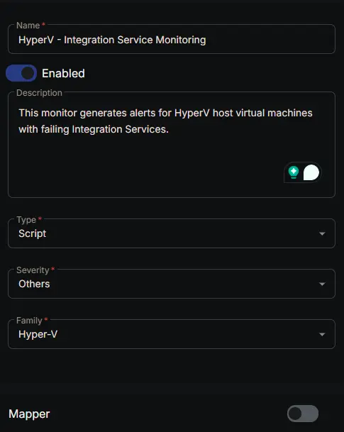
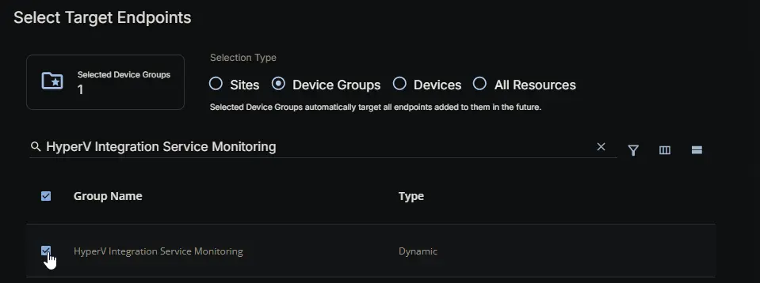
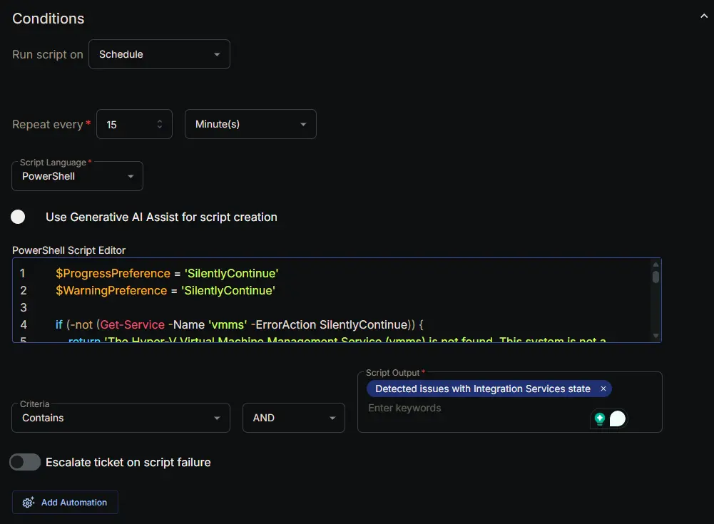
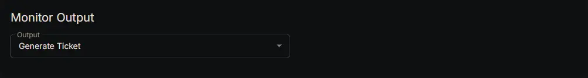
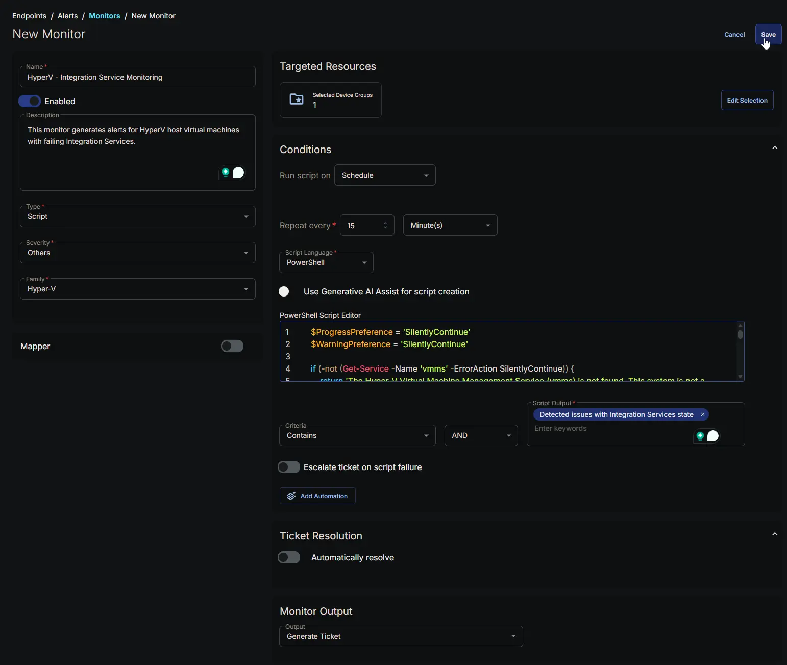

## Summary

This monitor generates alerts for HyperV host virtual machines with failing Integration Services.

## Dependencies

- [Custom Field: HyperVIntegrationSvcMonitoring](/docs/85741409-f7cd-4ec2-b8cc-fefd6f8f2e0b)
- [Group: HyperV Integration Service Monitoring](/docs/293f12ae-e79f-42be-bf8b-896f071607e6)
- [Solution: HyperV - Integration Service Monitoring](/docs/08acb7b4-3513-4231-9372-3dbd05e2f43f)

## Monitor Setup Location

**Monitors Path:** `ENDPOINTS` -> `Alerts` -> `Monitors`

## Monitor Summary

- **Name:** `HyperV - Integration Service Monitoring`
- **Description:** `This monitor generates alerts for HyperV host virtual machines with failing Integration Services.`
- **Type:** `Script`
- **Severity:** `Others`
- **Family:** `Hyper-V`

## Targeted Resources

- **Target Type:** `Device Groups`
- **Group Name:** `HyperV Integration Service Monitoring`

## Conditions

- **Run Script on:** `Schedule`
- **Repeat every:** `15` `Minutes`
- **Script Language:** `PowerShell`
- **Use Generative AI Assist for script creation:** `False`
- **PowerShell Script Editor:**

[PowerShell Script](https://github.com/ProVal-Tech/cw-rmm/blob/main/monitors/hyperv-integration-service-monitoring/script.ps1)

- **Criteria:** `Contains`
- **Operator:** `AND`
- **Script Output:** `Detected issues with Integration Services state`
- **Escalate ticket on script failure:** `False`
- **Add Automation:** `NONE`

## Ticket Resolution

**Automatically resolve:** `False`

## Monitor Output

**Output:** `Generate Ticket`

## Completed Monitor

## Changelog

### 2026-06-17

- Initial version of the document

