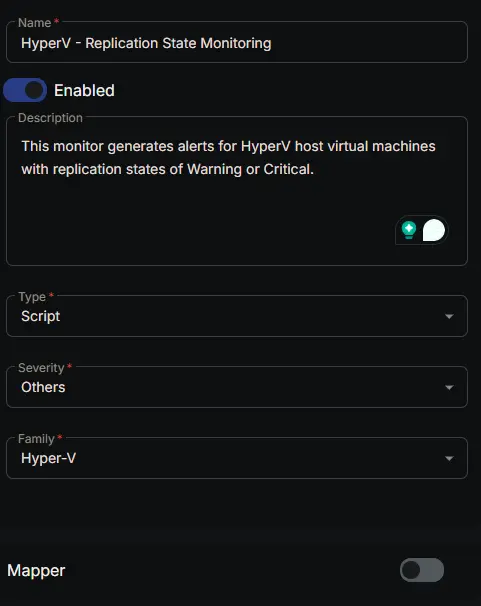
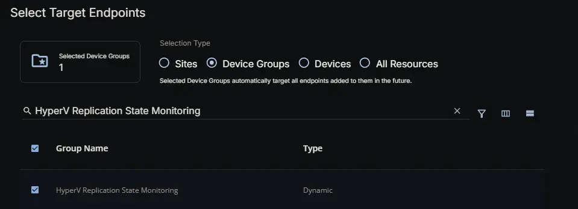
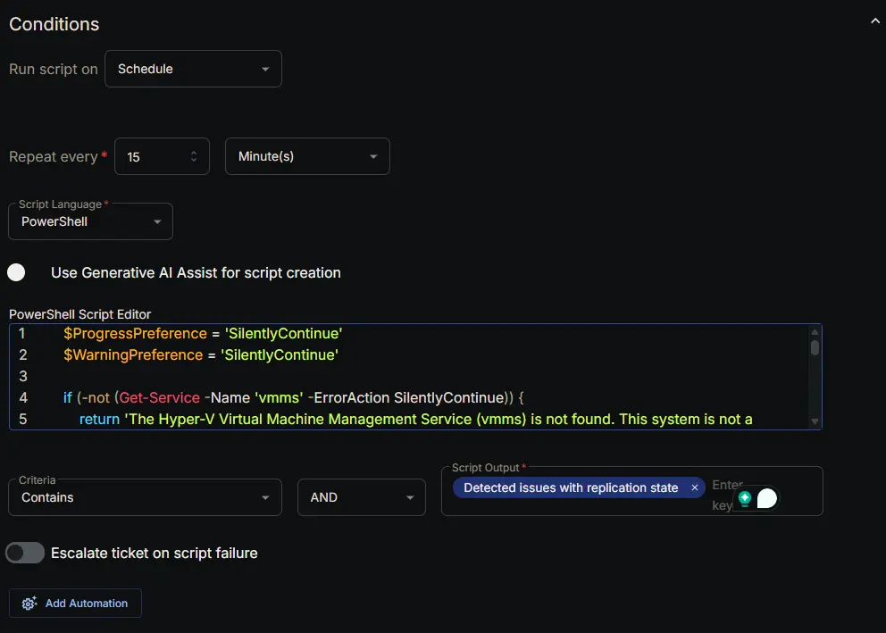
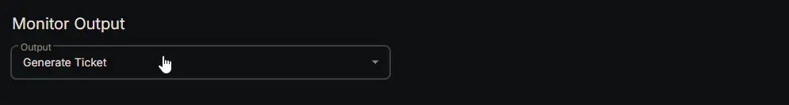
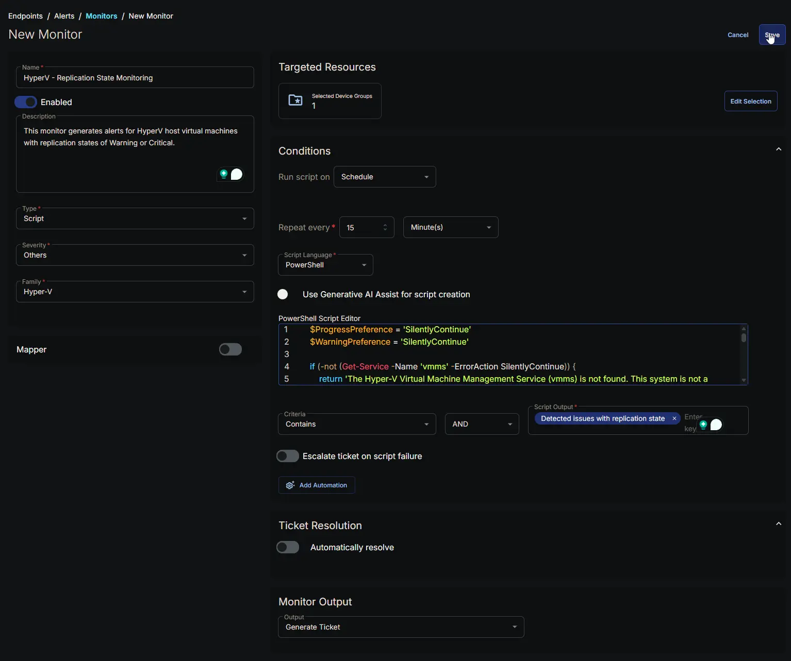

## Summary

This monitor generates alerts for HyperV host virtual machines with replication states of Warning or Critical.

## Dependencies

- [Custom Field: HyperVReplicationStateMonitoring](/docs/6e2b0d4f-9a4d-4b10-9628-cf7be6a7ab44)
- [Group: HyperV Replication State Monitoring](/docs/3d997e81-827e-4f8b-a356-4f6a3dd0ce7b)
- [Solution: HyperV - Replication State Monitoring](/docs/9f3f0b27-3b3b-4c3e-91b1-6d82d9480f52)

## Monitor Setup Location

**Monitors Path:** `ENDPOINTS` -> `Alerts` -> `Monitors`

## Monitor Summary

- **Name:** `HyperV - Replication State Monitoring`
- **Description:** `This monitor generates alerts for HyperV host virtual machines with replication states of Warning or Critical.`
- **Type:** `Script`
- **Severity:** `Others`
- **Family:** `Hyper-V`



## Targeted Resources

- **Target Type:** `Device Groups`
- **Group Name:** `HyperV Replication State Monitoring`



## Conditions

- **Run Script on:** `Schedule`
- **Repeat every:** `15` `Minutes`
- **Script Language:** `PowerShell`
- **Use Generative AI Assist for script creation:** `False`
- **PowerShell Script Editor:**

```PowerShell
$ProgressPreference = 'SilentlyContinue'
$WarningPreference = 'SilentlyContinue'

if (-not (Get-Service -Name 'vmms' -ErrorAction SilentlyContinue)) {
    return 'The Hyper-V Virtual Machine Management Service (vmms) is not found. This system is not a Hyper-V host.'
}

$output = @()
try {
    $vms = Get-VM -ErrorAction Stop |
        Where-Object -FilterScript {
            $_.ReplicationState -ne 'Disabled'
        }

    if ($vms) {
        foreach ($vm in $vms) {
            $replicationState = Get-VMReplication -VMName $vm.VMName -ErrorAction Stop

            if ($replicationState -in ('Critical', 'Warning')) {
                $output += ('{0} replication state: {1}' -f $vm.VMName, $replicationState)
            }
        }

        if ($output -match 'replication state') {
            return ('Detected issues with replication state:{0}{1}' -f [Environment]::NewLine, ($output -join [Environment]::NewLine))
        }

        return 'Replication state is Healthy'

    }

    return 'Replication not enabled for any VM'

} catch {
    return ('Script Failed to run properly. Reason: {0}' -f $Error[0].Exception.Message)
}
```

- **Criteria:** `Contains`
- **Operator:** `AND`
- **Script Output:** `Detected issues with replication state`
- **Escalate ticket on script failure:** `False`
- **Add Automation:** `NONE`



## Ticket Resolution

**Automatically resolve:** `False`


## Monitor Output

**Output:** `Generate Ticket`



## Completed Monitor



## Changelog

### 2026-06-17

- Initial version of the document
