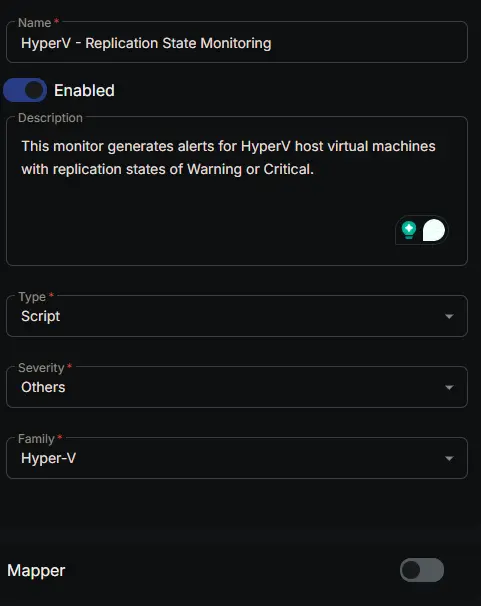
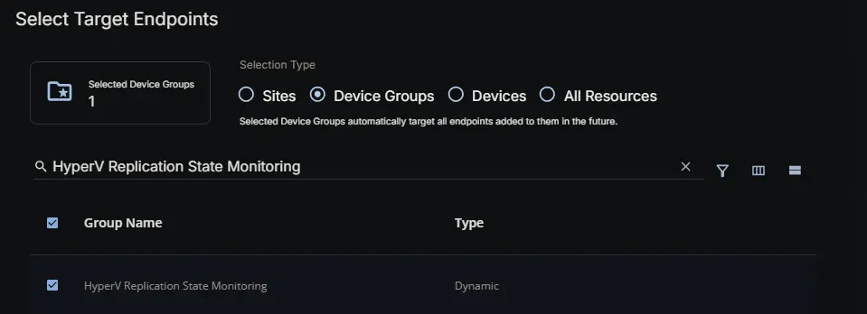
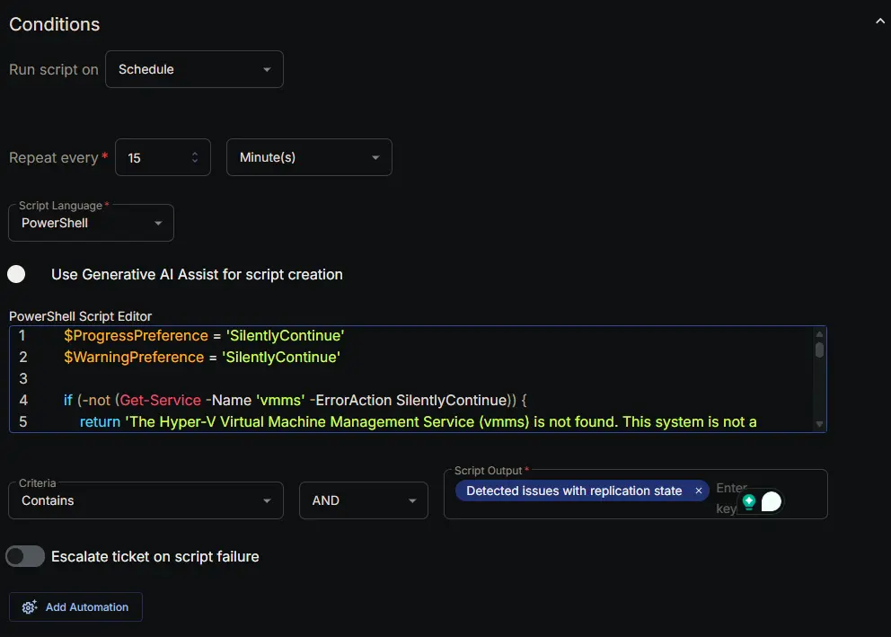
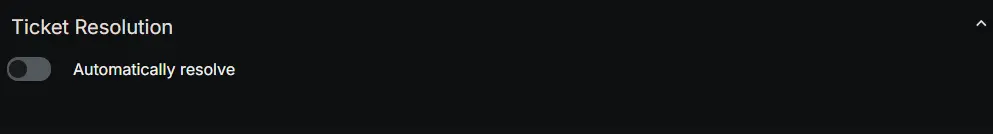
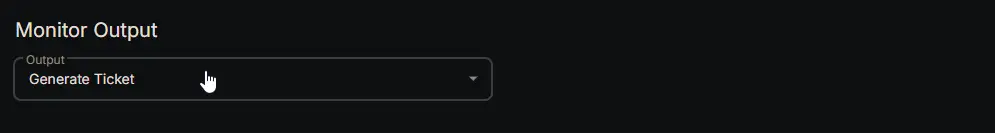
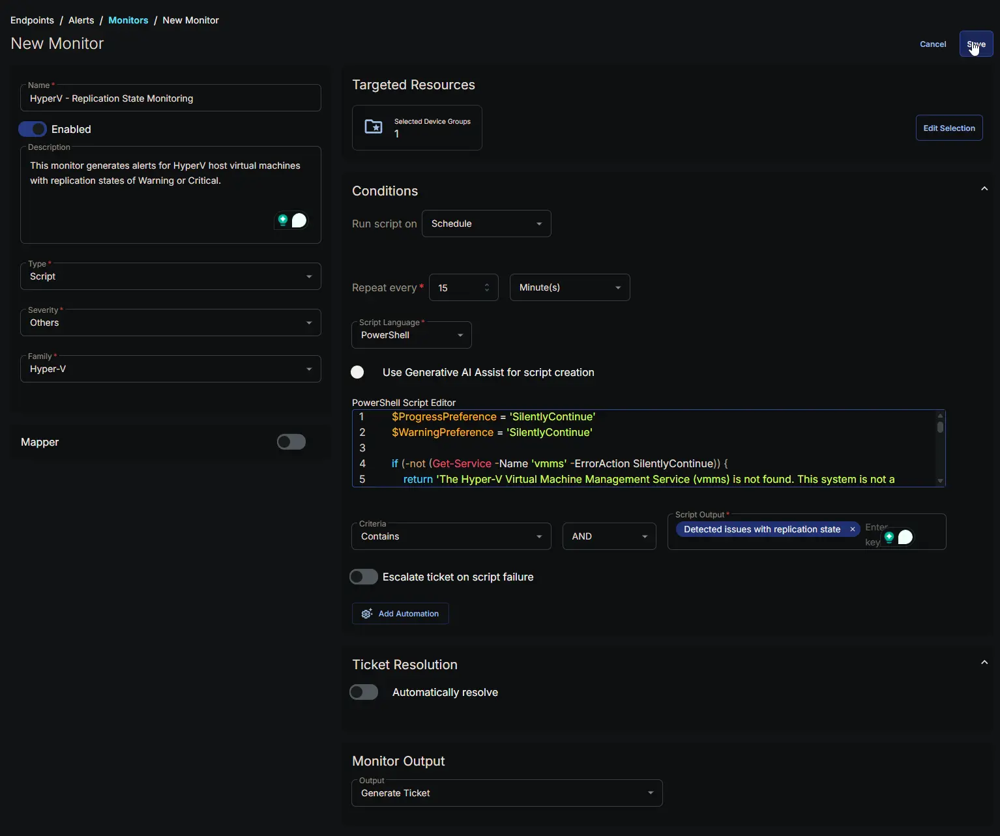

---
id: 'b1f0a6d3-5ec6-4fc9-a9b9-fab67de7f3de'
slug: /b1f0a6d3-5ec6-4fc9-a9b9-fab67de7f3de
title: 'HyperV - Replication State Monitoring'
title_meta: 'HyperV - Replication State Monitoring'
keywords: ['hyper-v', 'replication', 'state', 'monitoring', 'alert']
description: 'This monitor generates alerts for HyperV host virtual machines with replication states of Warning or Critical.'
tags: ['windows', 'alerting', 'hyper-v']
draft: false
unlisted: false
last_update:
  date: 2026-06-17
---

## Summary

This monitor generates alerts for HyperV host virtual machines with replication states of Warning or Critical.

## Dependencies

- [Custom Field: HyperVReplicationStateMonitoring](/docs/6e2b0d4f-9a4d-4b10-9628-cf7be6a7ab44)
- [Group: HyperV Replication State Monitoring](/docs/3d997e81-827e-4f8b-a356-4f6a3dd0ce7b)
- [Solution: HyperV - Replication State Monitoring](/docs/9f3f0b27-3b3b-4c3e-91b1-6d82d9480f52)

## Monitor Setup Location

**Monitors Path:** `ENDPOINTS` -> `Alerts` -> `Monitors`

## Monitor Summary

- **Name:** `HyperV - Replication State Monitoring`
- **Description:** `This monitor generates alerts for HyperV host virtual machines with replication states of Warning or Critical.`
- **Type:** `Script`
- **Severity:** `Others`
- **Family:** `Hyper-V`

## Targeted Resources

- **Target Type:** `Device Groups`
- **Group Name:** `HyperV Replication State Monitoring`

## Conditions

- **Run Script on:** `Schedule`
- **Repeat every:** `15` `Minutes`
- **Script Language:** `PowerShell`
- **Use Generative AI Assist for script creation:** `False`
- **PowerShell Script Editor:**

[PowerShell Script](https://github.com/ProVal-Tech/cw-rmm/blob/main/monitors/hyperv-replication-state-monitoring/script.ps1)

- **Criteria:** `Contains`
- **Operator:** `AND`
- **Script Output:** `Detected issues with replication state`
- **Escalate ticket on script failure:** `False`
- **Add Automation:** `NONE`

## Ticket Resolution

**Automatically resolve:** `False`

## Monitor Output

**Output:** `Generate Ticket`

## Completed Monitor

## Changelog

### 2026-06-17

- Initial version of the document

