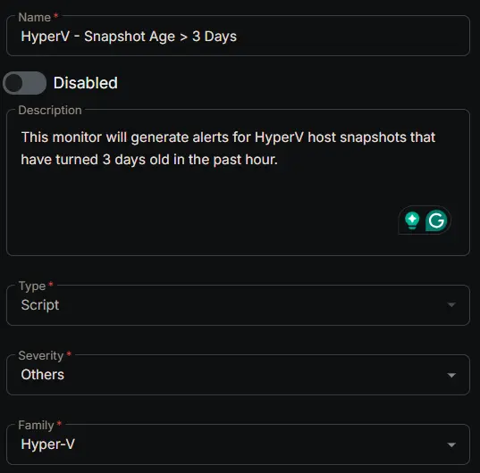
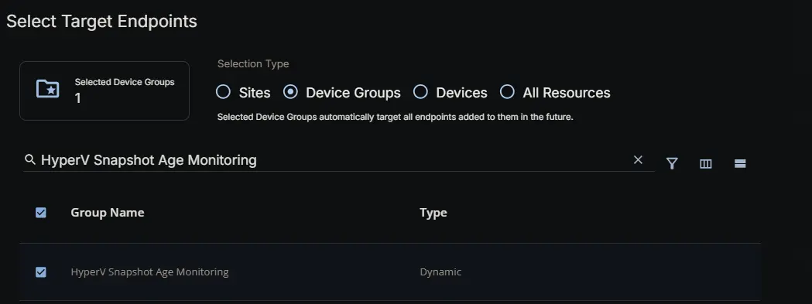
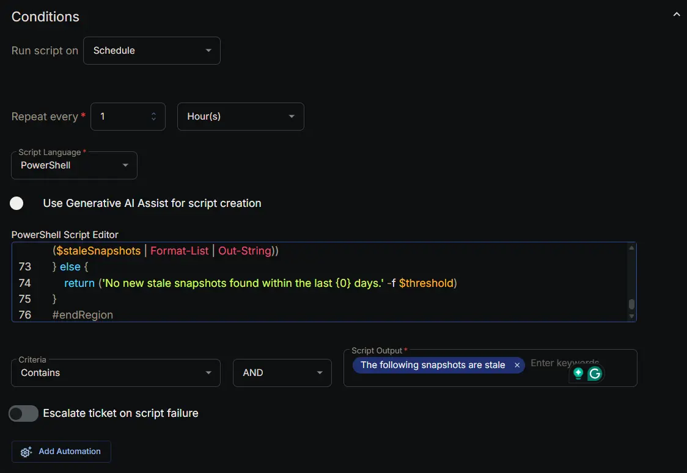
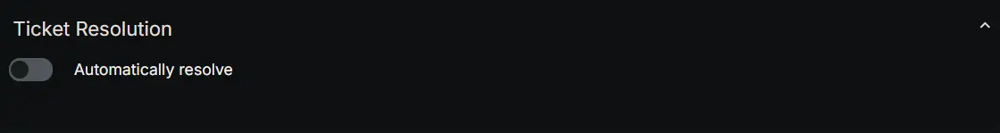
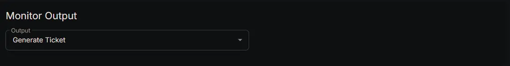
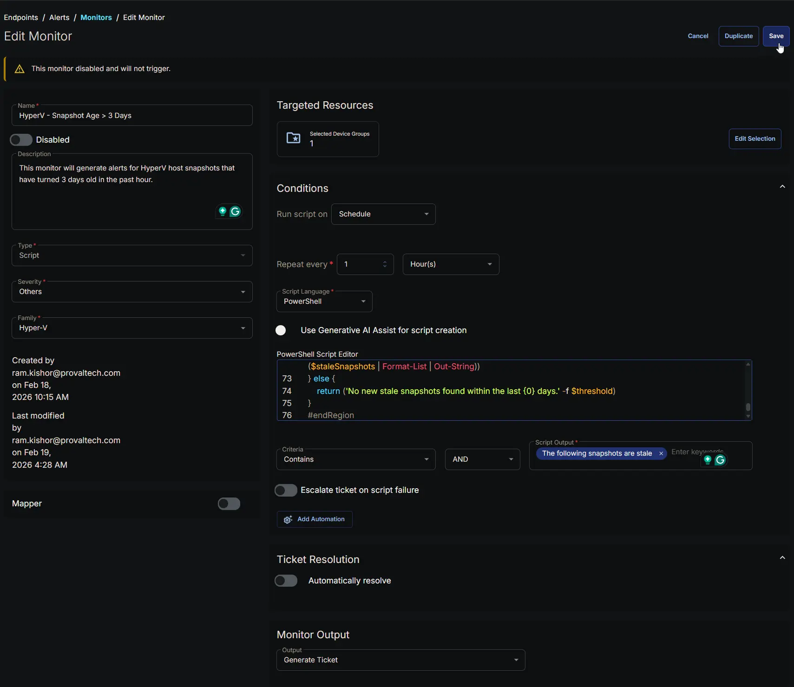

## Summary

This monitor will generate alerts for HyperV host snapshots that have turned 3 days old in the past hour.

## Dependencies

- [Custom Field: HyperV Snapshot Age Monitoring](/docs/e0a288ec-c323-45bb-94b0-02071635ce45)
- [Group: HyperV Snapshot Age Monitoring](/docs/21d5941d-f8ad-439c-a724-1e998972751c)
- [Solution: HyperV - Snapshot Age > 3 Days Monitoring](/docs/73e61957-b973-4c64-8c48-70c45f2d400a)

## Monitor Setup Location

**Monitors Path:** `ENDPOINTS` ➞ `Alerts` ➞ `Monitors`  

## Monitor Summary

- **Name:** `HyperV - Snapshot Age > 3 Days`  
- **Description:** `This monitor will generate alerts for HyperV host snapshots that have turned 3 days old in the past hour.`  
- **Type:** `Script`  
- **Severity:** `Others`  
- **Family:** `Hyper-V`



## Targeted Resources

- **Target Type:**  `Device Groups`  
- **Group Name:** `HyperV Snapshot Age Monitoring`



## Conditions

- **Run Script on:** `Schedule`  
- **Repeat every:** `1` `Hours`  
- **Script Language:** `PowerShell`  
- **Use Generative AI Assist for script creation:** `False`  
- **PowerShell Script Editor:**  

```PowerShell
#region globals
$ProgressPreference = 'SilentlyContinue'
$WarningPreference = 'SilentlyContinue'
$InformationPreference = 'Continue'
#endRegion

#region variables
$threshold = 3 # days
$tableName = 'staleSnapshots'
#endRegion

#region set tls policy
$supportedTLSversions = [enum]::GetValues('Net.SecurityProtocolType')
if (($supportedTLSversions -contains 'Tls13') -and ($supportedTLSversions -contains 'Tls12')) {
    [System.Net.ServicePointManager]::SecurityProtocol = [System.Net.ServicePointManager]::SecurityProtocol::Tls13 -bor [System.Net.SecurityProtocolType]::Tls12
} elseif ($supportedTLSversions -contains 'Tls12') {
    [System.Net.ServicePointManager]::SecurityProtocol = [System.Net.SecurityProtocolType]::Tls12
} else {
    Write-Information 'TLS 1.2 and/or TLS 1.3 are not supported on this system. This download may fail!' -InformationAction Continue
    if ($PSVersionTable.PSVersion.Major -lt 3) {
        Write-Information 'PowerShell 2 / .NET 2.0 doesn''t support TLS 1.2.' -InformationAction Continue
    }
}
#endRegion

#region strapper
Get-PackageProvider -Name NuGet -ForceBootstrap | Out-Null
Set-PSRepository -Name PSGallery -InstallationPolicy Trusted
try {
    Update-Module -Name Strapper -ErrorAction Stop
} catch {
    Install-Module -Name Strapper -Repository PSGallery -SkipPublisherCheck -Force
    Get-Module -Name Strapper -ListAvailable | Where-Object { $_.Version -ne (Get-InstalledModule -Name Strapper).Version } | ForEach-Object { Uninstall-Module -Name Strapper -MaximumVersion $_.Version }
}
(Import-Module -Name 'Strapper') 3>&1 2>&1 1>$null
Set-StrapperEnvironment
#endRegion

#region get information
$staleSnapshots = Get-VM |
    Get-VMSnapshot |
    Where-Object {
        $_.creationTime -le (Get-Date).AddDays(-$threshold) -and $_.IsDeleted -eq $false
    } |
    Select-Object -Property VMName, Name, ParentSnapshotName, SnapshotType, CreationTime
#endRegion

#region get stored data from table
$alertedSnapshots = try {
    Get-StoredObject -TableName $tableName -WarningAction SilentlyContinue -ErrorAction Stop
} catch {
    $null
}
$staleSnapshots | Write-StoredObject -TableName $tableName -WarningAction SilentlyContinue -Clobber -Depth 10
#endRegion

#region get stale snapshots that haven't been alerted on
if ($alertedSnapshots) {
    $staleSnapshots = $staleSnapshots | Where-Object {
        $snapshot = $_
        -not ($alertedSnapshots | Where-Object {
            $_.VMName -eq $snapshot.VMName -and
            $_.Name -eq $snapshot.Name -and
            $_.ParentSnapshotName -eq $snapshot.ParentSnapshotName
        })
    }
}
#endRegion

#region output
if ($staleSnapshots) {
    return ('The following snapshots are stale (older than {0} days):{1}{2}' -f $threshold, [char]10, ($staleSnapshots | Format-List | Out-String))
} else {
    return ('No new stale snapshots found within the last {0} days.' -f $threshold)
}
#endRegion
```

- **Criteria:**  `Contains`  
- **Operator:** `AND`  
- **Script Output:**  `The following snapshots are stale`  
- **Escalate ticket on script failure:** `False`  
- **Add Automation:**  ` `



## Ticket Resolution

**Automatically resolve:** `False`



## Monitor Output

**Output:** `Generate Ticket`



## Completed Monitor


