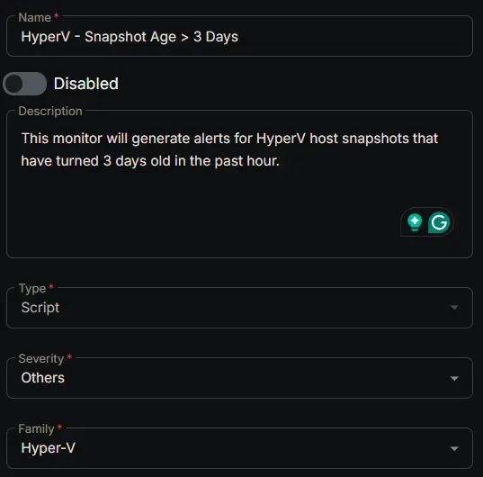
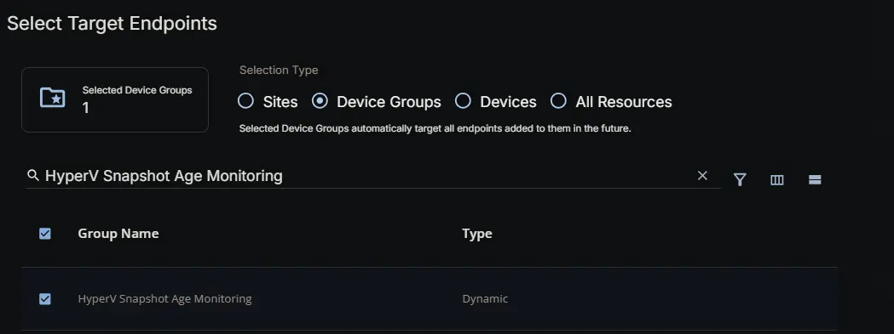
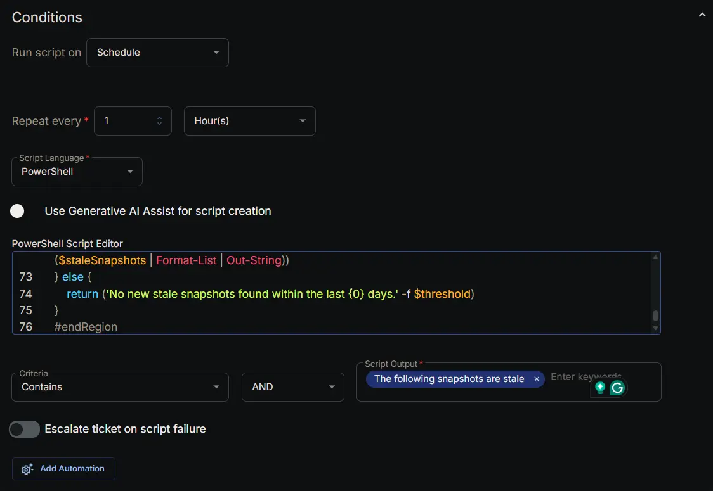
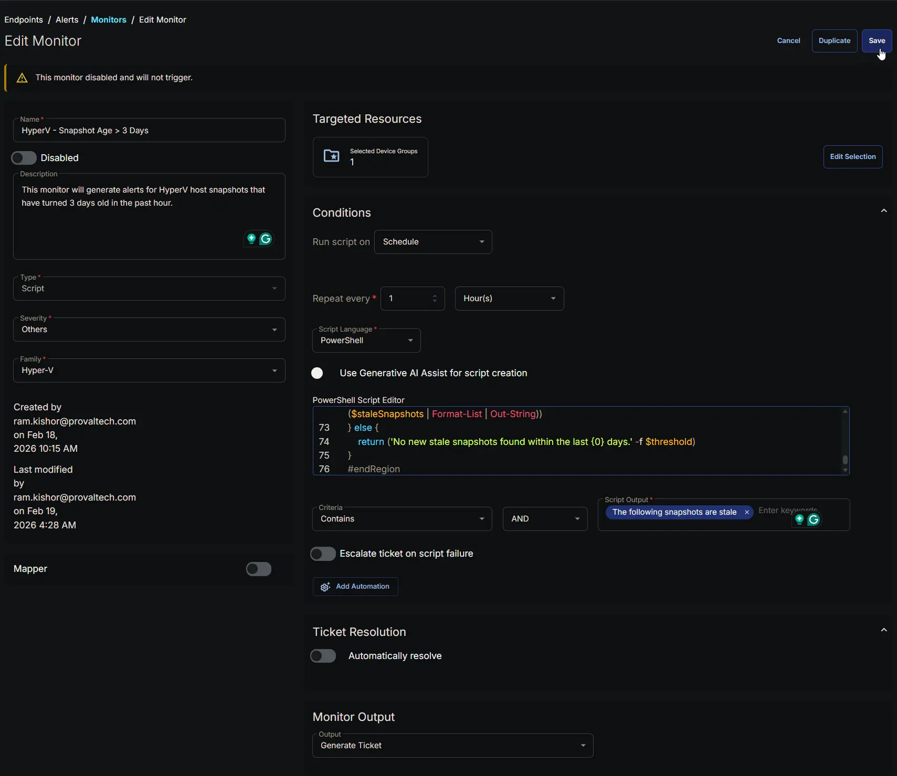

## Summary

This monitor will generate alerts for HyperV host snapshots that have turned 3 days old in the past hour.

## Dependencies

- [Custom Field: HyperV Snapshot Age Monitoring](/docs/e0a288ec-c323-45bb-94b0-02071635ce45)
- [Group: HyperV Snapshot Age Monitoring](/docs/21d5941d-f8ad-439c-a724-1e998972751c)
- [Solution: HyperV - Snapshot Age > 3 Days Monitoring](/docs/73e61957-b973-4c64-8c48-70c45f2d400a)

## Monitor Setup Location

**Monitors Path:** `ENDPOINTS` ➞ `Alerts` ➞ `Monitors`  

## Monitor Summary

- **Name:** `HyperV - Snapshot Age > 3 Days`  
- **Description:** `This monitor will generate alerts for HyperV host snapshots that have turned 3 days old in the past hour.`  
- **Type:** `Script`  
- **Severity:** `Others`  
- **Family:** `Hyper-V`

## Targeted Resources

- **Target Type:**  `Device Groups`  
- **Group Name:** `HyperV Snapshot Age Monitoring`

## Conditions

- **Run Script on:** `Schedule`  
- **Repeat every:** `1` `Hours`  
- **Script Language:** `PowerShell`  
- **Use Generative AI Assist for script creation:** `False`  
- **PowerShell Script Editor:**  

[PowerShell Script](https://github.com/ProVal-Tech/cw-rmm/blob/main/monitors/hyperv-snapshot-age-gt-3-days/script.ps1)

- **Criteria:**  `Contains`  
- **Operator:** `AND`  
- **Script Output:**  `The following snapshots are stale`  
- **Escalate ticket on script failure:** `False`  
- **Add Automation:**  `NONE`

## Ticket Resolution

**Automatically resolve:** `False`

## Monitor Output

**Output:** `Generate Ticket`

## Completed Monitor

## Changelog

### 2026-02-19

- Initial version of the document

