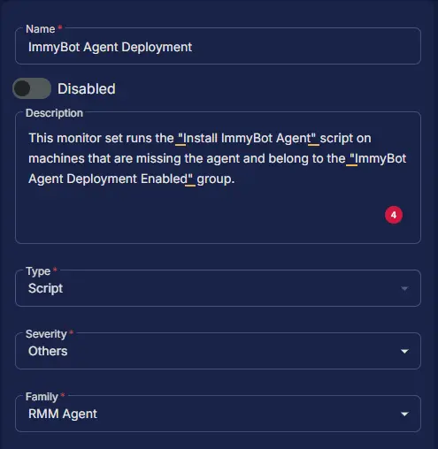
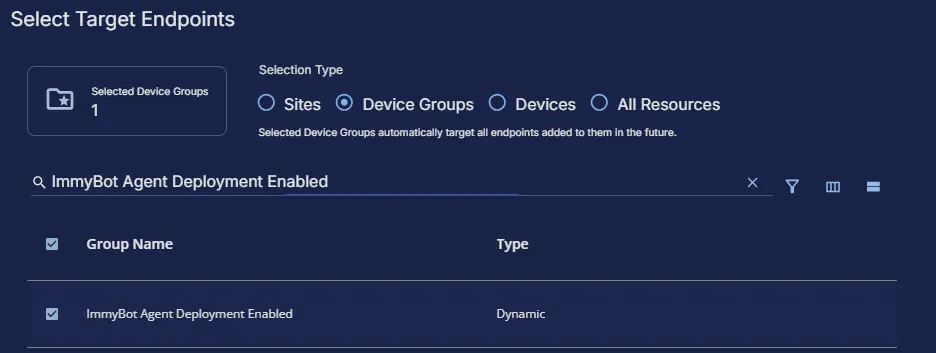
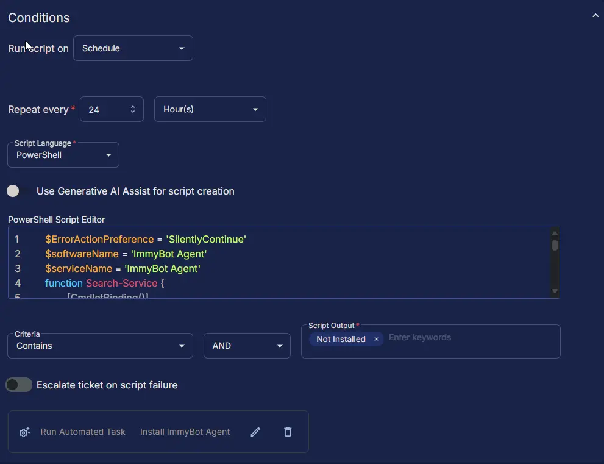
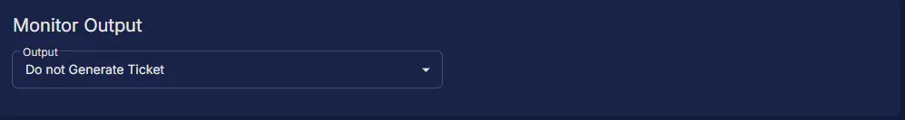
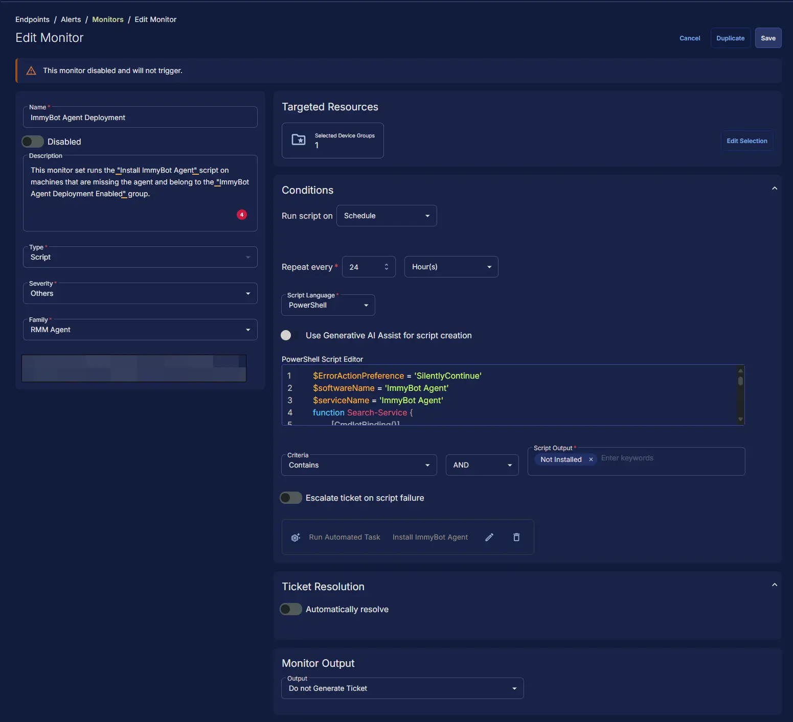

## Summary

This monitor set runs the [Install ImmyBot Agent](/docs/c2576ff2-e86f-43f7-94dc-462a7afbc7f1) script on machines that are missing the agent and belong to the [ImmyBot Agent Deployment Enabled](/docs/e69486d9-27f7-4fa6-87cd-d62151d6ddc4) group.

## Dependencies

- [Deploy ImmyBot](/docs/415511bb-26c0-4c9f-ac34-d395f29b223e)
- [ImmyBot Exclusion](/docs/5e44ed99-db67-41d3-b718-532395f2ac11)
- [ImmyBot Exclusion](/docs/77b89b50-c343-48a4-b8a0-9e80ceab78ed)
- [ImmyBot Tenant](/docs/2556d27a-3c3c-4437-aa2c-43143b97ff88)
- [ImmyBot Installer ID](/docs/9f10ae6a-e898-4bc6-95cb-946c77abdf2e)
- [ImmyBot Installer Key](/docs/9449d91e-3a45-4fa2-b0b4-099dc349bb50)
- [ImmyBot Agent Deployment Enabled](/docs/e69486d9-27f7-4fa6-87cd-d62151d6ddc4)
- [Install ImmyBot Agent](/docs/c2576ff2-e86f-43f7-94dc-462a7afbc7f1)
- [ImmyBot Agent Deployment](/docs/d0a57d05-71c0-495e-a055-803ad7a728ad)

## Monitor Setup Location

**Monitors Path:** `ENDPOINTS` ➞ `Alerts` ➞ `Monitors`  

## Monitor Summary

- **Name:** `ImmyBot Agent Deployment`  
- **Description:** `This monitor set runs the "Install ImmyBot Agent" script on machines that are missing the agent and belong to the "ImmyBot Agent Deployment Enabled" group.`  
- **Type:** `Script`  
- **Severity:** `Others`  
- **Family:** `RMM Agent`



## Targeted Resources

- **Target Type:**  `Device Groups`  
- **Group Name:** `ImmyBot Agent Deployment Enabled`



## Conditions

- **Run Script on:** `Schedule`  
- **Repeat every:** `24` `Hours`  
- **Script Language:** `PowerShell`  
- **Use Generative AI Assist for script creation:** `False`  
- **PowerShell Script Editor:**  

```PowerShell
$ErrorActionPreference = 'SilentlyContinue'
$softwareName = 'ImmyBot Agent'
$serviceName = 'ImmyBot Agent'
function Search-Service {
    [CmdletBinding()]
    param (
        [Parameter(Mandatory)][String]$ServiceName
    )
    if (Get-Service -Name $ServiceName -ErrorAction SilentlyContinue) {
        return $true
    } else {
        return $false
    }
}

function Get-ProductId {
    [CmdletBinding()]
    param (
        [Parameter(Mandatory)][String]$SoftwareName
    )
    $uninstallPaths = @(
        'HKLM:\SOFTWARE\Microsoft\Windows\CurrentVersion\Uninstall',
        'HKLM:\SOFTWARE\Wow6432Node\Microsoft\Windows\CurrentVersion\Uninstall'
    )
    $uninstallInfo = Get-ChildItem $uninstallPaths -ErrorAction SilentlyContinue |
        Get-ItemProperty |
        Where-Object { 
            $_.DisplayName -match [Regex]::Escape($SoftwareName)
        }
    if ($uninstallInfo) {
        return $uninstallInfo.PSChildName
    } else {
        return $null
    }
}

$serviceCheck = Search-Service -ServiceName $serviceName
$softwareCheck = Get-ProductId -SoftwareName $softwareName

if (!$serviceCheck -or !$softwareCheck) {
    return 'Not Installed or Broken'
} else {
    return 'Installed'
}
```

- **Criteria:**  `Contains`  
- **Operator:** `AND`  
- **Script Output:**  `Not Installed`  
- **Escalate ticket on script failure:** `False`  
- **Add Automation:**  `Install ImmyBot Agent`



## Ticket Resolution

**Automatically resolve:** `False`


## Monitor Output

**Output:** `Do not Generate Ticket`



## Completed Monitor


