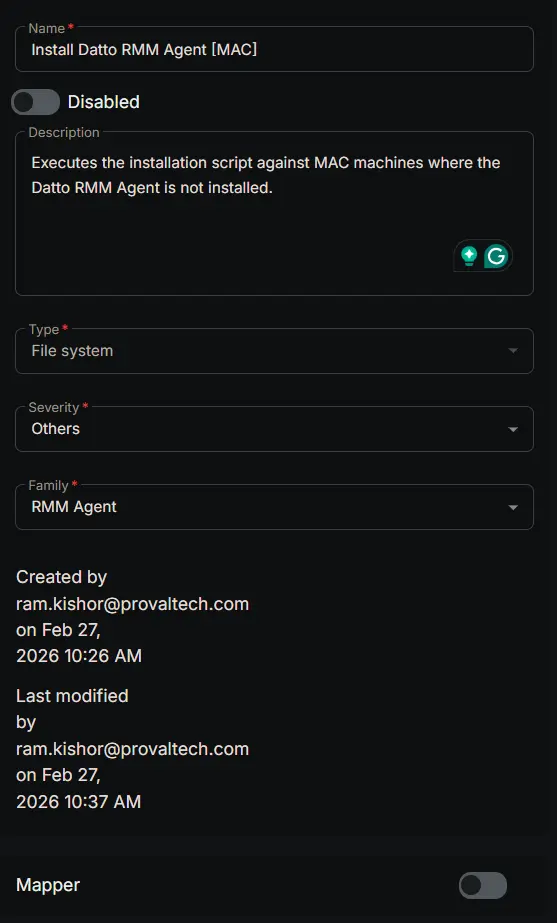
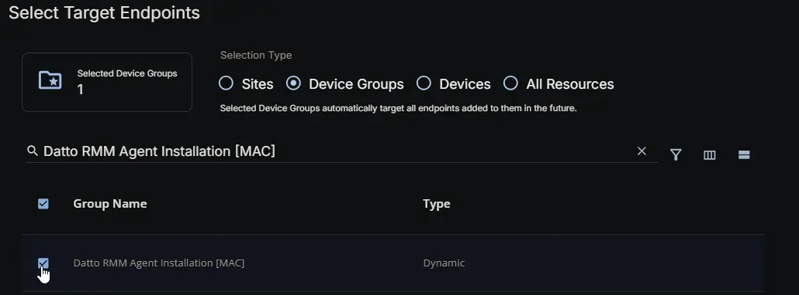
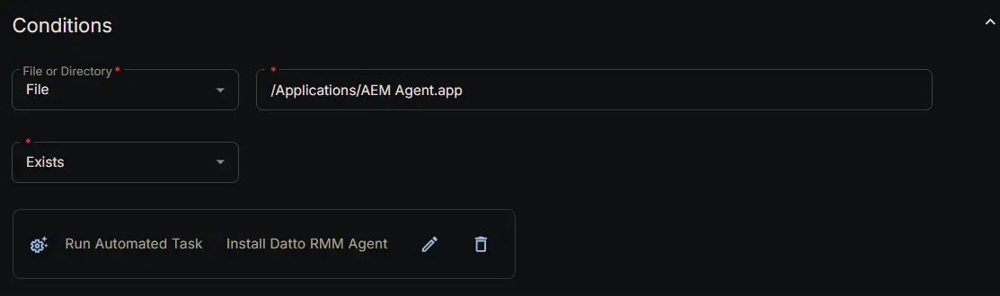
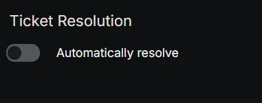
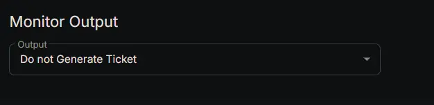
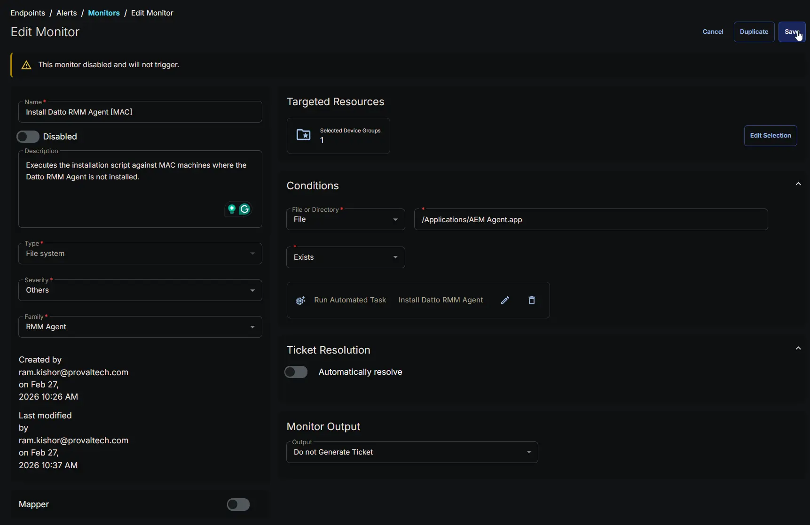

## Summary

Executes the [installation script](/docs/7920577d-9a4a-48d0-9102-b01c27c2e00f) against MAC machines where the Datto RMM Agent is not installed.

## Dependencies

- [Dynamic Group: Datto RMM Agent Installation [MAC]](/docs/b8948dfb-8c54-4872-9ae2-41d9ce4c5a15)
- [Task: Install Datto RMM Agent](/docs/7920577d-9a4a-48d0-9102-b01c27c2e00f)
- [Solution : Deploy Datto RMM Agent](/docs/b646e989-5515-4bda-9728-107ac03cdc07)

## Monitor Setup Location

**Monitors Path:** `ENDPOINTS` ➞ `Alerts` ➞ `Monitors`  

## Monitor Summary

- **Name:** `Install Datto RMM Agent [MAC]`  
- **Description:** `Executes the installation script against MAC machines where the Datto RMM Agent is not installed.`  
- **Type:** `File System`  
- **Severity:** `Others`  
- **Family:** `RMM Agent`

## Targeted Resources

- **Target Type:**  `Device Groups`  
- **Group Name:** `Datto RMM Agent Installation [MAC]`

## Conditions

- **File or Directory:** `File`  
- **File Path:** `/Applications/AEM Agent.app`  
- **Condition:** `Exists`  
- **Add Automation:**  `Install Datto RMM Agent`

## Ticket Resolution

**Automatically resolve:** `False`

## Monitor Output

**Output:** `Do not Generate Ticket`

## Completed Monitor

