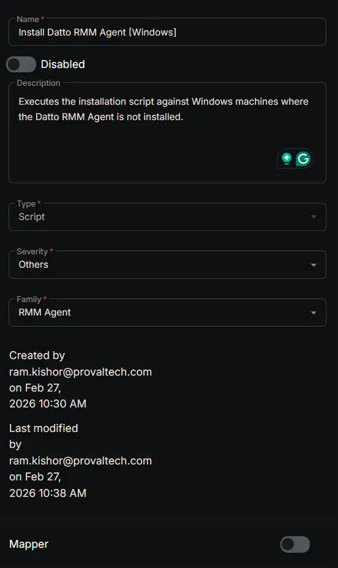
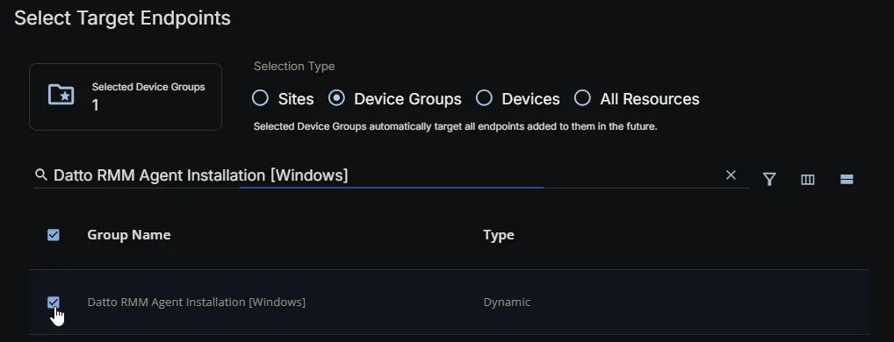
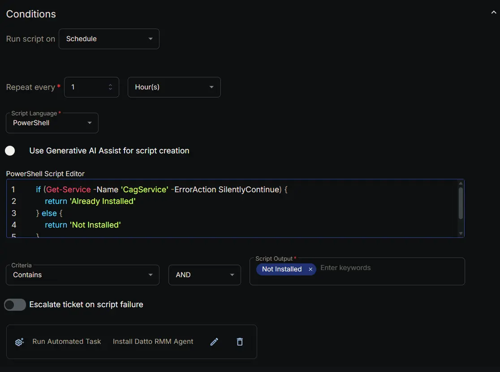
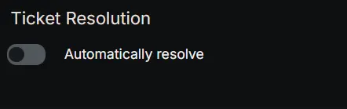
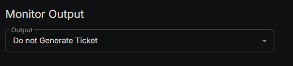
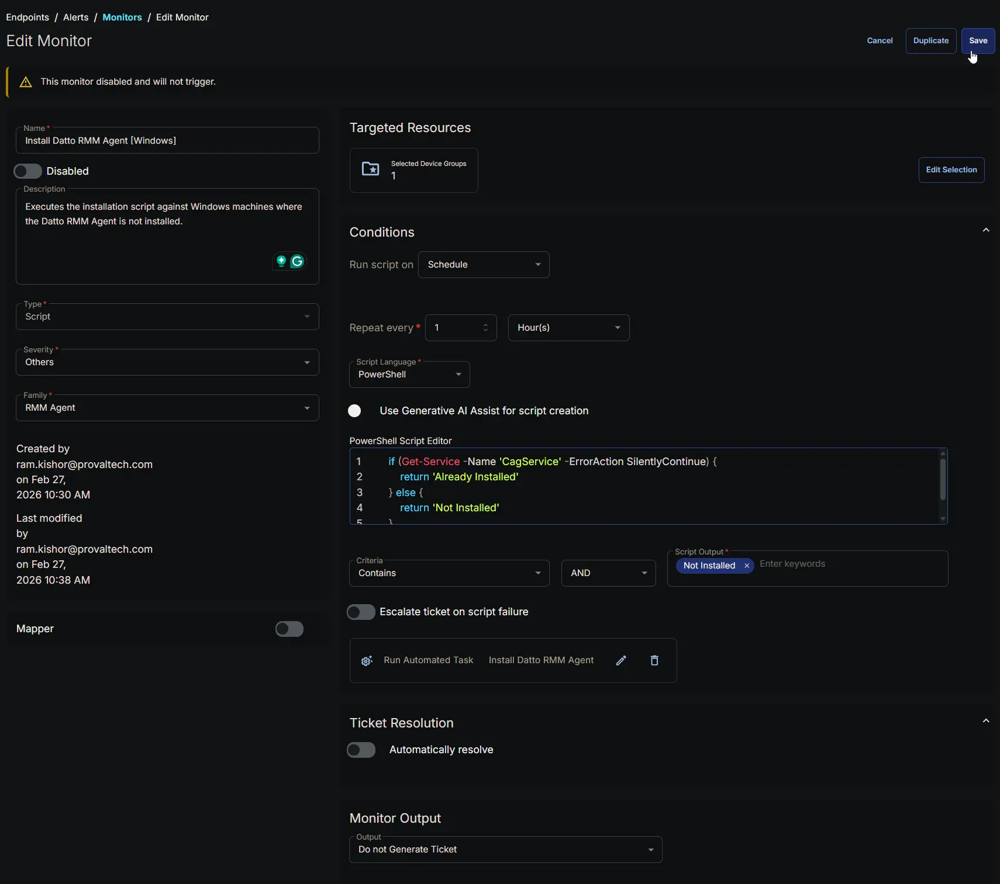

## Summary

Executes the [installation script](/docs/7920577d-9a4a-48d0-9102-b01c27c2e00f) against Windows machines where the Datto RMM Agent is not installed.

## Dependencies

- [Dynamic Group: Datto RMM Agent Installation [Windows]](/docs/f2349473-6980-4336-a294-37d9cdbc7e4d)
- [Task: Install Datto RMM Agent](/docs/7920577d-9a4a-48d0-9102-b01c27c2e00f)
- [Solution : Deploy Datto RMM Agent](/docs/b646e989-5515-4bda-9728-107ac03cdc07)

## Monitor Setup Location

**Monitors Path:** `ENDPOINTS` ➞ `Alerts` ➞ `Monitors`  

## Monitor Summary

- **Name:** `Install Datto RMM Agent [Windows]`  
- **Description:** `Executes the installation script against Windows machines where the Datto RMM Agent is not installed.`  
- **Type:** `File System`  
- **Severity:** `Others`  
- **Family:** `RMM Agent`



## Targeted Resources

- **Target Type:**  `Device Groups`  
- **Group Name:** `Datto RMM Agent Installation [Windows]`



## Conditions

- **Run Script on:** `Schedule`  
- **Repeat every:** `1` `Hours`  
- **Script Language:** `PowerShell`  
- **Use Generative AI Assist for script creation:** `False`  
- **PowerShell Script Editor:**  

```PowerShell
if (Get-Service -Name 'CagService' -ErrorAction SilentlyContinue) {
    return 'Already Installed'
} else {
    return 'Not Installed'
}
```

- **Criteria:**  `Contains`  
- **Operator:** `AND`  
- **Script Output:**  `Not Installed`  
- **Escalate ticket on script failure:** `False`  
- **Add Automation:**  `Install Datto RMM Agent`



## Ticket Resolution

**Automatically resolve:** `False`



## Monitor Output

**Output:** `Do not Generate Ticket`



## Completed Monitor


