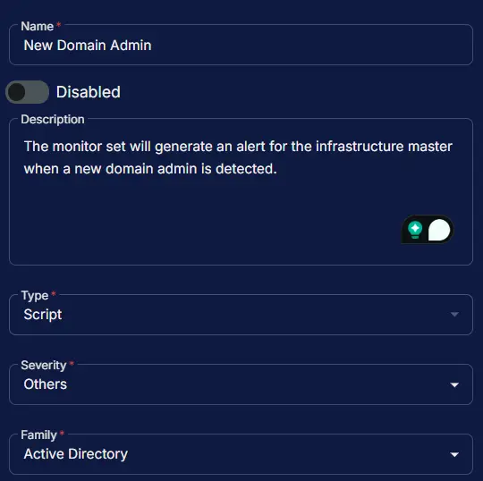
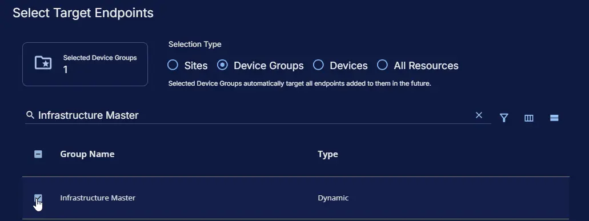
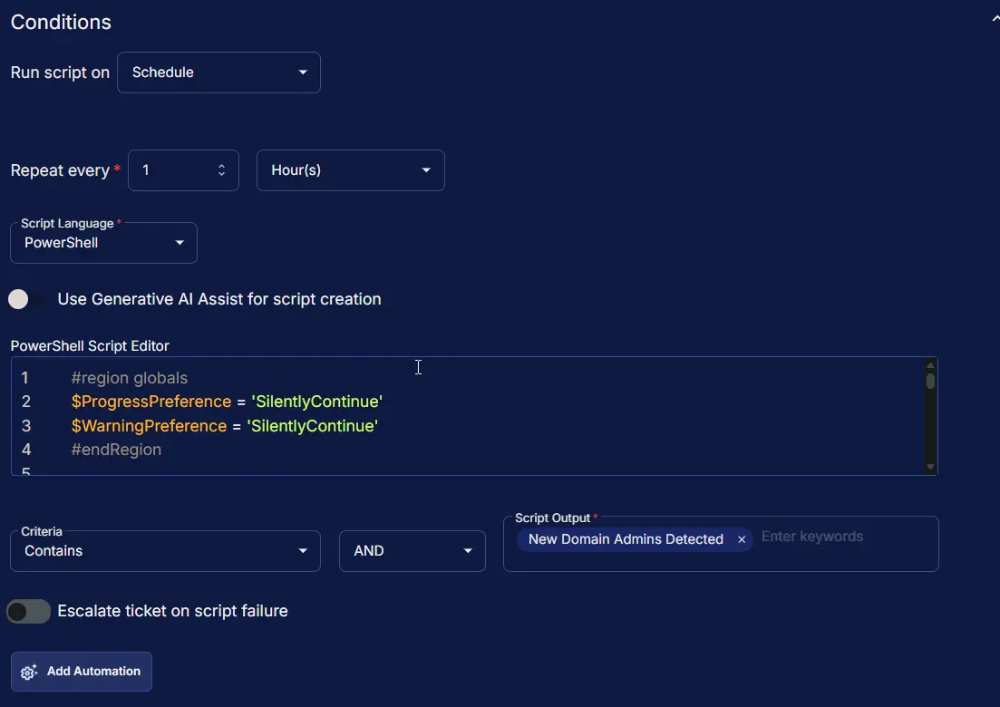
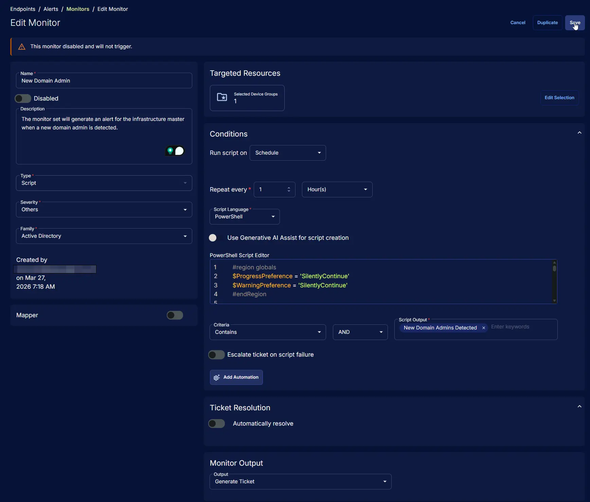

## Summary

The monitor set will generate an alert for the infrastructure master when a new domain admin is detected.

## Dependencies

- [Machine Group - Infrastructure Master](/docs/c2c2d22b-f735-4ec5-91a6-a014ab2e84a8)
- [Solution - New Domain Admins](/docs/35a03717-5ade-46fb-b396-10a277043788)

## Monitor Setup Location

**Monitors Path:** `ENDPOINTS` ➞ `Alerts` ➞ `Monitors`  

## Monitor Summary

- **Name:** `New Domain Admin`  
- **Description:** `The monitor set will generate an alert for the infrastructure master when a new domain admin is detected.`  
- **Type:** `Script`  
- **Severity:** `Others`  
- **Family:** `Active Directory`



## Targeted Resources

- **Target Type:**  `Device Groups`  
- **Group Name:** `Infrastructure Master`



## Conditions

- **Run Script on:** `Schedule`  
- **Repeat every:** `1` `Hours`  
- **Script Language:** `PowerShell`  
- **Use Generative AI Assist for script creation:** `False`  
- **PowerShell Script Editor:**  

```PowerShell
#region globals
$ProgressPreference = 'SilentlyContinue'
$WarningPreference = 'SilentlyContinue'
#endRegion

#region variables
$projectName = 'Get-NewDomainAdmin'
$workingDirectory = '{0}\_Automation\Script\{1}' -f $env:ProgramData, $projectName
$scriptPath = '{0}\{1}.ps1' -f $workingDirectory, $projectName
$logPath = '{0}\{1}-log.txt' -f $workingDirectory, $projectName
$errorLogPath = '{0}\{1}-error.txt' -f $workingDirectory, $projectName
$baseUrl = 'https://contentrepo.net/repo'
$scriptUrl = '{0}/script/{1}.ps1' -f $baseUrl, $projectName
$logContentReplacePattern = '{0}$' -f $projectName
#endRegion

#region check is domain controller
$check = (Get-CimInstance -ClassName 'Win32_ComputerSystem' -ErrorAction SilentlyContinue).DomainRole
if ($check -notin (4, 5)) {
    throw ('Script Failure: This script is meant to be run on a domain controller.')
}
#endRegion

#region working directory
if (-not (Test-Path -Path $workingDirectory)) {
    try {
        New-Item -Path $workingDirectory -ItemType Directory -Force -ErrorAction Stop | Out-Null
    } catch {
        throw ('Script Failure: Failed to create working directory {0}. Reason: {1}' -f $workingDirectory, $Error[0].Exception.Message)
    }
}
#endRegion

#region set tls policy
$supportedTLSversions = [enum]::GetValues('Net.SecurityProtocolType')
if (($supportedTLSversions -contains 'Tls13') -and ($supportedTLSversions -contains 'Tls12')) {
    [System.Net.ServicePointManager]::SecurityProtocol = [System.Net.SecurityProtocolType]::Tls13 -bor [System.Net.SecurityProtocolType]::Tls12
} elseif ($supportedTLSversions -contains 'Tls12') {
    [System.Net.ServicePointManager]::SecurityProtocol = [System.Net.SecurityProtocolType]::Tls12
}
#endRegion

#region download script
try {
    Invoke-WebRequest -Uri $scriptUrl -OutFile $scriptPath -UseBasicParsing -ErrorAction Stop
} catch {
    if (-not (Test-Path -Path $scriptPath)) {
        throw ('Script Failure: Failed to download the script from ''{0}'', and no local copy of the script exists on the machine. Reason: {1}' -f $scriptUrl, $Error[0].Exception.Message)
    }
}
#endRegion

#region execute script
$newAdmins = & $scriptPath
#endRegion

#region log verification
if (-not (Test-Path -Path $logPath )) {
    throw ('Script Failure: Failed to run the agnostic script ''{0}''. A security application seems to have interrupted the script.' -f $scriptPath)
}

if (Test-Path -Path $errorLogPath) {
    $content = Get-Content -Path $logPath
    $logContent = $content[ $($($content.IndexOf($($content -match $logContentReplacePattern)[-1])) + 1)..$($content.length - 1) ]
    Write-Information -MessageData ('Log Content: {0}' -f ($logContent | Out-String)) -InformationAction Continue
    throw ('Script Failure: The agnostic script ''{0}'' reported errors during execution. Please review the log content above for details.' -f $scriptPath)
}
#endRegion

#region output
if ($newAdmins) {
    return ('{0} New Domain Admins Detected: {1}' -f ($newAdmins.Name.Count), ($newAdmins | Out-String))
}
#endRegion
```

- **Criteria:**  `Contains`  
- **Operator:** `AND`  
- **Script Output:**  `New Domain Admins Detected`  
- **Escalate ticket on script failure:** `False`  
- **Add Automation:**  ``



## Ticket Resolution

**Automatically resolve:** `False`


## Monitor Output

**Output:** `Generate Ticket`


## Completed Monitor



## Changelog

### 2025-03-27

- Initial version of the document
- Replaces the deprecated task "New Domain Admins"
