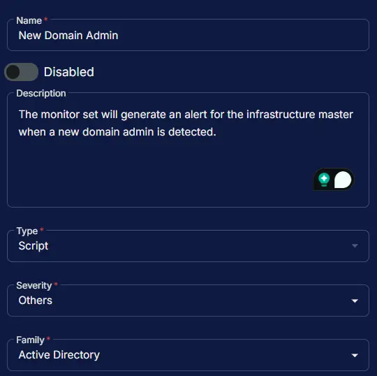
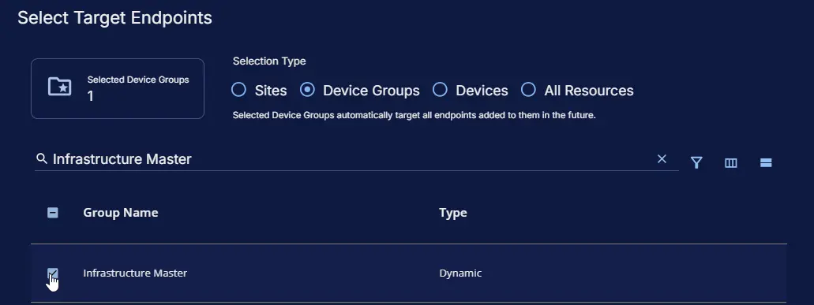
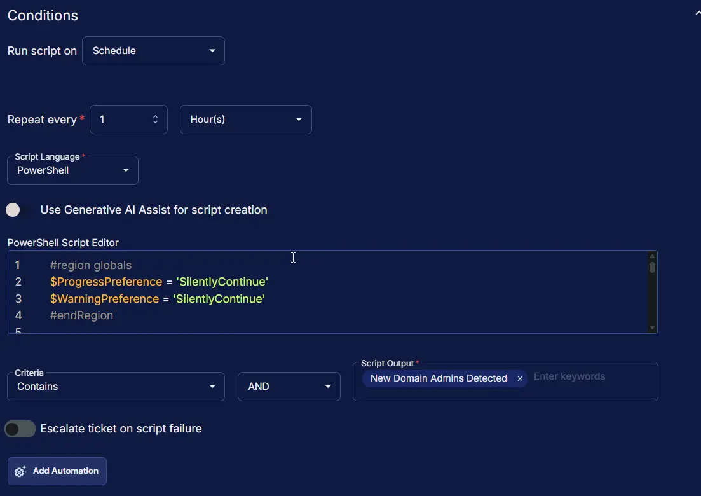
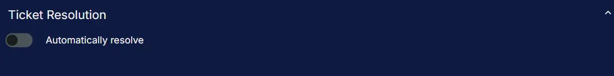
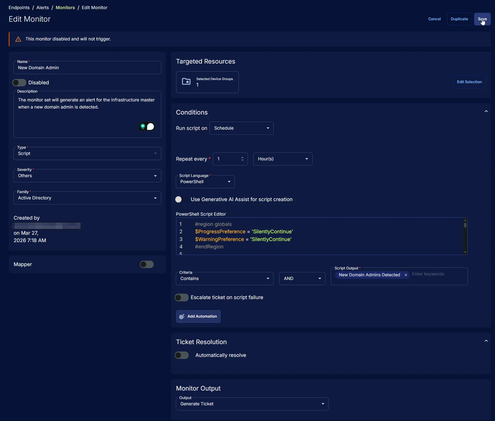

---
id: 'ecdcdcfa-d6b9-45fb-bace-6baf325f6010'
slug: /ecdcdcfa-d6b9-45fb-bace-6baf325f6010
title: 'New Domain Admin'
title_meta: 'New Domain Admin'
keywords: ['domain', 'admins', 'rmm', 'new-domain-admin', 'domain-admin']
description: 'The monitor set will generate an alert for the infrastructure master when a new domain admin is detected.'
tags: ['report', 'security', 'windows']
draft: false
unlisted: false
last_update:
  date: 2026-03-27
---

## Summary

The monitor set will generate an alert for the infrastructure master when a new domain admin is detected.

## Dependencies

- [Machine Group - Infrastructure Master](/docs/c2c2d22b-f735-4ec5-91a6-a014ab2e84a8)
- [Solution - New Domain Admins](/docs/35a03717-5ade-46fb-b396-10a277043788)

## Monitor Setup Location

**Monitors Path:** `ENDPOINTS` ➞ `Alerts` ➞ `Monitors`  

## Monitor Summary

- **Name:** `New Domain Admin`  
- **Description:** `The monitor set will generate an alert for the infrastructure master when a new domain admin is detected.`  
- **Type:** `Script`  
- **Severity:** `Others`  
- **Family:** `Active Directory`

## Targeted Resources

- **Target Type:**  `Device Groups`  
- **Group Name:** `Infrastructure Master`

## Conditions

- **Run Script on:** `Schedule`  
- **Repeat every:** `1` `Hours`  
- **Script Language:** `PowerShell`  
- **Use Generative AI Assist for script creation:** `False`  
- **PowerShell Script Editor:**  

[PowerShell Script](https://github.com/ProVal-Tech/cw-rmm/blob/main/monitors/new-domain-admin/script.ps1)

- **Criteria:**  `Contains`  
- **Operator:** `AND`  
- **Script Output:**  `New Domain Admins Detected`  
- **Escalate ticket on script failure:** `False`  
- **Add Automation:**  ``

## Ticket Resolution

**Automatically resolve:** `False`

## Monitor Output

**Output:** `Generate Ticket`

## Completed Monitor

## Changelog

### 2025-03-27

- Initial version of the document
- Replaces the deprecated task "New Domain Admins"

