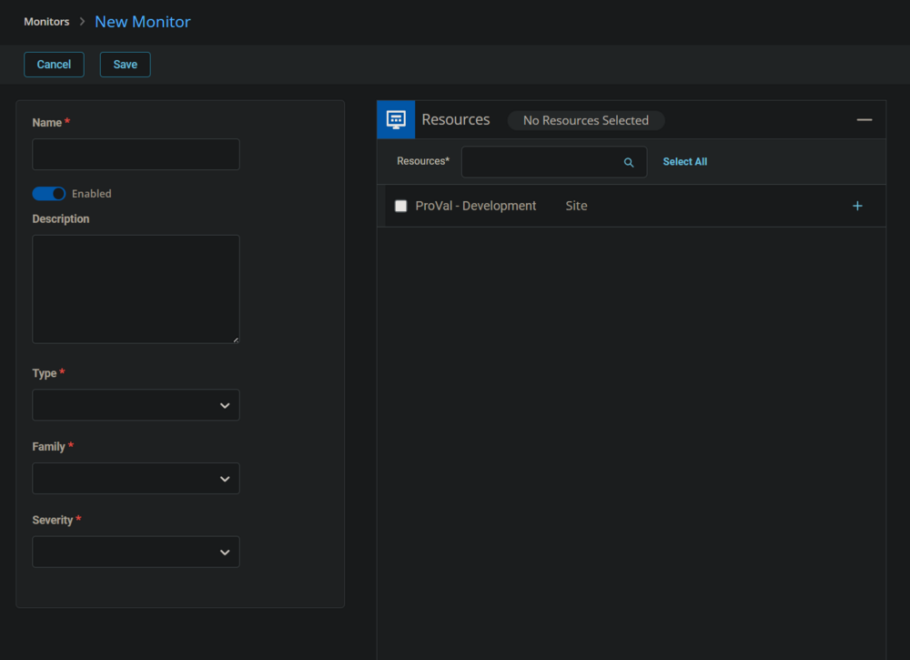
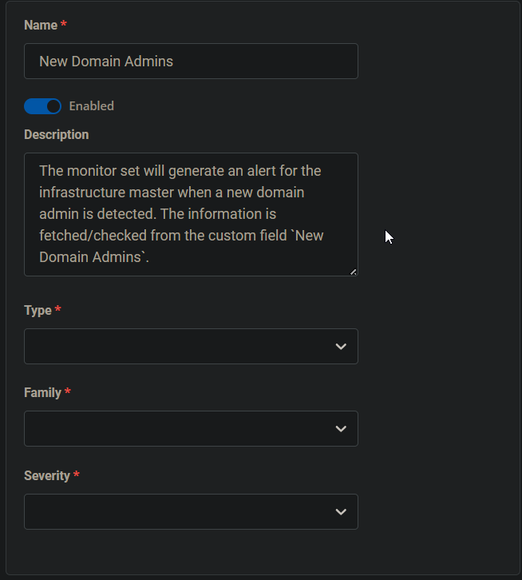
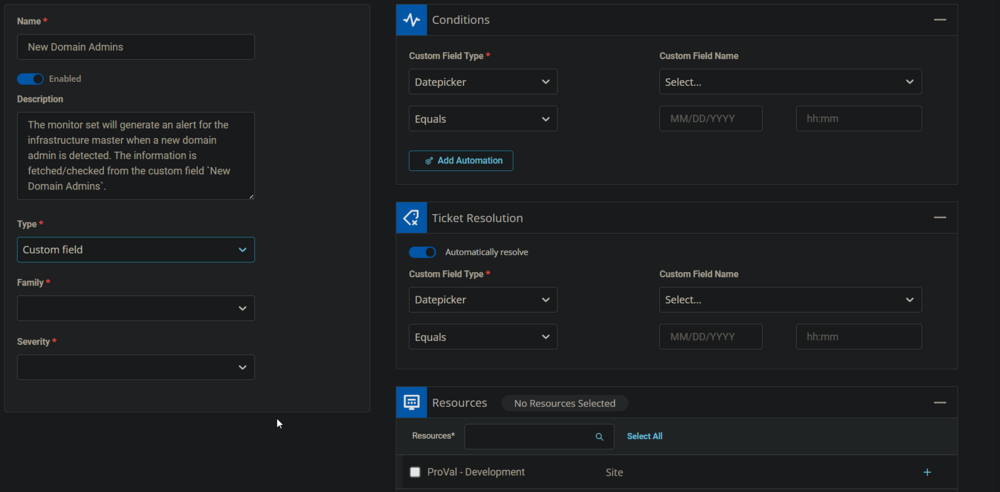
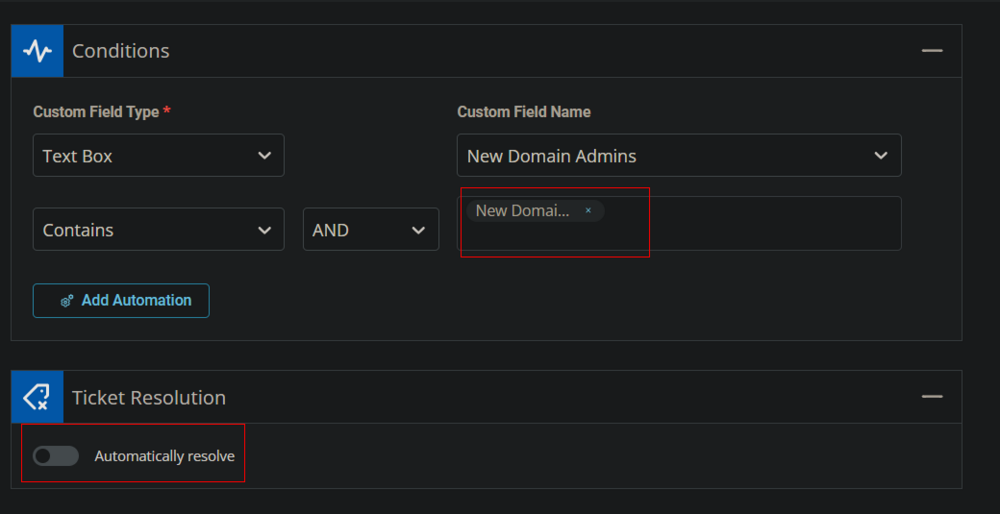
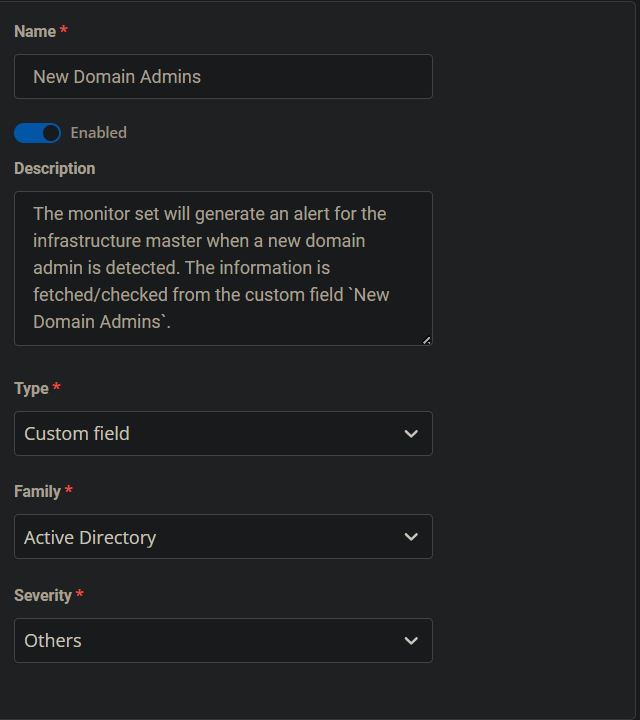
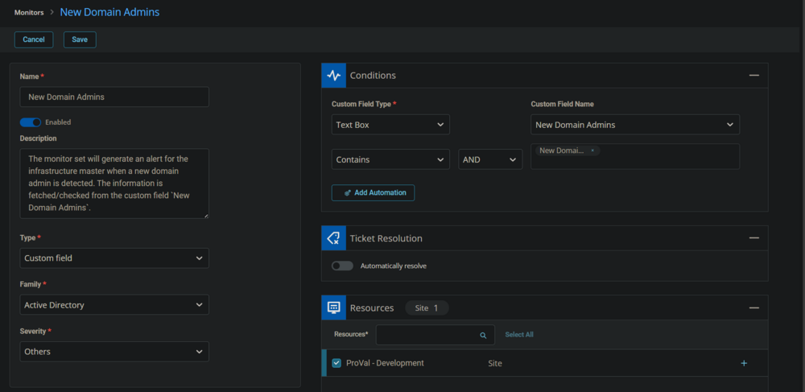
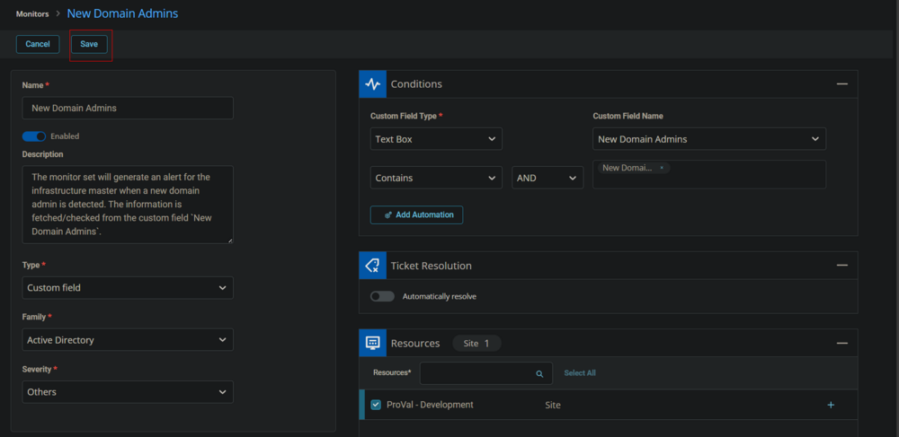

## Summary

The monitor set will generate an alert for the infrastructure master when a new domain admin is detected. The information is fetched/checked from the custom field [CW RMM - Custom Field - New Domain Admins](/docs/376db2a5-e76b-426f-b696-6791c83ab626).

The ticket generated by this monitor set will not be auto-closed.

## Dependencies

- [CW RMM - Task - New Domain Admins](/docs/a96db8f9-87fc-4e02-a1b3-2ed60913fc82)
- [CW RMM - Custom Field - New Domain Admins](/docs/376db2a5-e76b-426f-b696-6791c83ab626)

## Monitor

1. Go to **Alert Management** > **Monitors**.  
   

2. Click the **Add Monitor** button.  
   

3. This screen will appear.  
   

4. Fill in the Name and Description boxes.  
   **Name:** New Domain Admins  
   **Description:** The monitor set will generate an alert for the infrastructure master when a new domain admin is detected. The information is fetched/checked from the custom field `New Domain Admins`.  
   

5. Select the **Custom Field** in the Type dropdown.  
   

6. Select the **Text Box** from the **Custom Field Type** dropdown and **Latest Cumulative Update** from the **New Domain Admins** dropdown in the **Conditions** section. Unselect the **Automatically resolve** option in the **Ticket Resolutions** section.  
   

7. Add `New Domain admin(s):` in the **Enter Value Field** of the **Conditions** section.  
   

8. Select the Resources/Clients to apply the monitor set against.  
   

9. Select **Active Directory** for the **Family** and **Others** or any relevant option for the **Severity**.  
   

10. This is how the monitor set should look before saving it.  
    

11. Click the **Save** button to save the monitor set.  
    

