---
id: 'a4b90ce5-21c6-40c4-9158-ff60bd08a53f'
slug: /a4b90ce5-21c6-40c4-9158-ff60bd08a53f
title: 'Office Activation Status'
title_meta: 'Office Activation Status'
keywords: ['office', 'activation', 'alert', 'unlicensed', 'endpoint']
description: 'This document provides a comprehensive guide on creating a monitor that generates alerts for any unlicensed Office products on endpoints. It includes step-by-step instructions for setting up the monitor, configuring the script, and managing alert conditions.'
tags: ['setup', 'windows']
draft: false
unlisted: false
last_update:
  date: 2025-05-09
---

## Summary

Generates an alert for any unlicensed Office products on the endpoint.

## Monitor

1. Navigate to `Endpoints` > `Alerts` > `Monitors`  
   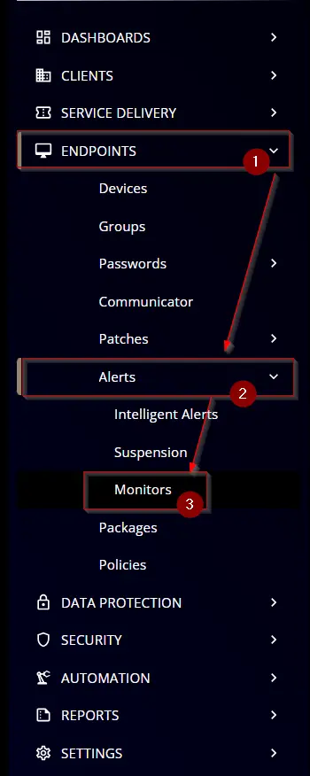

2. Click the `Create Monitor` button.  
   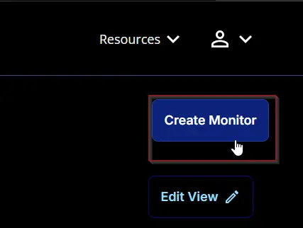

3. This screen will appear.  
   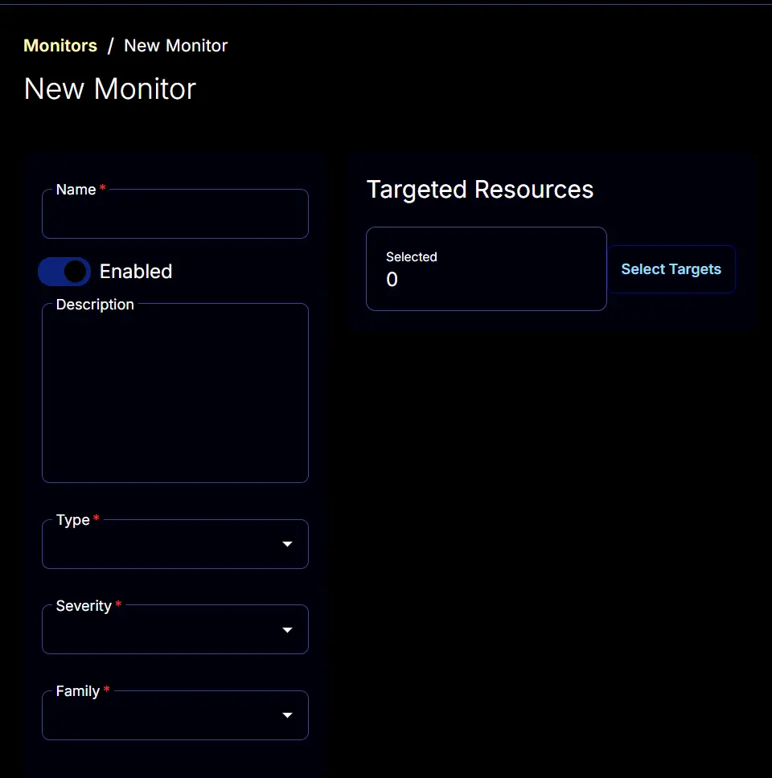

4. **Name:** Office Activation Status  
   **Description:** Generates an alert for any unlicensed Office products on the endpoint  
   **Type:** Script  
   **Family:** Desktop Operating System  
   **Severity:** Others  
   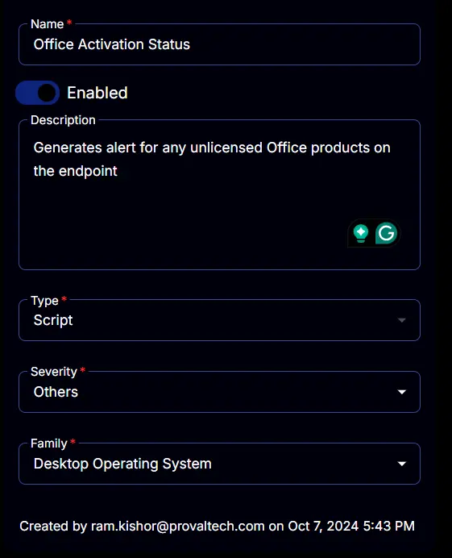

5. The `Conditions` tab will start looking like this:  
   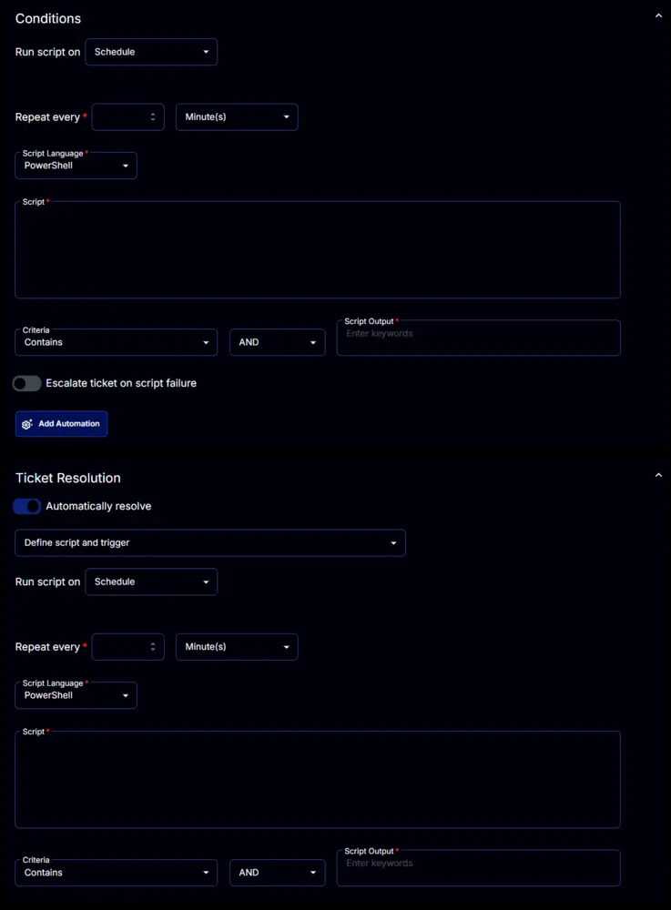

6. Set the `Repeat every` to `24` Hours:  
   

7. Disable the `Ticket Resolution` section by clicking the `Automatically resolve` button.  
   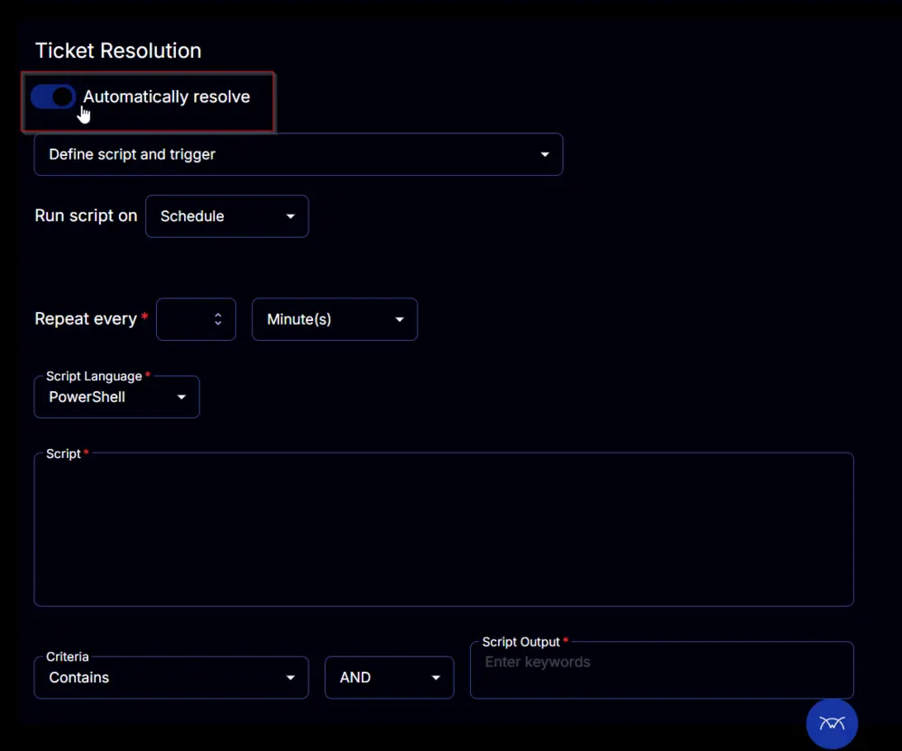

8. Paste this PowerShell script in the `Script` box.  

   [PowerShell Script](https://github.com/ProVal-Tech/cw-rmm/blob/main/monitors/office-activation-status/script.ps1)

   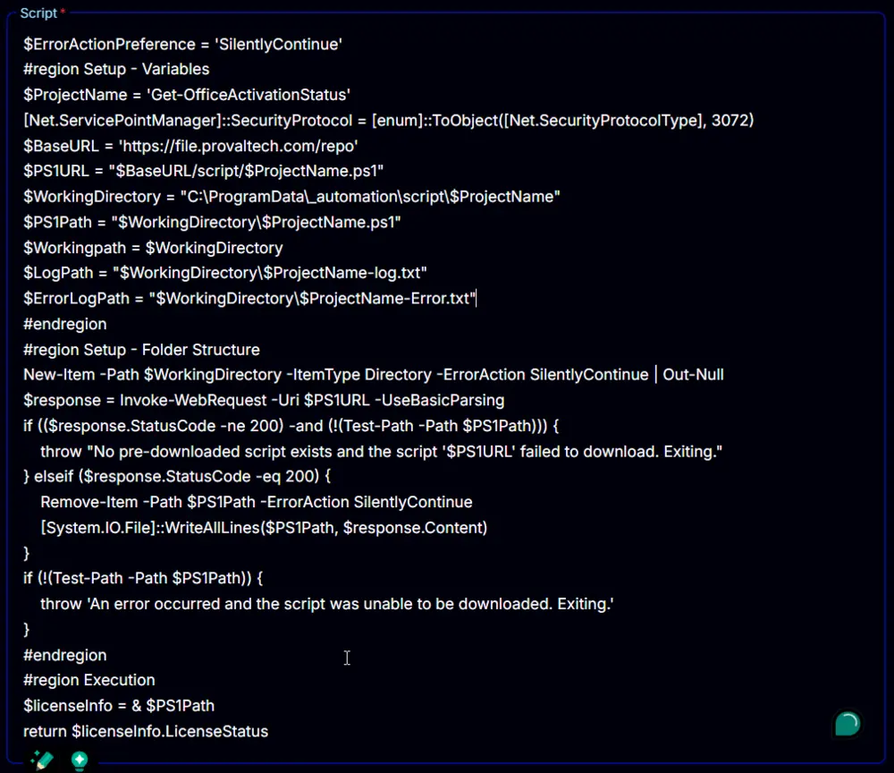

9. Set `Unlicensed`, `Non_Genuine_Grace_Period`, and `Out_Of_Tolerance_Grace_Period` to the `Script Output` box.  
   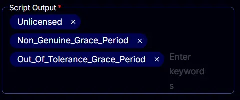

10. Enable the `Escalate ticket on script failure` option.  
    

11. Select the required client or group to target from the `Select Targets` button.  
    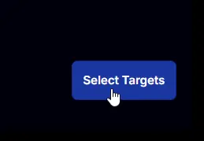  
    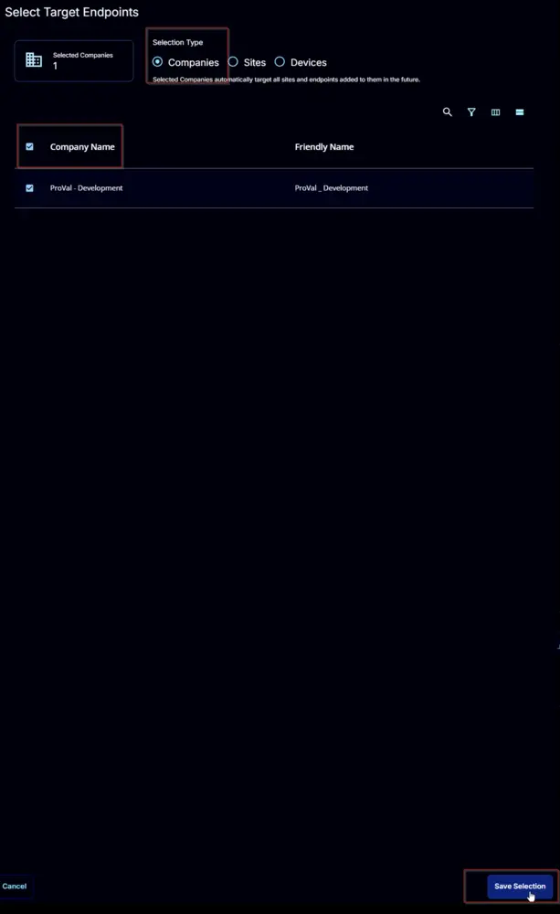

12. 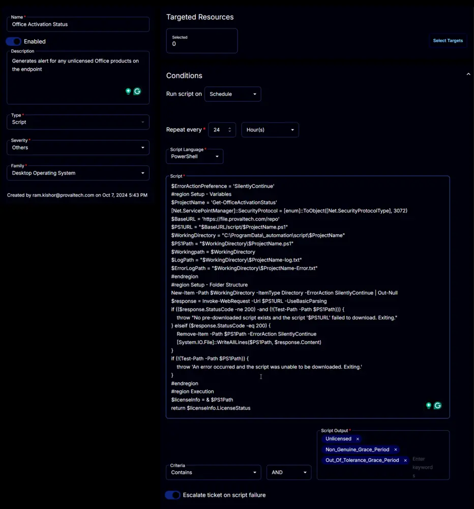

13. Click the `Save` button to save the monitor set.  
    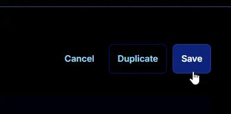

## Changelog

### 2025-04-10

- Initial version of the document

