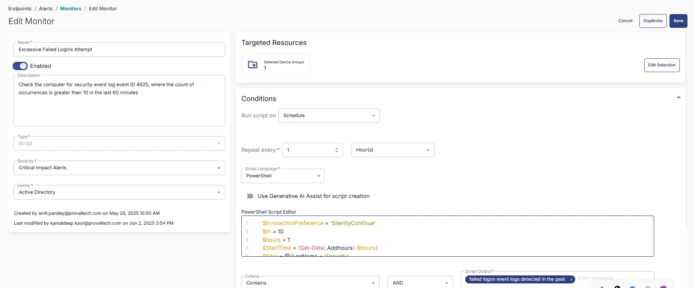

## Summary

Check the computer for security event log event ID 4625 where the count of occurrences is greater than 10 in the last 60 minutes.

The threshold can be modified by updating the value of the `$th` variable in the remote monitor's command.  
Change this value from 10 to the desired value after creating the monitor.

**The monitor set may not perform as expected for PowerShell versions older than 5.**

## Dependencies

- [CW RMM - Machine Group - Domain Controllers](/docs/eeeb4ee0-d683-44fd-81cf-7f8872b71c68)
- [CW RMM - Custom Field - Is Primary Domain Controller](/docs/b6a7c804-693c-4cf5-a60e-61dcb10ddcae)
- [CW RMM - Task - Validate Primary Domain Controller](/docs/7bc6ac21-322d-4630-836f-f00e93b94168)
- [CW RMM - Machine Group - Infrastructure Master](/docs/c2c2d22b-f735-4ec5-91a6-a014ab2e84a8)

## Target

[Infrastructure Master](/docs/c2c2d22b-f735-4ec5-91a6-a014ab2e84a8)  


## Implementation

1. From the left bar, select Endpoints → Alerts → Monitors  
     
   Then click 'Create Monitor'  
   

2. Fill in the mandatory columns on the left side:
   - Name: Possible Brute Force Attack
   - Description: Check the computer for security event log event ID 4625 where the count of occurrences is greater than 10 in the last 60 minutes.
   - Type: Script
   - Severity: Critical Impact Alerts
   - Family: Active Directory  
   

     

   **Conditions:**
   - **Run script on:** Schedule
   - **Repeat every:** 1 Hour(s)
   - **Script Language:** PowerShell
   - **PowerShell Script:**

    ```powershell
    $ErroractionPreference = 'SilentlyContinue'
    $th = 10
    $hours = 1
    $StartTime = (Get-Date).Addhours(-$hours)
    $filter = @{LogName = 'Security'
        ID = 4625
        StartTime = $StartTime
    }
    $events = Get-WinEvent -FilterHashtable $filter
    $filteredEvents = $events | Where-Object { $_.Message -notmatch 'Logon Type:\s+4' -and $_.Message -notmatch 'Logon Type:\s+5' }
    $total = ($filteredEvents | Measure-Object).count
    if ($total -ge $th) {
        $groupedEvents = $filteredEvents | Where-Object { $_.Properties.Value -match '\S' } | Group-Object  @{ Expression = { $_.Properties.Value } }, @{ Expression = { $_.Properties.Value } }
        $output = @()
        foreach ($group in $groupedEvents) {
            $ex = ([xml]$groupedEvents.Group[-1].ToXml()).Event
            $time = ([DateTime]$ex.System.TimeCreated.SystemTime).ToString('yyyy-MM-dd HH:mm:ss')
            $data = $ex.eventdata.data
            $e = [Ordered]@{}
            $data | ForEach-Object { $e[$_.Name] = $_.'#Text' }
            $procid = [Convert]::ToInt64($e.ProcessId, 16)
            $processStatus = if ($procid -gt 0 -and (Get-Process -Id $procid)) { 'Running' } else { 'Not Running' }
            $op = [pscustomObject]@{
                UserName = $e.TargetUserName
                UserSid = $e.TargetUserSid
                Domain = $e.TargetDomainName
                LogonType = $e.LogonType
                WorkstationName = $e.WorkstationName
                SourceIpAddress = $e.IpAddress
                SourceIpPort = $e.IpPort
                FailureStatus = $e.Status
                FailureSubStatus = $e.SubStatus
                callerProcessId = $procid
                CallerProcessName = $e.ProcessName
                CallerProcessStatus = $processStatus
                LogonProcess = $e.LogonProcessName
                AuthenticationPackage = $e.AuthenticationPackageName
                TransmittedServices = $e.TransmittedServices
                NTLMPackageName = $e.LmPackageName
                KeyLength = $e.KeyLength
                Occurrences = $group.Count
                MostRecentDetection = $time
            }
            $output += $op
        }
        $firstLine = "$total failed logon event logs detected in the past $hours hour(s)`n"
        $staticInfo = @'
    Logon Type Reference Table:
    2: Interactive
    3: Network
    4: Batch
    5: Service
    7: Unlock
    8: NetworkCleartext
    9: NewCredentials
    10: RemoteInteractive
    11: CachedInteractive
    Failure Reason Reference Table:
    0XC000005E: There are currently no logon servers available to service the logon request.
    0xC0000064: User logon with misspelled or bad user account.
    0xC000006A: User logon with misspelled or bad password for critical accounts or service accounts.
    0XC000006D: This is either due to a bad username or authentication information for critical accounts or service accounts.
    0xC000006F: User logon outside authorized hours.
    0xC0000070: User logon from unauthorized workstation.
    0xC0000072: User logon to account disabled by administrator.
    0XC000015B: The user has not been granted the requested logon type (aka logon right) at this machine.
    0XC0000192: An attempt was made to logon, but the Netlogon service was not started.
    0xC0000193: User logon with expired account.
    0XC0000413: Logon Failure: The machine you are logging onto is protected by an authentication firewall. The specified account is not allowed to authenticate to the machine.
    Note: Compare FailureSubStatus (or FailureStatus if FailureSubStatus is not available) with the reference table mentioned above to identify the failure reason.
    For more detailed information: https://learn.microsoft.com/en-us/previous-versions/windows/it-pro/windows-10/security/threat-protection/auditing/event-4625
    '@
        return $firstLine + $($output | Out-String) + $staticInfo
    }
    ```

   - **Criteria:** Contains
   - **Operator:** AND
   - **Script Output:** `failed logon event logs detected in the past`
   - **Escalate ticket on script failure:** Disabled
   - **Automatically resolve:** Disabled
   - **Monitor Output:** Generate Ticket

3. Select the target endpoints:

   - Click on Select Target:  
   

   - Then click on Device Group and search for the word '[Infrastructure Master](/docs/c2c2d22b-f735-4ec5-91a6-a014ab2e84a8)', and select the group as shown below:  
   

## Completed Monitor



## Ticketing

**Subject:** `Script Monitor - Possible Brute Force Attack is triggered on <Computer Name> (<Computer Name>) at the site <Company Name> - <Site Name> / Priority - Emergency`

**Example:** `Script Monitor - Possible Brute Force Attack is triggered on DEV-Server2019DC (DEV-Server2019DC) at the site ProVal - Development / Priority - Emergency`

**Sample Body:**

```
Company Name: ProVal - Development  
Site Name: ProVal - Development  
Resource - DEV-Server2019DC (DEV-Server2019DC)  
This issue was observed at 2024-12-16 18:24:23  
Following are the Monitor details for the same:  
Monitor Name: Possible Brute Force Attack  
Monitor Description: Check the computer for security event log event ID 4625 where the count of occurrences is greater than 10 in the last 60 minutes.  
Script Monitor has detected an issue on the endpoint, please refer to the details:  
Script Language: PowerShell  
Keyword detected:  
Script Output: 6 failed logon event logs detected in the past 1 hour(s)  

UserName: Administrator  
UserSid: S-1-0-0  
Domain: PROVALDEV  
LogonType: 2  
WorkstationName: DEV-SERVER2019D  
SourceIpAddress: 127.0.0.1  
SourceIpPort: 0  
FailureStatus: 0xc000006d  
FailureSubStatus: 0xc000006a  
CallerProcessId: 2088  
CallerProcessName: C:/Windows/System32/svchost.exe  
CallerProcessStatus: Running  
LogonProcess: User32  
AuthenticationPackage: Negotiate  
TransmittedServices: -  
NTLMPackageName: -  
KeyLength: 0  
Occurrences: 6  
MostRecentDetection: 2024-12-16 12:58:51  

Logon Type Reference Table:  
2: Interactive  
3: Network  
4: Batch  
5: Service  
7: Unlock  
8: NetworkCleartext  
9: NewCredentials  
10: RemoteInteractive  
11: CachedInteractive  

Failure Reason Reference Table:  
0XC000005E: There are currently no logon servers available to service the logon request.  
0xC0000064: User logon with misspelled or bad user account.  
0xC000006A: User logon with misspelled or bad password for critical accounts or service accounts.  
0XC000006D: This is either due to a bad username or authentication information for critical accounts or service accounts.  
0xC000006F: User logon outside authorized hours.  
0xC0000070: User logon from unauthorized workstation.  
0xC0000072: User logon to account disabled by administrator.  
0XC000015B: The user has not been granted the requested logon type (aka logon right) at this machine.  
0XC0000192: An attempt was made to logon, but the Netlogon service was not started.  
0xC0000193: User logon with expired account.  
0XC0000413: Logon Failure: The machine you are logging onto is protected by an authentication firewall. The specified account is not allowed to authenticate to the machine.  

Note: Compare FailureSubStatus (or FailureStatus if FailureSubStatus is not available) with the reference table mentioned above to identify the failure reason.  
For more detailed information: [Event 4625](https://learn.microsoft.com/en-us/previous-versions/windows/it-pro/windows-10/security/threat-protection/auditing/event-4625)  

Action: Please have the issue reviewed by a technician.
```

## Troubleshooting

#### **General Troubleshooting Steps**

**Identify the Account Type:**

- Domain Account: Check in Active Directory Users and Computers (ADUC).

- Local Account: Use Computer Management > Local Users and Groups.
- Service Account: Check services or scheduled tasks using the account.
- Unknown Account: Investigate for potential brute-force or enumeration attacks.
Review Event Logs:

Look for Event ID 4625 in the Security log.

Pay attention to:

Status/SubStatus codes

Logon Type

Source IP/Workstation

Target Account Name

#### **Error Code Specific Troubleshooting**

| Error Code   | Meaning                          | Action Steps                                                                 |
|--------------|----------------------------------|------------------------------------------------------------------------------|
| 0xC000006A   | Bad password                     | - Check if the password was recently changed.  	- Reset the password if needed.  	- Investigate repeated attempts (possible brute-force). |
| 0xC000006D   | Bad username or auth info        | - Verify username.  	- Check for typos or outdated credentials.  - Investigate source of repeated failures. |
| 0xC0000064   | Bad or misspelled username       | - Confirm the account exists.  	- Investigate for enumeration attempts.   |
| 0xC000005E   | No logon servers available       | - Check domain controller availability.  	- Ensure network connectivity.  - Restart Netlogon service. |
| 0xC000006F   | Logon outside authorized hours   | - Review account restrictions in AD.  	- Adjust allowed logon hours if needed. |
| 0xC0000070   | Unauthorized workstation         | - Check workstation restrictions in AD.  	- Update allowed workstations.  |
| 0xC0000072   | Account disabled                 | - Enable the account in AD.  	- Investigate why it was disabled.         |
| 0xC000015B   | Logon type not granted           | - Check Group Policy or Local Security Policy.  	- Grant appropriate logon rights. |
| 0xC0000192   | Netlogon service not started     | - Start the Netlogon service.  	- Set it to automatic.                   |
| 0xC0000193   | Expired account                  | - Extend or renew the account expiration date.                              |
| 0xC0000413   | Auth firewall restriction        | - Review firewall or security policies.  	- Allow the account to authenticate. |


#### **Service Account Specific Checks**

Find Services Using the Account:

Run: `Get-WmiObject win32_service | Where-Object { $_.StartName -like "*accountname*" }`

Or check manually in Services.msc.

Update Password:

Change the password in AD.

Update it in all services, scheduled tasks, and applications using it.

#### **If the Account is Unknown or Suspicious**

Investigate Source IP: Use firewall logs or SIEM tools.
Check for Patterns: Repeated failures from the same IP or targeting multiple accounts.
Block IP or Account: If malicious, take immediate action.
Enable Account Lockout Policies: To prevent brute-force attacks.
