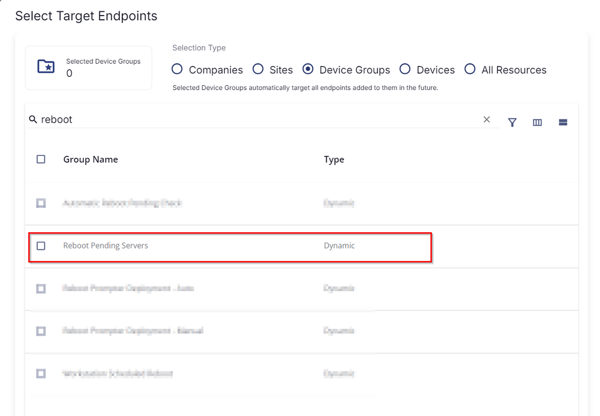
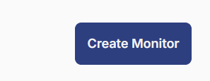
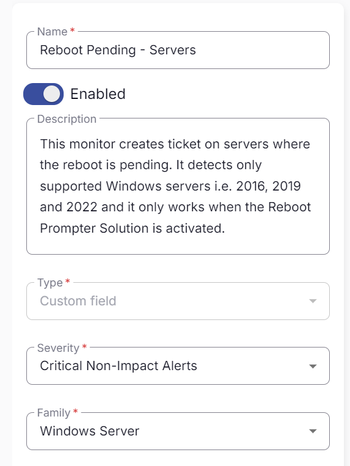
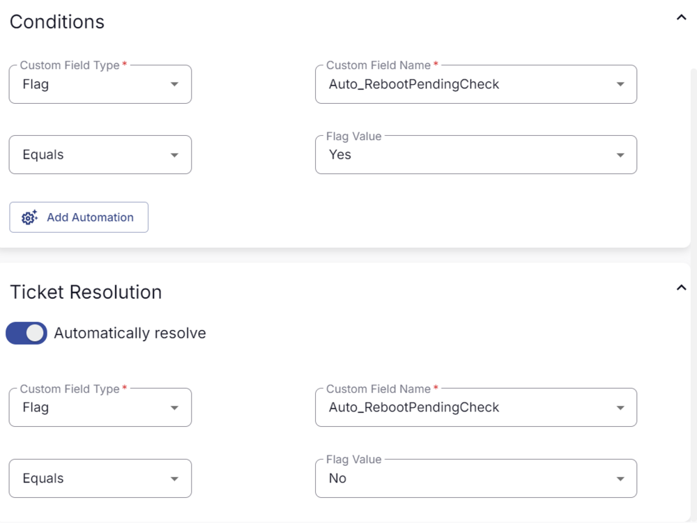
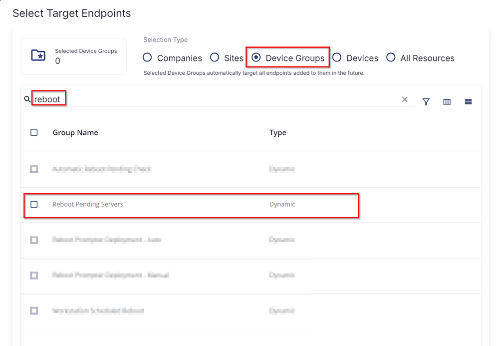

## Summary

This monitor creates a ticket on servers where the reboot is pending. It detects only supported Windows servers, i.e., 2016, 2019, and 2022, and it only works when the Reboot Prompter Solution is activated.

## Details

This should target the group as shown below:

## Dependencies

[CW RMM - Dynamic Group - Reboot Pending Servers](/docs/d6235892-7f62-4a75-83ef-c6c01cc43898)

## Implementation

1. From the left bar, select **Alert Management** -> **Monitor**  
   
     
   Then click **Create Monitor**  
   
   

2. Fill in the mandatory fields on the left side.  
   - **Name:** Reboot Pending - Servers  
   - **Description:** This monitor creates a ticket on servers where the reboot is pending. It detects only supported Windows servers, i.e., 2016, 2019, and 2022, and it only works when the Reboot Prompter Solution is activated.  
   - **Type:** Custom Field  
   - **Severity:** Critical Non-Impact Alerts  
   - **Family:** Windows Server  
   
   

3. Fill in the condition on the right side.  
   Follow the screenshot:  
   
   

4. Select the target.  
   Click on **Select Target:**  
   
     
   Then click on **Device Group**, search for the word "reboot," and select the **Reboot Pending Servers** group as shown below:  
   
   

## Ticketing

**Subject**  
The custom field failed on %computername%

**Body**  
The custom field failed on %computername%

