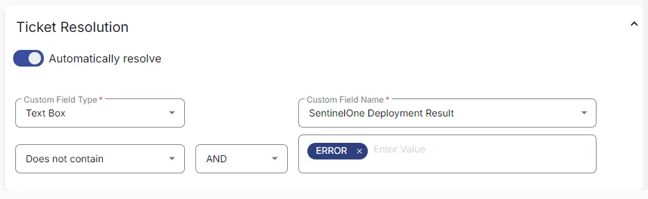

## Summary

This monitor will create tickets if [CW RMM - Task - SentinelOne Deployment](/docs/25651d1f-99d6-4906-8666-220994a4862e) fails to install SentinelOne on the machines.

## Dependencies

- [CW RMM - Task - SentinelOne Deployment](/docs/25651d1f-99d6-4906-8666-220994a4862e)
- [CW RMM - Custom Field - Endpoint - SentinelOne Deployment Result](/docs/7af6b9e0-bf2f-4705-874e-c58c5fa9171d)

## Monitor

1. Go to **Alert Management > Monitors**.  
     

2. Click the **Create Monitor** button.  
     

3. This screen will appear.  
     

4. Fill in the following details:  
   **Name:** SentinelOne Deployment Failure  
   **Description:** This monitor will create tickets if CW RMM - Task - SentinelOne Deployment fails to install SentinelOne on the machines.  
   **Type:** Custom Fields  
   **Severity:** Critical Non-Impact Alerts  
   **Family:** Desktop Security  
     

5. Select **Text Box** in the Custom Field Type.  
   Select **SentinelOne Deployment Result** from the Custom Field Name drop-down.  
   Add **Error** in the Value.  
     

6. Click the **Select Targets** button to select the clients to monitor.  
     

7. Select all companies and click the **Save Selection** button.  
     

8. In Ticket Resolution,  
   Set **Text Box** as the Custom Field Type.  
   Select **SentinelOne Deployment Result** from the Custom Field Name drop-down.  
   Replace **Equals** with **Does not Contain**.  
   Add **Error** in the Value.  
     

9. Confirm that this is the final appearance of the monitor set, then save it by clicking the **Save** button.  
     

