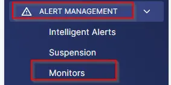
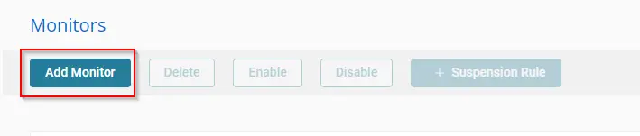
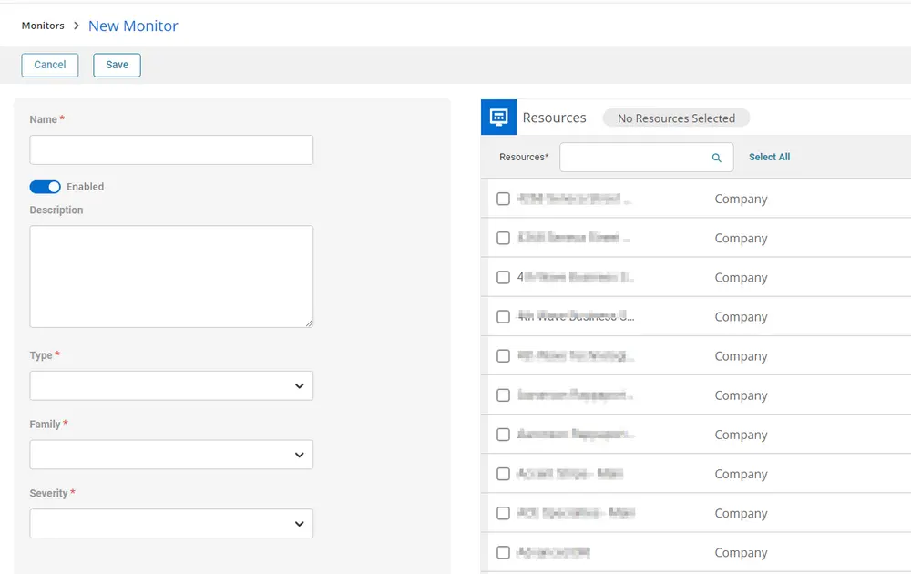
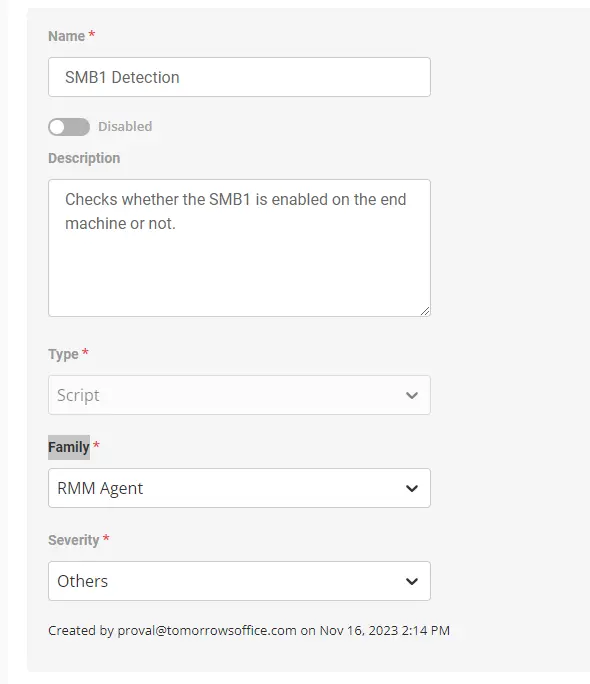
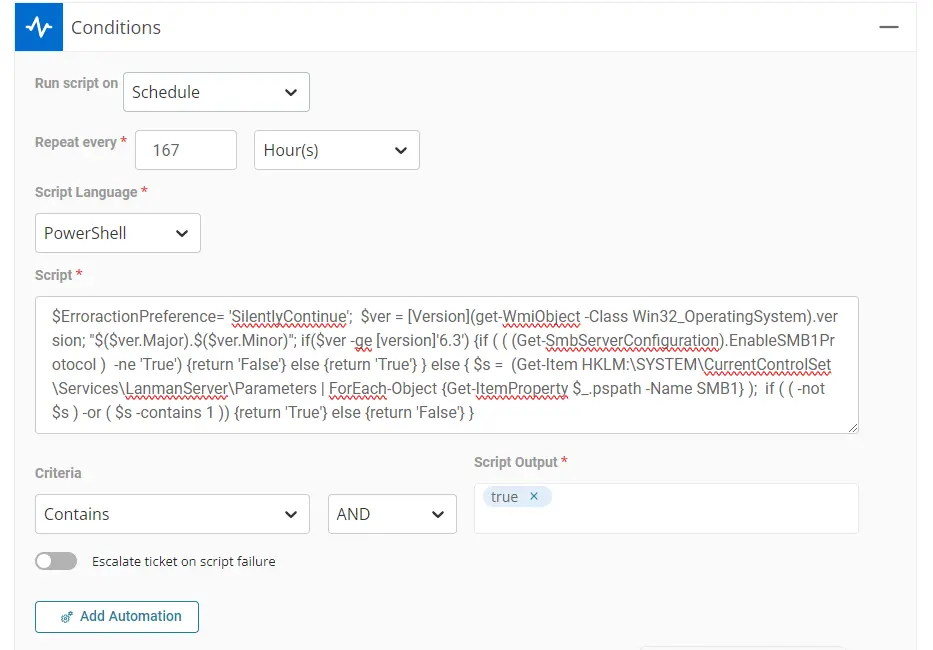
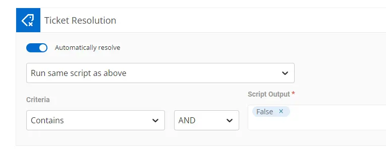
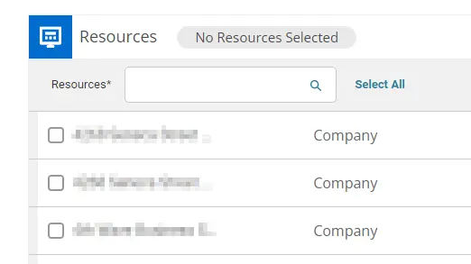
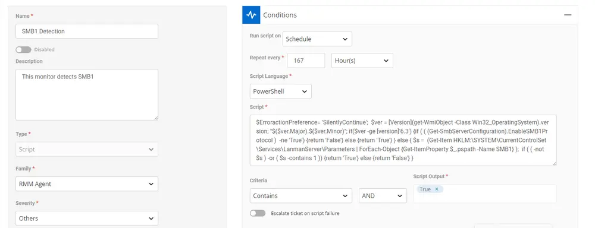
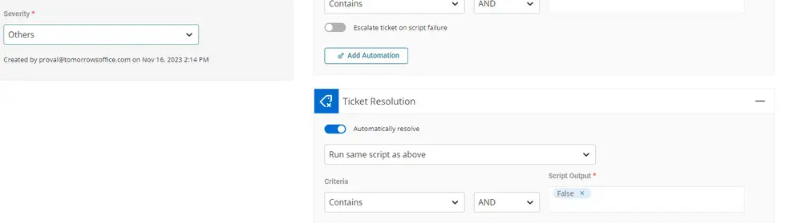

## Summary

This monitor checks whether SMB1 is enabled on the end machine. It runs the OS version [compatible command](https://learn.microsoft.com/en-us/windows-server/storage/file-server/troubleshoot/detect-enable-and-disable-smbv1-v2-v3?tabs=server#how-to-detect-status-enable-and-disable-smb-protocols) to fetch the data.

## Monitor

1. Go to **Alert Management > Monitors > Add monitor**  
     
     

2. This screen will appear.  
     

3. Fill in the Name and Description boxes.  
   **Name:** SMB1 Detection  
   **Description:** Check whether SMB1 is enabled on the end machine.  

   Select `Script` as `Type`, `RMM Agent` for the `Family`, and `Others` or any relevant option for the `Severity`.  
     

4. In the conditions selection, select PowerShell in the Script Language, select Schedule in Run Script on, and type 167 hours in Repeat every. Add the following query in the Script box:  

   ```powershell
   $ErroractionPreference = 'SilentlyContinue'

   # Get the OS version
   $ver = [Version](Get-WmiObject -Class Win32_OperatingSystem).version
   "$($ver.Major).$($ver.Minor)"

   # Check if the OS version is greater than or equal to 6.3
   if ($ver -ge [version]'6.3') {
      # Check if SMB1 is enabled using Get-SmbServerConfiguration
      if (((Get-SmbServerConfiguration).EnableSMB1Protocol) -ne 'True') {
         return 'False'
      } else {
         return 'True'
      }
   } else {
      # For older OS versions, check the registry for SMB1 status
      $s = Get-Item HKLM:\SYSTEM\CurrentControlSet\Services\LanmanServer\Parameters |
            ForEach-Object { Get-ItemProperty $_.pspath -Name SMB1 }

      if ((-not $s) -or ($s -contains 1)) {
         return 'True'
      } else {
         return 'False'
      }
   }
   ```  

   In Criteria, select `Contains`, `AND`  
   Enter `True` in Script output.  
   The Conditions Section should look something like this:  
     

5. Select `Run same script as above` condition for the Ticket Resolution section. Select `Contains`, `AND` for criteria. Enter `False` in Script Output.  
   Ticket Resolution should look something like this:  
     

6. Select the Resources/Clients to apply the monitor set against.  
     

7. This is how the monitor set should look before saving it.  
     
   ****  

8. Click the `Save` button to save the monitor set.